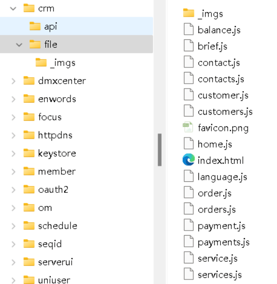
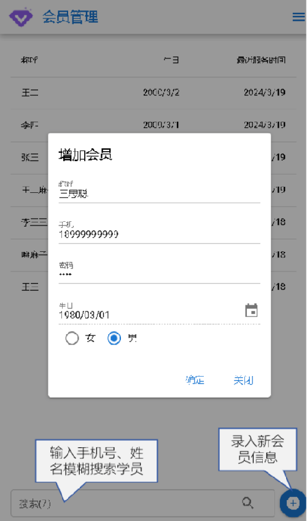
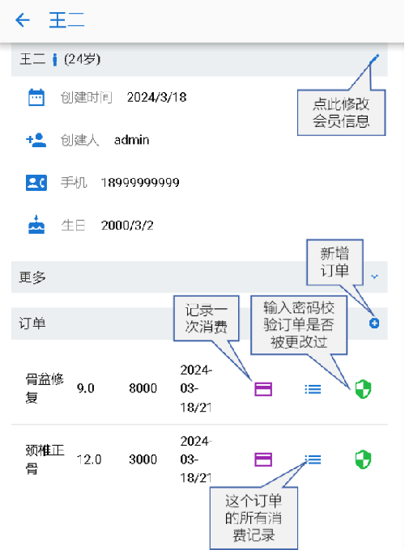
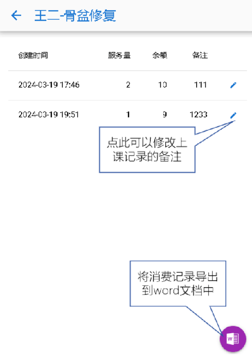
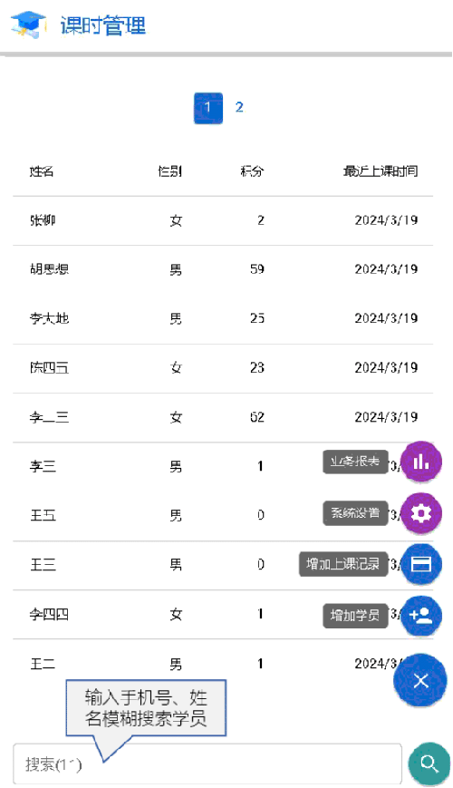
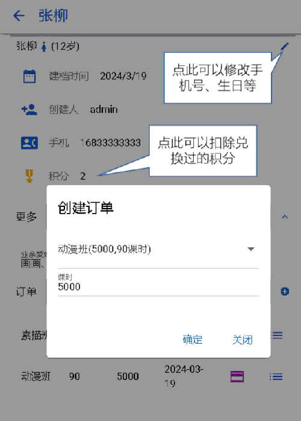
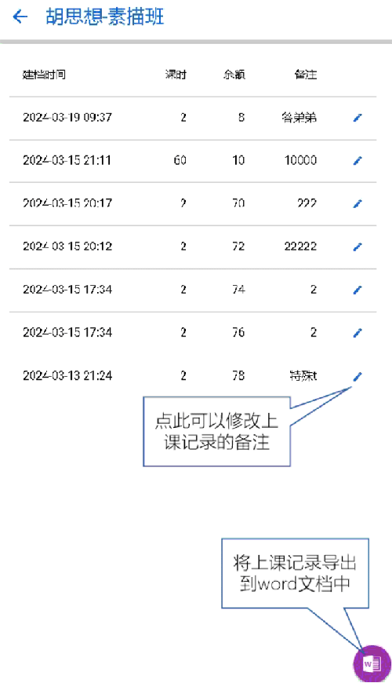
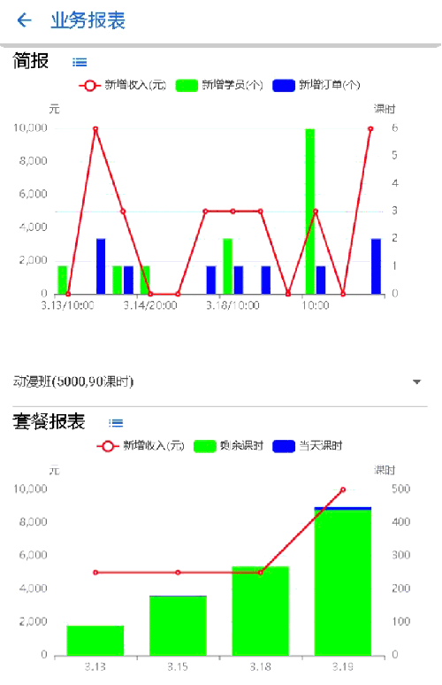

<div align="center" style="font-size:2em;font-weight:bold;">
  至简网格客户端使用与UI开发指导<br>
  
</div>


# **修订记录**

| 日期 |   内容    |   作者    |
| --- | --- | --- |
| 2024.3.1 | 创建文档 | flyinmind |
| 2024.3.22 | 增加内置组件 | flyinmind |
| 2026.6.24 | 补充内容，并转为md格式 | flyinmind |

# **摘要**

至简网格是一款HTTP服务器，用于开发基于数据库的端云结合的服务程序，可以运行在资源极其有限的设备上，比如安卓手机、树莓派等，使得服务器可以尽量前移到生产端，可以运用于边沿计算、企业生产信息化、办公自动化等，

为了方便用户使用服务端的能力，必须要有与之配套的客户端。本文介绍至简网格客户端的安装使用与UI开发，UI开发中，需要开发人员具备基本的js、vue的技术积累。

---
# 一、安装与使用

## 安装

在做端侧UI开发之前，首先需要安装客户端。当前支持windows、android两种客户端，两种界面很接近，操作也一样。 但是有部分安卓中的功能，在windows客户端中没有，比如扫码、横竖屏等。

### windows客户端

从网站下载安装程序后，双击安装即可。

windows客户端需依赖系统的Edge浏览器。此浏览器在windows7及以上版本都可以安装，windows10、windows11中已默认安装。如果未安装，则需要手动下载安装 [Edege浏览器](https://www.microsoft.com/zh-cn/edge/download)。

### android客户端

至简网格安卓客户端至少需要在安卓8.0中安装（2017年8月22日发布）。

至简网格客户端没有上传到各大应用市场，需要使用安卓手机的浏览器扫码下载，然后再安装。

有些情况下，浏览器没有安装应用的权限，会提示确认是否赋予浏览器安装应用的权限，此时必须给予授权。


安装时，会有安全提醒，请选中“我已充分了解风险，并继续安装”。因为安卓手机品牌众多、版本众多，提示不尽相同，总之需要容许安装才可以。


通过以上步骤，安装就完成了，与普通App安装是一样的。

## 端侧设置

帐号分为两类：个人帐号、公司帐号，用户可以登录一个个人账号，登录一个或多个公司的公司账号，比如，一个会计为多家公司代账的情况，就需要登录多家公司的服务，使用时根据需要切换到不同公司的公司帐号。

“设置”中可以进行个人帐号注册与登录，或者公司帐号的登录。

如果当前打开的服务是一个公司服务，则自动使用当前选中的公司的账号；如果是一个个人服务，无论当前选中的是哪个公司的账号，都使用个人账号。

### 个人帐号

在使用一些个人服务时，比如密码箱、专注力等服务，它们不属于任何一家公司，所以必须使用个人帐号。


个人帐号需要自己注册，当前只支持自建帐号，没有使用QQ、微信等第三方帐号。


### 公司帐号

公司帐号及其初始密码是公司的超级管理员创建的，创建方法请参照[公司帐号管理](#公司帐号管理)。

在登录公司帐号之前，需要先点击左上角的图标添加公司，待添加的公司必须已经注册过，可以询问公司相关负责人获得公司id与接入码。


公司ID：公司或组织注册时获得的ID；

接入码：接入密码，需注意，它相当于WIFI密码，不可随意透露给公司外不相关人员。


如果服务器置于内网环境，点击“确定”后，端侧无法知道连接哪个服务器，这时会要求输入“内网地址”。


### 登录

个人帐号与公司帐号的登录与退出是一样的。

因为公司帐号是超级管理员添加的，系统默认的公司超级管理员帐号是admin，密码是123456。强烈建议在第一次登录时修改admin密码。


系统支持同时登录一个个人帐号与多个公司帐号，登录时需要点击左上角的图标，选择个人或者某个公司。


然后再点击右上角的登录，在弹出窗口中输入帐号、密码，点击“登录”即可。


在使用服务时，如果是个人服务，则自动使用个人帐号身份。如果是公司服务，则使用当前选中的公司帐号，在左上角可以切换当前的公司。 如果当前帐号是个人帐号，且有多个公司帐号，因为个人帐号无法在公司级服务中使用，所以默认使用排在最前面的公司帐号。

## 应用市场

应用分成两类，一类是公司应用，如CRM、会员等。公司应用需要单独部署公司服务器才可以使用，服务器程序可以部署在一部安卓手机上，也可以部署在服务器上，或者部署在云端。
一类是个人应用，比如密码箱、专注力等。个人应用为生活提供便利，比如记密码、练习专注力、记单词、算账、杂记等，这些功能不需要部署服务器，安装即可使用。

### 应用列表

在应用列表中点击应用就可以进入详情界面，进行安装或卸载。


### 应用详情

在详情中有关于应用的详细介绍。如果没有安装，则下方显示“安装”按钮，否则显示“卸载”按钮；当检测到新版本时，会多一个“升级”按钮。


注：以上图例只作为样例，并不代表实际情况。

## 打开应用

在应用主界面的最下方，点击“应用”按钮，出现一个应用栏，里面列出了所有已安装的应用，比如CRM、会员等。 点击一个应用，就可以进入应用的主界面。

每种应用的主界面不同，下图为CRM的主界面。


打开一个应用，使用一段时间后，再次点击“应用”按钮，可以切换到其他应用。 如果退出程序，下次打开程序时，会自动进入上次打开过的应用。

Windows版本的客户端与此类似，应用栏显示在屏幕的右侧。


## 公司帐号管理

公司级服务大多依赖公司帐号服务，它记录了公司内所有员工的帐号、密码、授权等信息。主要功能有员工帐号管理、服务授权与群组管理。系统实现中，强依赖帐号管理与服务授权。群组管理在每个业务中根据需要使用，在CRM、会员服务中都未使用群组功能。

### 帐号管理

公司级员工帐号只有超级管理员可以增加、删除，在界面的右上角有“服务授权”与“群组管理”两个图标。


点击某个员工帐号，进入帐号详情界面，在此可以修改员工的邮箱、电话号码等信息。忘记密码时，可以在此重置密码。

注意：重置的密码是随机生成的6个字符，在使用此密码登录后，需及时更改。


在此还可以禁用帐号，禁用的帐号无法登录系统，也可以重新启用。在此还可以查看帐号从属于哪些组织、在服务中拥有的授权。 如果需要调整，可以删除从属关系与授权。

### 服务授权

员工拥有帐号后，还不能在任何服务中进行操作，只有经过超级管理员授权后，才可以使用相应的服务。 授权时指定的角色，需要服务的开发人员在角色定义接口中定义。


授权时可以指定是否可以在公网访问内网的服务，如果未授权公网访问，则只能在内网访问服务。

---
# 二、UI开发

## 概述

至简网格客户端本质是一个轻应用开发平台，端侧的开发，就是使用html+js+vue+quasar开发网页，如果需要输出报表，可以使用echarts。至简网格在客户端中提供了一些原生接口，使得与至简网格的服务端对接变得非常方便，其他开发与普通网页开发是完全一致的。

至简网格并没有限制使用什么前端js框架，但是推荐使用vue+quasar，并且内置了vue与quasar，服务开发时，可以直接引用它们。

### 服务目录结构

端侧UI开发是放在服务的file子目录中的，比如下图是CRM服务的目录结构，其中file目录就是端侧UI的实现。服务在启动时会自动生成一个app.cfg文件，并将它们一起打包成一个zip文件。客户端在安装、升级时，用的就是这个zip文件。



端侧ui在安装、升级时，下载此zip文件，并且解压到本地目录，然后加载其中的index.html文件，显示服务的UI。所以，如果服务需要在客户端显示内容，则，file目录下必须有一个index.html文件。在index.html文件中，完成vue、quasar的初始化加载，如果要用报表，还需要加载echarts。


### 服务中的网络请求

在端侧开发中，对网络的请求不可以使用任何一种ajax框架，比如axios、jquery等，因为为了实现至简网格服务端的灵活部署，内置webview时，禁用了它的网络访问能力。如果需要实现网络请求，必须使用原生的Http函数，request是用来请求至简网格服务端接口的，download是用来下载文件的，getExternal是用来访问非至简网格服务中的内容的。

### 服务起始页样例
```HTML
<!DOCTYPE html><-- DOCTYPE不可省略 -->
<html>
<head>
<meta charset="utf-8" />
<meta name="content-type" content="text/html;charset=utf-8" />
<meta name="viewport" content="width=device-width, initial-scale=1.0" />
<-- 避免加载favicon -->
<link rel="icon" href="data:image/ico;base64,aWNv">
<-- 如果使用quasar，则必须加载以下两个css -->
<link href="/assets/v3/quasar_font.css" rel="stylesheet" type="text/css">
<link href="/assets/v3/quasar.css" rel="stylesheet" type="text/css">
<title>CRM</title>
</head>
<body style="overflow:hidden">
<-- app.mount('#app')用到div的id，v-cloak使得vue在没有得到值之前，不显示变量名 -->
<div id="app" v-cloak>
<-- router-view，应用的页面都在此加载 -->
<router-view></router-view>
</div>
</body>
<-- 必须加载的js -->
<script src="/assets/v3/vue.js"></script>
<script src="/assets/v3/vue-router.js"></script>
<script src="/assets/v3/quasar.js"></script>
<script src="/assets/v3/osadapter.js"></script>
<-- 根据需要选择是否加载 -->
<script src="/assets/v3/echarts.js"></script>
<script src="/assets/v3/qrcode.js"></script>
<script type="module">
import Language from "./language.js"
//延迟加载，引入公共组件，这样import可以兼容安卓7
//如果不考虑兼容android 7，则可以按需加载，在VueRouter.createRouter的routes中直接import
import DateInput from "/assets/v3/components/date_input.js"
import UserSelector from "/assets/v3/components/user_selector.js"
import AlertDialog from "/assets/v3/components/alert_dialog.js"
import ConfirmDialog from "/assets/v3/components/confirm_dialog.js"
const l=(typeof os)=='undefined' ? navigator.language : os.language();
const tags = l.indexOf("zh") == 0 ? Language.cn : Language.en;
//router定义
const router = VueRouter.createRouter({"history": VueRouter.createMemoryHistory(),
	routes:[
		//定义router，安卓7不支持按需加载import
		{path:'/home', component:()=>import('./home.js')},
		...
	]
});

//service定义
const service = {
	go_back() { //返回，在页面中通过service.go_back调用
		router.back();
	},
	jumpTo(url) {
		router.push(url);
	}
};

//app主体定义
const app = Vue.createApp({
provide:{tags:tags, service:service, icons:icons},
created(){
	service.baseInfo();
	this.$router.push('/home').catch(err => {err}) //避免报NavigationDuplicated，此错误不影响功能
},

mounted() {
	window.sys_go_back = this.sysGoBack;//给webview调用
},

methods:{
	sysGoBack() {
		//声明全局函数，在webview中调用，
		//实现按回退按钮回退到历史页面，如果无历史，则退出activity或应用
		if(this.$router.currentRoute.value.path==="/home") {
			return false;
		}

		this.$router.back();
		return true;
	}
}
});

app.use(Quasar);//必须：设置Quasar
app.use(router);//必须：设置route
//注册全局组件，按需选择，另外还有address控件
app.component('component-user-selector', UserSelector);
app.component('component-alert-dialog', AlertDialog);
app.component('component-confirm-dialog', ConfirmDialog);
app.component('component-date-input', DateInput);
app.mount('#app');//必须：启动APP
</script>
</html>
```

### 交互页面样例

以下为一个删减来所有细节的首页实现，具体的实现可以参照已在gitee、csdn、github开源的服务实现。
```JavaScript
export default {
inject:['service', 'tags'], //引用全局对象，页面中可以像使用data中变量一样使用
data(){return{
	name:"test"//数据定义，在页面中{{xxx}}括起的部分，在此都必须定义
}},

created(){
	this.init(); //初始化加载，在mounted
},

methods:{
	init(){
		//处理逻辑
	}
},

//注意"`"不是单引号，是键盘左上角的反单引号(backquote)
template:`
<q-layout view="lHh lpr lFf" container style="height:100vh">
<q-header elevated>
<!-- 非必须，页眉内容 -->
</q-header>
<q-footer elevated>
<!-- 非必须，页脚内容 -->
</q-footer>
<q-page-container>
<q-page class="q-pa-md">
<!-- 中间内容 -->
{{name}}
</q-page>
</q-page-container>
</q-layout>
`//用反单引号结尾
}
```

## Http请求

在内置浏览器中禁用了所有网络访问能力，即使使用axios也不能访问，必须通过request(opts, service)、download(opts, service)、getExternal(url)三个接口实现。它们在assets/v3/osadapter.js中定义，调用内置的Http类。

### request

request函数中不可以传入完整的url，只需传入服务名、接口名，request内部根据网络分布情况，选择合适的服务器，自动拼接出完整的请求url。
```JavaScript
request({method:"POST", url:"/api/customer/create", data:dta}, "crm").then(resp => {
	if(resp.code != RetCode.OK) {
		this.$refs.errMsg.showErr(resp.code, resp.info);
		return;
	}
	//如果有响应数据，在这里处理resp.data
})
```

#### 请求参数

request、download的service参数为被请求的服务名称，opts为请求选项，包括method、url、data、private四项，file\_name是download特有的。

| 选项   |  说明 |
| ---   | ---   |
|method |支持GET/POST/PUT/DELETE方法，如果是GET/DELETE|
|url    |请求URL，可以在"?"后面带参数|
|data	|请求参数，必须是json对象，如果method是GET/DELETE，则无需传opts.data参数|
|isCloud|表示无论当前选中的是哪个公司，请求都会发到根公司的云上服务中|
|private|可以不传递，默认为true，表示需要做用户鉴权，如果访问public接口，将private设为false即可；<br>如果客户端已登录，则会自动使用用户token获取服务token，然后用服务token访问服务接口；如果用户未登录，则操作失败，建议在收到NO\_RIGHT错误码时，跳出提醒登录的窗口|
|timeout|单位毫秒，不设置或设成小于或等于8000的值，则使用默认的HttpClient，超时为8秒，否则创建一个临时HttpClient，使用此timeout值；<br>不推荐使用此设置，除非万不得已，比如安装服务、备份数据等请求，因为每次都会新建一个HttpClient，既耗时又耗资源|

#### 响应处理

request是用来请求接口的，返回都是json格式。如果响应中需要携带数据内容，必须放在data字段中，没有响应数据时，data可以省略。

响应处理中，首先判断code是否为RetCode.OK，只有OK是正常处理，其他错误码则根据情况处理，比如EXISTS，在某些情况下是正常的响应码，这需要业务实现时判断。响应数据在resp.data中，data是一个js对象。

##### 响应整体结构

所有响应的顶层结构都是一样的，包括返回码code、信息info；如果是查询类的请求，会包括data字段，每个查询类接口的data都不相同。
```JSON
{
	code:0,
	info:"Success",
	data:{
		a:1,
		b:"xxx",
		c:{…},
		d:[…]
	}
}
```

##### 返回码

响应体中的code为返回码，客户端的返回码与服务端完全一致。如果无错误则为OK(0)，返回码在js脚本中用RetCode.xx直接引用，code定义如下：

| 名称 | 值 | 含义 |
| --- | --- | --- |
| OK | 0 | 成功 |
| DEPRECATED | 1 | 接口即将废弃 |
| INTERNAL\_ERROR | 100 | 内部错误 |
| INVALID\_TOKEN | 102 | 无效token |
| EMPTY\_BODY | 103 | 请求体错误，用在POST请求中 |
| DB\_ERROR | 104 | 数据库错误 |
| INVALID\_SESSION | 105 | 无效的session |
| SERVICE\_NOT\_FOUND | 106 | 服务不存在 |
| TOO\_BUSY | 107 | 系统太忙 |
| SYSTEM\_TIMEOUT | 108 | 系统超时 |
| NOT\_SUPPORTED\_FUNCTION | 109 | API存在，但是所需的功能不支持 |
| API\_NOTFOUND | 110 | API不存在 |
| NO\_RIGHT | 111 | 无权调用 |
| NO\_NODE | 112 | 找不到可用的节点提供服务 |
| INVALID\_NODE | 113 | 无效的节点，比如数据库分片的情况下，请求发到错误的webdb实例上 |
| THIRD\_PARTY\_ERR | 114 | 调用第三方服务失败 |
| UNKNOWN\_ERROR | 150 | 未知错误 |
| EXISTS | 2000 | 已经存在 |
| NOT\_EXISTS | 2001 | 不存在 |
| API\_ERROR | 3000 | API错误 |
| WRONG\_JSON\_FORMAT | 3001 | JSON体解析失败 |

### download

request用来请求服务端接口，返回都是json格式的，download是用来下载文件的，返回内容是二进制格式。

opts中，除了支持request的所有选项外，还需要增加一个file\_name参数，用来指定被下载的文件在存到本地时的名称，如果不指定，就用url中的uri作为文件名。

如果不是通过接口访问获得文件，还可以增加一个file参数，设为true时，使用的url中将不会携带api。 其他参数与request相同。
```JavaScript
download({file_name: fn,/*attatchment*/ url:'/downloadlog?n=' + encodeURIComponent(f)}, "crm").then(resp => {
	if(resp.code == RetCode.OK) {
		this.dlList.splice(0, 0, {file:resp.data.saveAs, size:resp.data.size, bg:'#00000000'})
	} else {
		this.dlList.splice(0, 0, {file:f, size:0, bg:'#884444'})
	}
	this.dlDlg=true;
});
```
### getExternal

用于请求访问非至简网格服务的http资源，它的响应内容全部当作普通文本处理，服务在处理响应结果时，必须自己理解它的格式定义。
```JavaScript
getExternal({url:’https://domain/pathtores....’,headers:{...}}).then(txt=> {
	var resp = JSON.parse(txt);
	if(resp.code != 0) {
		...
	}
});
```

## 内置函数

在端侧，至简网格提供了一些内置的函数，随着系统的完善，会有更多的内置能力通过js函数方式开放出来。

### 函数列表

在客户端UI编程中，有些功能js不能或不易实现，比如加解密、文件读写等，只能在平台中通过原生的方式实现。

| 函数 | 备注 |
| --- | --- |
| 公共函数    | |
| request(opts, service) | 向service指定的服务发起请求，详细内容请参考[Http](http://www.zhijian.net.cn/docs/client/http)中的描述 |
| download(opts, service) | 下载文件，请求参数与request完全相同，响应的内容是一个文件，并且存到端侧指定的目录中，此目录是端侧工作目录下的download子目录 |
| getExternal(opts) | 请求其他网站的URL，opts与request中定义相同，只是URL需要传递完整的值，比如https://www.gitee.com/xxxx |
| Platform类    | |
| height() | 以像素为单位的浏览器可见区域高度，如果使用了quasar，建议使用$q.screen.height |
| width() | 以像素为单位的浏览器可见区域宽度，如果使用了quasar，建议使用$q.screen.width |
| portrait() | 变成竖屏 |
| landscape() | 变成横屏 |
| undefineOrientation() | 不定义横竖屏，恢复成原来的样子 |
| language() | 当前系统选择的语言，比如zh-CN |
| isSupported(feature) | 判断一个功能是否被支持，当前只有scancode(识别二维码、条形码)、orientation(改变屏幕显示方向)可选 |
| showTools() | 显示工具栏 |
| hideTools() | 隐藏工具栏，注意，此功能在windows客户端不起作用 |
| scanCode(jsCbId) | 扫描二维码、条码，jsCbId请参照 [扫码案例](#scan2dbar)，通过\_\_regsiterCallback(callback)注册回调时获得 |
| Console类  | 日志输出到端侧的日志文件中，而不是浏览器的控制台上；输出到控制台请使用小写的console |
| debug(s) | 输出debug级别的日志 |
| info(s) | 输出info级别的日志 |
| warn(s) | 输出warn级别的日志 |
| error(s) | 输出error级别的日志 |
| File类    | 本地文件处理 |
| init() | 初始化，使用之前必须初始化，为服务创建私有目录，所以以下函数中的fileName都不必提供完整路径，自动会加上服务对应的根目录 |
| append(fileName,s) | 向fileName指定的文件末尾追加内容， |
| write(fileName,s) | 向fileName指定的文件写入内容，如果已存在该文件，则会覆盖掉。服务只可以读写服务根目录或其子目录下的文件。 |
| read(fileName) | 从fileName指定的文件读出内容，返回一个字符串。此功能不宜用于读取超大文件 |
| JStr类    | |
| uuid() | 产生uuid字符串，使用base64编码 |
| replaceChars(str,ch,replaceWith) | 在str中寻找ch，并替换成replaceWith |
| chkIdNo(s) | 判断是否为合法的身份证号码 |
| chkCreditCode(s) | 判断是否为合法的统一信用码 |
| base64CharCode(c) | 返回一个字符的base64编码，c必须是“a-z,A-Z,0-9,\_,-”中的一个 |
| base64Char(v) | 将0-63数值，转为“a-z,A-Z,0-9,\_,-”中的一个 |
| intHash(s) | 返回字符串的整型hash值 |
| longHash(s) | 返回字符串的长整型hash值 |
| absHash(s) | 返回字符串的长整型hash的绝对值 |
| isLanIP(v) | 判断是否为局域网IP，支持IPv4与IPv6判断 |
| isIPv4(v) | 是否为一个合法的IPv4地址 |
| isIPv6(v) | 是否为一个合法的IPv6地址 |
| Secure类    | |
| pbkdf2(pwd, iterationCount) | 使用pbkdf2算法，将pwd迭代iterationCount次 |
| pbkdf2Check(pwd, savedPwd) | 检查输入的pwd与savedPwd是否一致，savedPwd由pbkdf2函数生成 |
| cbcEncrypt(plain, key) | 使用AES-CBC算法加密，plain为明文，key为密钥。IV为随机产生，并记录在密文的前面16字节中。 |
| cbcDecrypt(cipher, key) | 使用AES-CBC算法解密，cipher为密文，其中包括了随机IV |
| gcmEncrypt(plain, key) | 使用AES-GCM算法加密，plain为明文，key为密钥。IV为随机产生，并记录在密文的前面16字节中。 |
| gcmDecrypt(cipher, key) | 使用AES-GCM算法解密，cipher为密文，其中包括了随机IV |
| keyPair(pwd) | 产生ECC密钥对，pwd为加密密钥对的密钥；返回内容为一个字符串 |
| publicKey(kp) | keyPair产生密钥后，通过此函数导出公钥 |
| privateKey(kp,pwd) | keyPair产生密钥后，通过此函数导出私钥，因为私钥是加密的，所以必须提供密码 |
| eccEncrypt(plain, pubKey) | 使用ECC公钥加密，plain为明文，pubKey为publicKey从密钥对中导出的公钥；返回加密后的字符串密文 |
| eccDecrypt(cipher, prvKey) | 使用ECC私钥解密，cipher为密文，prvKey为privateKey从密钥对中导出的私钥（未加密，需注意安全）；返回解密后的字符串明文 |
| keyPairEncrypt(kp, plain) | 使用ECC密钥对中公钥加密plain字符串；返回加密后的密文字符串 |
| keyPairDecrypt(kp, pwd, cipher) | 使用ECC密钥对中私钥解密cipher字符串，pwd为调用keyPair产生密钥对时的密码；返回解密后的明文字符串 |
| saveItem(k, v) | 使用系统根密钥加密存储服务信息；使用此函数时需注意，系统根密钥加密的内容只在当前系统可以解密，离开当前系统则无法解密 |
| readItem(k) | 使用系统根密钥解密存储的服务信息，如果不存在，则返回空字符串 |
| md5(str) | 使用MD5算法对str进行不可逆运算 |
| sha1(str) | 使用SHA1算法对str进行不可逆运算 |
| sha256(s) | 使用SHA256算法对s1,s2,s3…进行不可逆运算，在它们之间会增加分隔符“-” |
| hmacSHA256(str) | 使用SHA256算法对str进行不可逆运算。随机生成16字节key，并记录在结果的前面 |
| hmacSHA256Check(str, saved) | 验证str与saved是否一致，saved是hmacSHA256算法生成的 |
| hmacSHA1(str, key) | 使用HMAC-SHA1算法对str进行不可逆运算，key可以是一个随机字符串 |
| isPwdStrong(acc, pwd, min, max, charTypeNum, diffCharNum) | 判断密码强度是否足够。 acc：帐号，用于判断密码是否与帐号接近 pwd：密码 min：最小长度 charTypeNum：不同字符的数量 diffCharNum：不同类型字符数量，0-9|a-z|A-Z|其他，共四类 |
| Database类   | 虽然浏览器都内置了数据库实现，但是，浏览器内置数据库标准已废弃，考虑到未来的兼容性，所以提供此类。除了open函数，所有函数异步返回，结果的形式为：{code:ressult\_code,info:error\_infomation,data:{...}} |
| open(db) | 打开一个本地的数据库，此处以及后面函数中出现的db参数都是指是数据库名称；返回0表示失败，1表示已打开过了，2表示新建成功 |
| initialize(db,sqls) | 初始化数据库，sqls是一个字符串，包括一条或多条建表语句，多条时，用分号分隔 |
| execute(db,sql) | 执行一条增、删、改类的sql语句；返回data:{lineNum:xxx}，lineNum为受影响的行数 |
| executes(db,sqls) | 执行一条或多条增、删、改类的sql语句，多条时，用分号分隔；返回内容与execute相同 |
| queryArrays(db,sql) | 执行一条查询sql，结果以数组方式返回，不包括列名；比如，data:{rows:[[a,b,c],[d,e,f]...]}，每行记录的列顺序与sql中的列顺序一致 |
| queryMaps(db,sql) | 执行一条查询sql，结果以对象数组方式返回，包括列名，比如，data[{c1:a,c2:b,c3:c},{c1:d,c2:e,c3:f}...] |
| queryMap(db,sql) | 执行一条查询sql，结果以对象方式返回，比如，data:{c1:a,c2:b,c3:c} |

### 使用举例
#### 数据库案例
```JavaScript
var db='test_db';
if(Database.open(db)>0) {
	alert(xxx);
	return;
}
Database.initialize(db,"create table if not exists testtab(...);create index if not exists ...").then(res=>{
	if(res.code!=RetCode.OK){
		...
		return;
	}
	...
});
Database.execute(db, "insert into testtab(...),values(...)").then(res=>{
	if(res.code!=RetCode.OK){
		...
		return;
	}
	if(res.data.lineNum>0){
		...
	}
});
Database.queryMaps(db, "select c1,c2 from testtab where ...").then(res=>{
	if(res.code!=RetCode.OK){
		...
		return;
	}
	for(var row of res.data.rows) {
		Console.info(row.c1 + "," + row.c2);...
	}
});
```

#### 扫码案例<a id="scan2dbar"></a>
```JavaScript
var jsCbId=__regsiterCallback(resp => {
	if(resp.code!=RetCode.OK) {
		this.$refs.alertDlg.showErr(resp.code, resp.info);
		return;
	}
	var data = JSON.parse(resp.data.value);
	......
});
Platform.scanCode(jsCbId);
```
#### 生成二维码

如果需要生成二维码，必须在起始页index.html中包含qrcode（已内置到客户端版本中）。
```JavaScript
<script src="/assets/v3/qrcode.js"></script>

showQrCode() {
	var txt = JSON.stringify({data...});//待生成的内容必须为一个字符串
	new QRCode(this.$refs.qrCodeArea, {
	text: txt,
	width: width, //必须像素为单位
	height: width,
	colorDark: '#000000',
	colorLight: '#ffffff',
	correctLevel: QRCode.CorrectLevel.H
});
}
```

如果是在一个dialog中显示，需要在dialog的show事件中处理显示二维码的工作，否则无法显示。
```HTML
<q-dialog v-model="qrCodeDlg" @show="showQrCode">
<q-card :style="{'min-width': width+'px'}" bordered><q-card-section>
<div ref="qrCodeArea" :style="{width:width+'px',height:width+'px'}"></div>
</q-card-section></q-card>
</q-dialog>
```

## 内置组件

端侧内置了一些常用组件，有地址选择、告警对话框、确认对话框等。

使用时，首先在UI实现时先import它们，比如：
```JavaScript
import DateInput from "/assets/v3/components/date_input.js"
import UserSelector from "/assets/v3/components/user_selector.js"
import AlertDialog from "/assets/v3/components/alert_dialog.js"
import ConfirmDialog from "/assets/v3/components/confirm_dialog.js"
```

其次，在app.mount('#app')之前将这些组件都注册进去：
```JavaScript
app.component('component-user-selector', UserSelector);
app.component('component-alert-dialog', AlertDialog);
app.component('component-confirm-dialog', ConfirmDialog);
app.component('component-date-input', DateInput);
```

最后，在使用时当作标签使用
```HTML
<component-user-selector :label="tags.signers" :accounts="newCust.nextSigners"></component-user-selector>
```

### addr\_dialog

以一个对话框的形式，提供三级（省、市、县/区）的地址选择，这些数据都是从云上查询接口得到的。它支持以下属性：

| 属性名称 | 备注 |
| --- | --- |
| country | 国家码，字符串类型，默认为156（中国） |
| label | 标签，字符串类型，显示在地址选择框上方，默认为空 |
| ok | 确定按钮的标签，字符串类型，默认为"确定"，点击此按钮，会触发confirm:modelValue |
| cancel | 取消按钮的标签，字符串类型，默认为"取消" |

### addr\_input

以一个输入框的形式，提供多级的地址选择，输入任意关键字，会模糊搜索一个完整的地址。它支持以下属性：

| 属性名称 | 备注 |
| --- | --- |
| label | 标签，字符串类型，显示在地址选择框上方，默认为空 |

注意：此组件在安卓7中无法正常显示，并且，oppo的安卓8中也会无法显示。如果考虑兼容，请使用addr\_dialog。

### addr\_select

用三级输入框选择地址，每一级选择后，后面的级会自动更新。支持以下属性：

| 属性名称 | 备注 |
| --- | --- |
| label | 标签，字符串类型，显示在地址选择框上方，默认为空 |

### alert\_dialog

提示对话框，此对话框在点击空白处时会消失。支持以下方法：

| 方法名 | 备注 |
| --- | --- |
| show(msg) | 显示msg |
| showErr(code,info) | 显示错误码及其对应的错误信息，如果errMsgs中包括了错误码信息，则显示errMsgs，否则显示默认的错误信息 |

支持以下属性：

| 属性名称 | 备注 |
| ---     | --- |
| errMsgs | 错误码与错误信息的对应关系，对象类型，比如{4000:"参数错误"} |
| title   | 标题，字符串类型，默认为“警告” |
| close   | 关闭按钮的标签，字符串类型，默认为“关闭” |

使用时先引入组件，注意要增加ref属性，比如errMsg。
```HTML
<component-alert-dialog ref="errMsg"></component-alert-dialog>
```

需要显示错误信息时，调用showErr函数：
```JavaScript
this.$refs.errMsg.showErr(errCode, errInfo)
```

showErr会根据errCode查找对应的错误信息，这些信息是errMsgs属性传递进来的。找到后在加上errInfo一起输出。
如果需要直接显示一段信息，可以调用show：
```JavaScript
this.$refs.errMsg.show(info)
```

如果是在其他组件中引用本组件，可以参照以下方法：

首先引入本组件：
```JavaScript
import AlertDialog from "/assets/v3/components/alert_dialog.js"
```
然后，在组件中注册组件：
```JavaScript
export default {
	...
	components:{
		"alert-dialog":AlertDialog
	},
	...
}
```
并在template中申明组件：
```JavaScript
<alert-dialog :title="failToCall" :close="close" ref="errMsg"></alert-dialog>
```
最后，就可以调用组件的函数了：
```JavaScript
this.$refs.errMsg.showErr(errCode, errInfo);
```

### confim\_dialog

确认对话框，使用方法与alert\_dialog类似。支持以下方法：

| 方法名 | 备注 |
| ---   | --- |
| show(msg,callback) | 显示msg，并设置点击确认时的回调函数 |

支持以下属性：

| 属性名称 | 备注 |
| ---    | --- |
| title  | 标题，字符串类型，默认为“警告” |
| ok     | 确定按钮的标签，字符串类型，默认为“确定”，点击时会调用回调函数 |
| close  | 关闭按钮的标签，字符串类型，默认为“关闭” |

### date\_input

日期输入框。quasar本身的日期组件已经很棒，提供此组件，是用于提供一些默认属性，降低代码量。支持以下属性：

| 属性名称   | 备注 |
| ---       | --- |
| label     | 输入框的标题，字符串类型 |
| dateFormat| 日期的显示格式，字符串类型，默认为“YYYY/MM/DD” |
| min       | 最小的日期，字符串类型，格式需要与dateFormat一致 |
| max       | 最大的日期，字符串类型，格式需要与dateFormat一致，也可以使用today，表示当前日期 |
| weekDays  | 从星期天到星期六，每天的名称，字符串数组类型，默认为["日","一","二","三","四","五","六"] |
| months    | 从1月到12月，每月的名称，字符串数组类型，默认为["一月","二月",...] |
| close     | 关闭按钮的标签，字符串类型，默认为“关闭” |

### datetime_input

日期+时间输入框。quasar本身的日期组件已经很棒，提供此组件，是用于提供一些默认属性，另外在下方可输入时间。支持以下属性：
| 属性名称  | 备注 |
| ---      | --- |
|label     |输入框的标题，字符串类型|
|dateFormat|日期的显示格式，字符串类型，默认为“YYYY/MM/DD”|
|min       |最小的日期，字符串类型，格式需要与dateFormat一致|
|max       |最大的日期，字符串类型，格式需要与dateFormat一致，也可以使用today，表示当前日期|
|weekDays  |从星期天到星期六，每天的名称，字符串数组类型，默认为["日","一","二","三","四","五","六"]|
|months    |从1月到12月，每月的名称，字符串数组类型，默认为["一月","二月",...]|
|showMinute|是否显示分钟，如果不显示则填00，默认为true|
|disable   |是否容许改变，默认为false|
|ok        |确定按钮的标签，字符串类型，默认为“确定”|
|cancel    |关闭按钮的标签，字符串类型，默认为“取消”|

### time\_input

时间输入框。quasar本身的时间组件选择较为麻烦，此组件提供滚动选择时间。支持以下属性：

| 属性名称 | 备注 |
| --- | --- |
| showSecond | 是否包括秒，默认为true |
| disable | 是否禁止输入，默认为false |

### month\_input

日期输入框，只能选择年与月。支持以下属性：

| 属性名称 | 备注 |
| --- | --- |
| min | 最小可选择日期，字符串类型，默认为0000/1 |
| max | 最大可选择日期，字符串类型，默认为9999/1 |
| monthName | 月份的标签，默认为“月” |

min、max格式支持yyyy-MM、yyyy/MM、yyyy.MM，还支持cur（当前月份）、+/-m、+/-y（与当前月份相对偏移的月份数或年数）。

### user\_selector

用户选择输入框。调用公司用户服务中接口获得帐号信息，选择一个帐号。输入帐号、电话号码的部分或全部对帐号进行模糊搜索，并列出搜索结果供选择。

支持以下属性：
| 属性名称 | 备注 |
| ---     | --- |
| label   | 输入框的标题，字符串类型 |
| useid   | 是否返回群组id，布尔类型，默认为false，返回帐号，否则返回帐号id |
| accounts| 选中的帐号或帐号id，数组类型，如果是单选，则只有一个成员 |
| multi   | 是否多选，布尔类型，默认为true，表示可选择多个帐号，在accounts中返回 |
| service | 限定的服务，字符串类型，如果不为空，则只返回在这个服务中获得授权的帐号，默认为空，表示不限制 |
| roles   | 限定的角色，字符串数组类型，必须与service属性一起设置。如果不为空，则只返回在指定服务中获得相应角色的帐号，默认为空，表示不限制 |

### user_input
帐号输入框。调用公司用户服务中接口获得帐号信息，选择一个帐号。输入帐号、电话号码的部分或全部对帐号进行模糊搜索，并列出搜索结果供选择。
一边输入帐号，一边过滤帐号的组件，返回{id:xxx,account:yyyyy}。与user_selector不同，此组件只能输入一个帐号。


### login\_dialog

用户登录对话框。输入帐号、密码，调用公司用户服务中接口进行用户登录。支持以下属性：

| 属性名称 | 备注 |
| --- | --- |
| label | 对话框的标题，字符串类型，默认为“登录” |
| accType | 帐号类型，字符串类型，默认为"N"，表示为普通帐号，公司帐号时只能为N |
| account | 帐号，字符串类型 |
| pwd | 密码，字符串类型 |
| cancel | 取消登录按钮标签，字符串类型，默认为“取消” |
| close | 关闭按钮标签，字符串类型，默认为“关闭”，此按钮在登录失败时出现在错误提示框中 |
| failToCall | 错误提示信息，字符串类型，默认为“关闭”，此提示在登录失败时出现在错误提示框中 |

### service\_selector

服务选择输入框。输入服务名或描述信息模糊搜索服务列表供选择。支持以下属性：

| 属性名称 | 备注 |
| --- | --- |
| label | 对话框的标题，字符串类型，默认为“登录” |
| services | 选中的服务列表，字符串数组类型 |
| type | 服务类型，字符串类型，默认为“enterprise”，表示选中公司类服务，如果为personal，表示选择个人服务 |
| useid | 是否返回服务id，布尔类型，默认为false，返回服务名，否则返回服务id |
| multi | 是否多选，布尔类型，默认为true，表示可选择多个服务，在services中返回，否则只返回一个服务 |

### scroll_select

滚动选择输入框。界面可见多行，列表可以滚动。支持以下属性：
| 属性名称  | 备注 |
| ---      | --- |
|height    |滚动框高度 |
|width     |滚动框宽度 |
|chkedStyle|选中项风格，默认为{'background-color':'blue',color:'white'}|
|itemClass |所有选项的显示风格 |
|options   |选项，形如[{label:'xx',value:yyy}...]，也可以是['xxx','yyy',...]|

### process\_dialog

进度提示框，用于显示一个环状进度条，此进度条并不表示当前确定的进度，只是一个表示任务仍在继续的状态。它支持以下方法：

| 方法名 | 备注 |
| --- | --- |
| show(title, info, icon, action, actionDone) | title：对话框的标题<br>info：进度提示信息<br>icon：圆形进度条中间的图标<br>action：点击确定按钮时需要执行的任务，必须为异步函数，传入参数为进度对话框本身，可以调用它的函数，比如setInfo。action可以为空<br>actionDone：任务完成时的回调，会传递两个参数，第一个为进度对话框本身，第二个为action执行之后的返回值。可以为空 |
| setInfo(info) | info参数为进度提示信息，可以在action、actionDone中调用，显示与进度有关的信息 |

支持以下属性：

| 属性名称 | 备注 |
| ---    | --- |
| width  | 对话框的宽度，单位可以是px、vw、vh、em、rem等，字符串类型，默认为“80vw” |
| ok     | 确定按钮的标签，字符串类型，默认为“执行”，点击时会调用action函数 |
| close  | 关闭按钮的标签，字符串类型，默认为“关闭” |

使用时先引入组件，注意要增加ref属性，比如procDlg。
```HTML
<component-process-dialog ref="procDlg"></component-process-dialog>
```

需要显示进度条时，引用ref，调用show函数：
```JavaScript
this.$refs.procDlg.show('数据备份', '确定要执行备份吗？', 'cloud_download',
	(dlg)=> {
		dlg.setInfo('');
		return this.service.command({cmd:"restore"}, 100000); //必须为异步函数
	},
	(dlg,resp)=> {
		if(resp.code!=RetCode.OK) {
			dlg.setInfo(formatErr(resp.code, resp.info));
		} else {
			dlg.setInfo(this.tags.restoreSuccess);
		}
	}
)
```

## 报表开发

至简网格内置了echarts，并默认使用echarts生成图表。为了使用echarts，必须在起始页index.html中引用。
echarts已集成到客户端版本中，业务无需自己下载。 除折线图、柱状图等基本图表外，还包括tree/relation/scatter/sunburst四个高级图表。
```HTML
<script src="/assets/v3/echarts.js"></script>
```
echarts详细使用方法，请参考 [echarts官方文档](https://echarts.apache.org/zh/index.html%22%20%5Ct%20%22http%3A//www.zhijian.net.cn/_blank)

---
# 三、服务举例

## 极简CRM

客户关系管理系统，为中小微企业管理客户信息，实现客户信息、联系人信息、订单信息、回款信息、售后服务信息记录，实现了基本的业财一体化。

提供了实时的简报，让每个销售人员能够掌握自己当前的销售进展。服务报表中，提供了公司维度的收支报表与按产品维度的收支报表。

## 极简会员

会员管理系统，为服务行业提供的客户会员软件，与CRM不同，这类服务直接面向个人，所以其中不包括企业信息，只有会员信息。可以完成会员登记、订单管理、消费记录，能够输出实时的图形化报表，针对每个会员都可以一键导出所有服务记录存入word文档中，形成服务案例，便于新员工学习，提升服务水平。





会员详情页，可以创建订单、增加消费记录，当会员对消费记录有不同意见时，可以输入密码校验订单是否被恶意修改过。



一键导出消费记录到本地的一个word文档。

## ClassHour

课时管理系统，为课外辅导班、兴趣班开发的学员课时管理服务。能够实现学员登记、订单管理、课时管理等，并且能够输出实时的报表。结合一些辅导中心的激励机制，提供了积分奖励功能。



学员信息可以通过模糊搜索查找，也可以在这里为一个或多个学员创建课时记录，课时会自动扣减。



点击学员可以看到学员详情，在这个界面可以创建订单，在订单上记录课时等。



在课时记录中，可以了解学员的学习进度。与会员管理系统类似，它也可以一键导出学员的上课记录到一个word文档中，可以将这个文档转给学员家长。



报表中有总体的报表，也有单个套餐的报表，点击报表上面蓝色的图标就可以查看生成报表的原始详细数据。