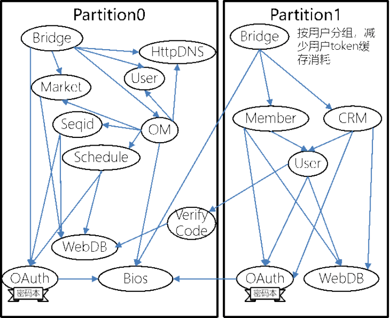
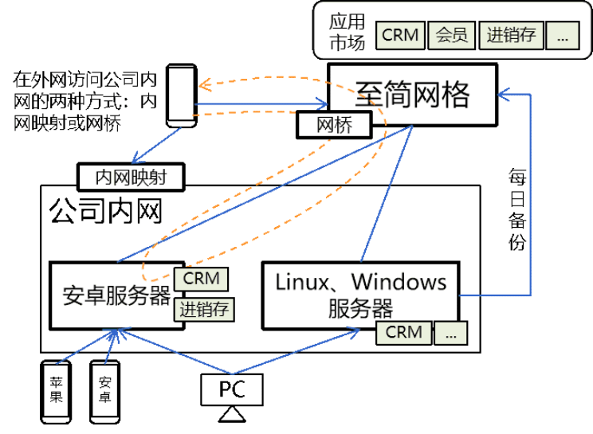
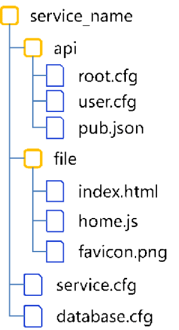
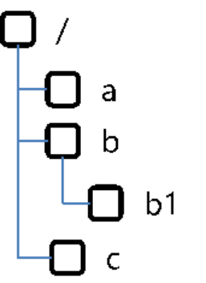
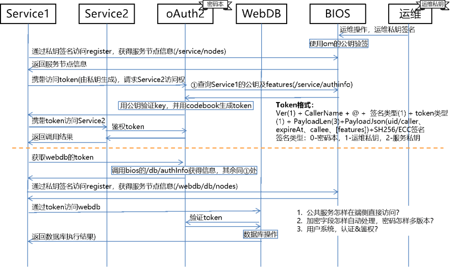
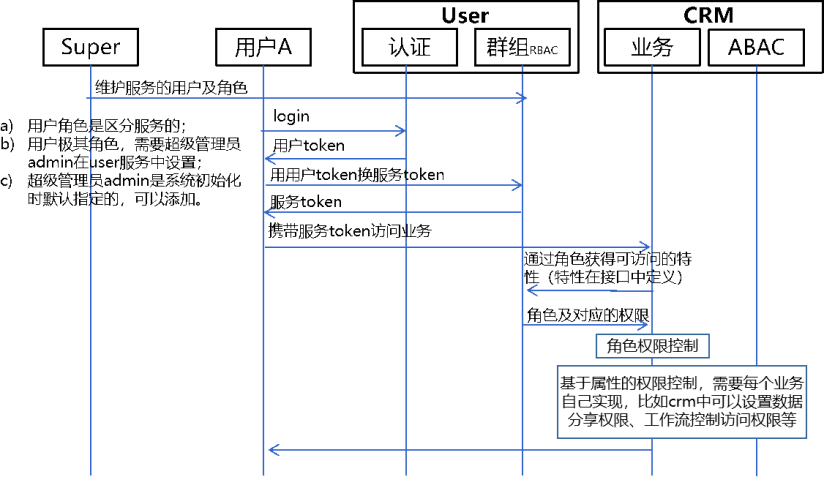
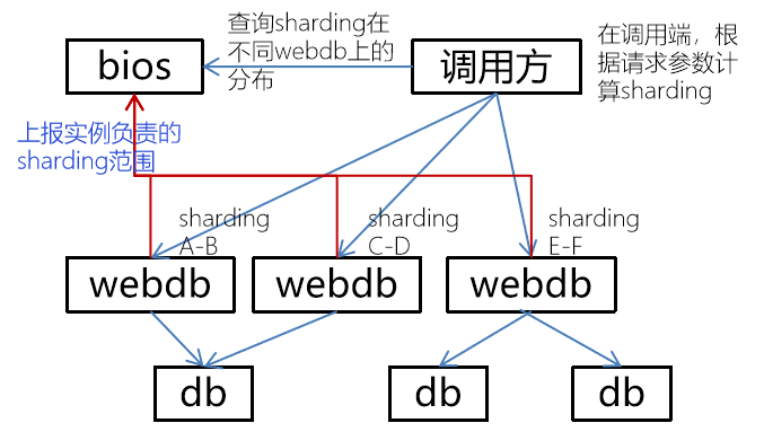
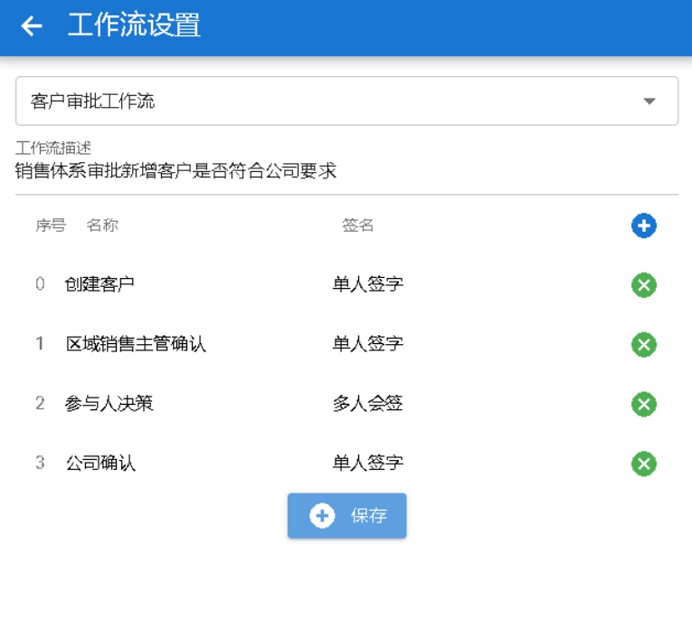
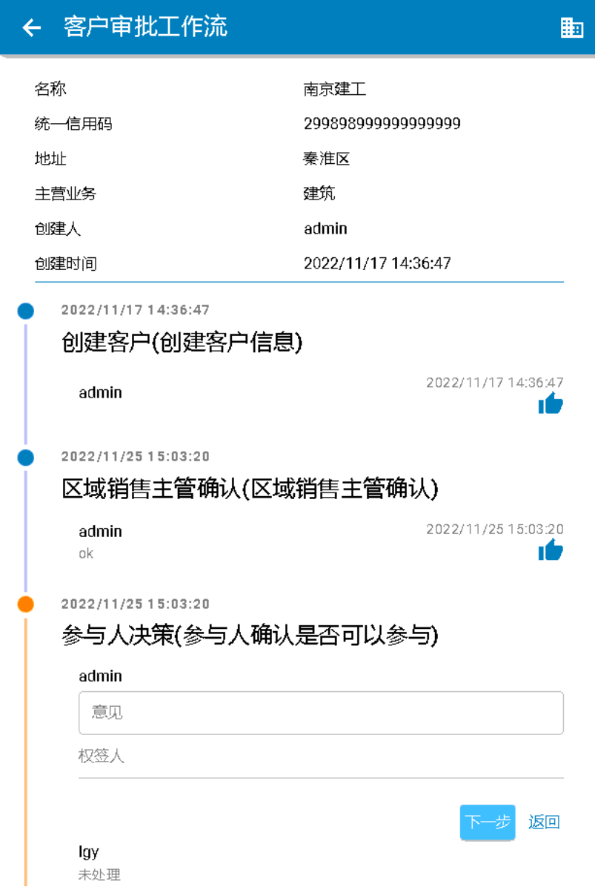

<div align="center" style="font-size:2em;font-weight:bold;">
  至简网格服务开发指导<br>
  
</div>


# 修订记录

| 日期 | 内容 | 作者 |
| --- | --- | --- |
| 2024.3.1 | 创建文档 | flyinmind |
| 2024.4.8 | 增加安装部分的内容 | flyinmind |
| 2026.6.24 | 1）修改占位符；<br>2）转为markdown格式；<br>3）更正部分内容；<br>4）将安装部分删除，独立成一个文档| flyinmind |

# 摘要

至简网格是一款基于HTTP协议的通用业务服务器，用于开发基于数据库的端云结合的服务程序，服务程序可以运行在资源极其有限的设备上，比如安卓手机、树莓派等，使得服务器可以尽量前移到生产端，可以运用于边沿计算、企业信息化、办公自动化等场景。

它致力于简化开发、部署与运维工作；通过简单的配置即可实现数据库、接口开发；内置了可靠性、安全性能力，业务开发无需过多关注；具备伸缩能力，单例模式可以安装在一部老旧的安卓手机上；集群模式可以跨实例、跨机房、跨城市部署。

本文主要用于指导至简网格服务端程序开发，包括数据库定义、接口定义等。

# 术语

| 术语 | 解释 |
| --- | --- |
| 服务 | 能完成一组功能的服务端程序 |
| 业务 | 具有完整的前后端功能的服务程序，与服务并没有明显的界限 |
| 实例 | 运行了一个或多个服务的服务器或虚拟机 |
| 平台 | 包括企业私网中的服务侧、端侧以及提供公共能力的云侧 |
| AZ | Available Zone可用区，通常可理解为一个机房，同城跨AZ部署，建议AZ距离20km左右（取自天津港事件） |
| Region | 区域，通常可理解为一个城市，如果用于异地容灾，建议距离大于500公里（取自唐山、汶川地震最远破坏距离） |
| 分区 | Partition，分区是逻辑上的，一个分区一定在一个AZ中；同一个分区中的服务实例是共享的；除了公共分区（分区号0-1023），不同分区之间不可互访 |



---
# 一、简介

至简网格为解决企业信息化、自动化而生，服务侧与端侧配合，简化信息记录、统计等繁琐的日常工作。至简网格服务端可以安装在多个节点上实现大规模集群工作，承载巨大的访问量， 也可以安装在单个节点上，满足一些小流量的使用场景。

服务器最小可以安装在一部老旧的安卓手机上，使得管理企业服务与使用普通手机应用一样简单。 只需要简单操作就可以实现企业服务的安装、启停、升级、卸载等维护工作，无需聘请专门的技术人员。

至简网格提供的业务软件都是开源的，永久免费使用，只有在使用每日备份等需要占用服务端资源的服务时，才会产生极少的费用，一般每年只需几十元。

如果您的企业有更高的要求，需要对服务进行定制，至简网格为此提供了极大的便利。 服务源码都是JSON格式的文本，即使不是程序员，也容易理解；客户端程序就是普通的页面，通过简单的自学，非常容易掌握，可以根据需要自行修改。实在掌握不了的情况下，也可以聘请低级别的程序员进行修改，因为它的难度对于了解软件开发的人来说，是极其简单的。

安全性与可靠性实现难度高，日常使用时，体现不出价值，但是一旦出现问题，却是致命的。 所以，至简网格内置实现了安全、可靠的特性，应用开发时，不必关注底层的安全与可靠实现细节，这样，极大方便了服务的实现。

无论是服务端还是客户端，都竭尽全力地简化，降低开发难度与使用难度。总之，它是一套非常好用的端云结合的开发框架。

以下是至简网格端云结合的总体框架：



---
# 二、为什么

已经有很多服务端开发框架与端侧开发框架，为什么还要重复造这两个轮子？

首先，没有找到合适的端云配合的框架。

其次，虽然有spring cloud这样的框架，但是它们都太大，一旦使用就会扯进一堆一堆的组件，在极其受限的环境下使用，会带来无穷尽的兼容性问题， 让开发无法推进下去，而至简网格不会放弃安卓、树莓派等平台的兼容性，所以只能放弃。 移动端有Capacitor，因为没有时间研究透彻，不敢轻易使用，electron也是同样；当前的需求并不多，所以都自己动手，减少研究它们的时间消耗。

最后，除了上面那些需要重复造轮子的原因，至简网格还有哪些优势值得选择呢？

1. 小到极致
    服务端、客户端，都不超过10M，PC客户端甚至不到6M。
    极小的端侧体现不出优势，但是极小的服务侧，就便于服务器边沿部署，一部手机、一个树莓派就绰绰有余。因为小，运用场景就可以扩大。 随着通讯能力提升，边缘计算、物联网会变得普遍，至简网格可以方便地部署到各类设备上，将计算尽量下沉。

2. 大到跨市
    麻雀虽小五脏俱全，它可以部署在一部旧手机上，也可以跨城市多活部署。 底层实现是完全分布式的，只要采取合适的分片策略， 或者开启数据备份，完全可以跨机房、跨城市多活部署，不必担心单个设备、单个机房故障导致业务中断。 至简网格在底层实现时就为数据分片提供了便利。

3. 非常简单
	- 开发简单
	服务前、后端代码量都很小，代码很简单。服务侧业务开发，绝大部分情况使用简单的JSON配置就能完成；端侧交互开发，只要懂得vue就能胜任。
比如至简网格提供的CRM、会员两个服务，其中CRM较大，接口定义部分约3500行JSON配置，端侧交互约3500行js代码，总共7000左右，安装包不到100K。
代码即成本，代码量少，开发&维护的成本就少；开发难度低，即使是初级程序员也能开发维护。
	- 维护简单
	安卓版本的服务器，使用起来跟普通App一样安装、升级、卸载，服务一键启停，服务软件下载安装不过几秒钟。与服务对应的端侧应用使用更加简单，秒级安装，自动升级。
	- 使用简单
	已支持安卓与Windows客户端，端侧交互简单；权限控制简单，支持多种业务维度的授权控制，并且用户可以在企业内网使用，也可以开放部分用户在公网访问。

4. 可靠安全

    可靠与安全相关的设计实现，在至简网格随处可见，比如，分区隔离、公司隔离；传输都采用https，使用ECC256证书，安全性达到RSA3072的强度；每个服务实例都自动分配了独一无二的证书；服务间访问都需要token，两个服务器即使在同一个局域网内，默认也不能窜访；用户密钥经过PBKDF2加密存储，即使数据库泄露，也无法解开密码； 数据库两份拷贝，支持每日往云端备份……安全与可靠设计融入到至简网格的方方面面。

---
# 三、服务开发概览

在至简网格中，每个服务对应一个独立的目录，目录中存放端侧界面实现，以及服务定义、数据库定义、接口定义，这些定义文件的内容都是json格式的，很容易理解。

## 服务目录结构

服务的根目录下有api、file两个子目录，以及service.cfg与database.cfg两个文件。



1. api子目录中存放所有的接口定义文件，如果无接口定义，可以没有此目录，每个文件中可以定义多个接口；
	- A) 在调用接口时，url需要携带文件名及接口名，比如调用user.cfg中的接口add，则url为/user/add;
	- B) root.cfg是特殊的，访问其中的接口不必携带/root，直接传/xxxx即可；
	- C) json扩展名的文件存放一个Map结构，Map的每一项都是一个静态接口，其中的内容直接返回，比如roles:{...}，访问时直接调用/roles即可得到大括号中的内容；
	- D) def扩展名的文件是宏定义文件，也是Map结构，每一项都是一个process，在接口定义文件的process部分可以引用宏定义。
2. file子目录存放所有的交互页面，属于[端侧开发](client_dev_guide.md)， 使用vue+quasar实现，起始页固定为index.html，在index.html中import所需的组件；
	- A) 端侧在安装应用时，下载的就是file子目录的压缩包；
	- B) 建议一个组件对应一个js文件，比如home.js、customer.js等;
	- C) 如果无交互界面，可以没有此目录，如果希望服务有一个个性化logo，建议增加file目录，并存放适合的favicon.png文件。
3. service.cfg中定义了服务的名称、依赖的服务等信息；
4. database.cfg中定义了服务的数据库表结构，treedb、searchdb无需建表，但是也需要在里面申明，如果只在本实例使用的数据库，定义在database.loc.cfg文件中，定义方法与database.cfg完全相同。

## service.cfg

service.cfg配置非常简单，格式如下：
```JSON
{
	"author":"flyinmind@zhijian.net.cn", //作者
	"company" : "zhijian.net.cn", //公司或组织名称
	"version":"0.1.0", //版本号
	"dependencies":[
		//依赖的服务列表，如果不申明，就不能调用这个服务
		//webdb、bios、oauth等服务无需申明依赖
		//安卓等平台的单例版本，会根据此处的定义自动添加服务依赖
		//非单例版本，需要在OM平台上设置依赖关系
		{"name":"user", "minVersion":"0.1.0", "maxVersion":"0.2.1"}
	],

	"displayName":"客户关系管理系统" //对外显示的名称
}
```

配置中没有name这样的配置，因为服务的name就是工程的目录名称。

## database.cfg

database.cfg定义了rdb的表结构，treedb、searchdb没有建表操作，但是必须在此申明。
在单例模式（比如在安卓服务器中）运行时，至简网格会自动执行database中的建库、建表操作，根据服务器已有的数据版本，执行对应版本的升级操作。
```JSON
[
	{
		"name":"crm", //库名称
		"version":"0.2.0", //版本号
		"type":"rdb", //类型，有rdb（关系型数据库）、tdb（树形数据库）、sdb（搜索数据库）
		"versions":[
			{
				//minVer与maxVer指定了最小、最大可执行版本
				//如果运行中的数据库版本不在此范围内，sqls中的sql不会执行
				"minVer":"0.0.0",
				"maxVer":"0.1.0",
				"toVer":"0.2.0", //升级后的数据库版本号
				"sqls":[
					//建表或升级sql，一个字符串，字符串中可以换行，可以有多条sql
					"create table if not exists orders ( -- 订单信息
						id int not null primary key, -- seq_id
						...
					)"
				]
			},
			{
				//另一个版本的初始或升级脚本
			}
		]
	},

	{
		"name":"crm", //searchdb的名称，与rdb同名，表示与rdb在同一个库中
		"type":"sdb"
	},

	{
		//treedb的名称，与rdb同名，表示与rdb在同一个库中
		//与rdb共库的情况，需要表名不能有dir、item，否则会造成表名冲突
		"name":"crm",
		"type":"tdb"
	}
]
```
如果数据库只用在当前实例，每个服务实例上的数据是独立的（比如地址查询，每个实例都有完整的地址信息记录），无需同步、备份，这种数据库可以用database.loc.cfg定义，定义方法与database.cfg完全相同。

## 接口文件

接口定义文件分成3类，扩展名分别为cfg、json、def。每个”.cfg“文件中，是一个json数组，数组中每个元素定义一个接口。访问时url有接口定义文件以及接口名称共同决定。比如，在接口文件customer.cfg中定义了create接口，则可以通过 "/customer/create" 访问。
```JSON
[
	{
		"name": "create", //接口名称
		"method":"POST", //调用的method，如果调用方使用的method错误，会返回API_NOT_FOUND错误
		"property" : "private", //public或private，private接口必须在请求头中携带服务token才可以访问，
		"tokenChecker" : "USER", //鉴权类，USER|OAUTH|OM|APP
		"comment":"创建客户，需要在电子流中审批", //描述
		"request": [...],
		"process" : [...],
		"response":[...]
	},
	...
]
```
## 接口宏定义

".def"文件定义宏，宏定义只能是process，可以在接口的process里引用它。比如在def文件中定义一个check\_accounts宏：
```JSON
"check_accounts":{
	"name":"check_accounts",
	"comment":"检查帐号是否都存在",
	"type" : "call",
	"service": "user",
	"method":"POST",
	"url":"/user/userid",
	"tokenSign":"OAUTH",
	"parameters":"{\"accounts\":#ACCLIST#}"
}
```

这个宏可以在接口中多次引用，比如：
```JSON
"process" : [
	{"macro": "check_accounts", "#ACCLIST#":"@{JSON|to,0}"},
	...
]
```
宏可以传递参数，宏参数名称前后要加上“#”，比如上例中的"#ACCLIST#"，这些宏参数最终都转成了字符串替换到宏定义中。

## 静态接口

".json"文件是用来定义静态内容的接口，与type为 [static的处理](#static)不同之处在于“这些接口必须public的”。常用在roles接口中，roles接口是定义服务中用户角色的，比如：
```JSON
{
	"roles": {
		"admin":{"name":"企业主","rights":{"sku":"\*","report":"\*","proxy":"\*"}},
		"sales":{"name":"销售","rights":{}},
		"finance":{"name":"财务","rights":{"report":"\*"}},
		"support":{"name":"服务","rights":{}}
	}
}
```

这样在其他服务中就可以通过调用”/roles“获得服务中支持的角色，以及角色可以执行哪些接口。

---
# 四、接口定义

绝大部分服务都需要服务端接口配合客户端实现端云交互，接口定义的文件都在服务根目录的api子目录下，扩展名有cfg、def、json三种，每种文件记录的都是json格式的接口配置。def文件是宏定义，配合cfg完成接口定义，json文件中记录返回静态内容的接口，本章只讲解cfg文件中的接口定义。

## 总体格式

服务端开发主要是接口定义，每个接口定义分成5个部分， 基本信息（名称、请求方法、属性、token检查方法、接入检查方法等）、变量定义vars、请求参数request、处理逻辑process、响应体response。总体结构如下：
```JSON
{
	"name":"api名称",
	"method":"可接受的请求方法，不设置表示不限,POST|GET|PUT|DELETE",
	"property":"属性，private或public",
	"tokenChecker": "认证方式，property有public时不必设置，[USER,UNIUSER,OAUTH,COMPANY,INIT,MNT,APP,APP-调用方服务名或/*](#服务间认证&鉴权)",
	"aclChecker": "接入检查，只支持RBAC(Role Based Access Control)或者自定义实现",
	"sameAs":"如果接口的request、vars、process、response与某个其他的接口完全一致，则可以增加此配置，指定为那个接口的路径，比如与stats.cfg中的report接口相同，则可以写成/stats/report，此时request、vars、process、response不必配置",
	"feature": "特性，与RBAC配合，用于更加细致的控制[角色授权](#鉴权)",
	"comment":"描述，用于生成接口描述，可不提供",

	"vars":[
		[变量列表，可以有多个](#vars)，每一个都是json对象
	],

	"request":[
		[请求参数列表，可以有多个，支持嵌套复杂结构](#请求request)
	],

	"process":[
		[处理逻辑，可以有多个](#处理process)，也可以应用宏定义
	],

	"response":[
		[响应结果，可以有多个，支持嵌套复杂结构](#响应response)
	]
}
```
多个接口定义可以放在同一个接口定义文件中，扩展名必须是“.cfg”。以json数组方式存储，每个接口定义是数组中的一个元素，比如:[api1DefineJson, api2DefineJson,...]

## 请求request

请求参数是一个json数组，每个元素是一个请求参数定义，可以指定参数名称、类型、取值范围等信息，比如：
```JSON
"request": [
	{"name":"name","type":"string","must":true,"regular":"^[a-z0-9]{1,30}$"},
	{"name":"val","type":"int","must":true,"max":0,"min":10}
]
```

参数与变量可以看作是一类，在脚本中都使用@{paraName}引用。

### 参数定义

根据参数类型，每类参数的配置项有所不同，下表列出了所有的配置项，前面是所有参数共有的配置项，后面根据参数类型列出了特有的配置项。

| 配置项 | 定义 | 类型 | 备注 |
| --- | --- | --- | --- |
| name | 参数名称 | String | 同一个接口的参数列表中，必须唯一 |
| type | 参数类型，不区分大小写 | String | STRING、INT、LONG、FLOAT、BOOL、DATE、DOUBLE、 OBJECT、BYTES、NOW、UUID、SEQUENCE、CONFIG、JSON。 <br>几个特殊类型： <br>Config：从bios的服务配置项中获取内容； <br>Json：json串，作为响应参数时会被转成json对象，作为输入参数时，被转为json字符串 |
| must | 是否为必须参数 | Bool | 如果为true，当请求未携带此参数时，校验失败 |
| max | Number型：最大值； String型：最大长度 | Int | 数值型的情况，默认为该类型能够表达的最大值，比如type为int时，默认为Integer.MAX\_VALUE。 long、double、float以此类推。 String类型默认为255 |
| min | Number型：最小值； String型：最小长度 | Int | 数值型的情况，默认为该类型能够表达的最大值，比如type为int时，默认为Integer.MIN\_VALUE。 long、double、float以此类推。 String类型默认为0 |
| list | 是否为list | Bool | list中每个元素类型都由此参数的type指定； 在Json类型参数中，list指定json是否为一个数组，true时为数组，否则为map |
| maxSize | list中最多的元素个数 | Int | list为true时，才有意义，默认为10240 |
| minSize | list中最少的元素个数 | Int | list为true时，才有意义，默认为0 |
| default | 参数默认值 | 与type指定的参数类型一致 | 当不是必须参数时，可以设置默认值，当参数没有传递时，则参数使用此值。 <br>数值型、String、Bool：填写对应类型的值； <br>Datetime：日期，格式由format指定； <br>Bytes：base64字符串，用keytool生成； <br>Json：一个json字符串； |
| const | 是否为常量参数 | Bool | 常量参数，无需在请求时传递， 必须指定default值，接口定义中可以像普通参数一样使用 |
| dataSeg | 返回内容的字段名 | String | 默认就是name。当响应内容是一个复杂的结构时，可以在dataSeg中指定分级，每级用“.”分隔 |
| options | 可选值列表 | List | 如果请求参数不在可选列表中，则参数校验失败 |
| log | 是否可以打印在日志中 | Bool | 默认为true，表示可以打印到日志中 |
| | | | **Object特有的配置项** |
| props | 嵌套定义复杂的结构 | List | 每一项是一个基本参数配置，用于指定object中的字段。props里面的字段还可以设为object类型，以此实现复杂的结构嵌套。 {"name":"infos", "type":"object", "must":true, "props":[ {"name":"name", "type":"string"}, {"name":"val", "type":"string"} ]} |
| checkAll | 是否检查每个字段 | Bool | 默认为true，检查props中定义的每个字段合法性。 如果是响应内容，checkAll为false时，无论object有什么冗余内容，都会原样放过。 |
| | | | **String特有的配置项** |
| len | 字符串长度 | Int | 本质是将min、max设置成相同的值 |
| regular | 字符串合法性正则检查 | String | 只在String类型参数中有意义 |
| tail | 末尾添加的内容 | String | 在字符串的末尾额外添加的内容 |
| trim | 是否去除首尾空格 | Bool | 默认为false |
| maps | 映射关系 | Map | 将一个值映射成其他值，只在String类型参数中有意义，通常用于多版本的兼容中 |
| codeMode | 编码模式 | String | 需要指定keyName，keyName在OM中配置 encode:加密数据 decode：解密数据 |
| keyName | 加密密钥名称 | String | keystore中密码的名称，密钥第一次使用时会在keystore服务中自动创建 |
| | | | **Password特有配置项（继承了所有String参数的配置项）**|
| rule | 密码强度检查 | String | 以逗号分隔成四个部分，从后向前，可以省略一部分，它们分别为： <br>minLen:最短长度，默认为4 <br>charTypeNum:字符类型数量（大写字母、小写字母、数字、英文标点、其他），默认为3 <br>differentCharNum:不同字符数量，默认为4 <br>accountPara:账号字段名称，用于判断密码是否与账号类似，默认为null，表示不判断 |
| equalsTo | 需要等于的字段 | String | 用在确认密码中，判断本参数必须要等于另外一个参数 |
| | | | **IP特有配置（继承了所有String参数的配置项）** |
| format | 检查字符串是否为合法的IP地址 | String |V4:是否为IPv4地址 <br>V6:是否为IPv6地址 <br>PORT:是否携带了端口号 <br>LAN:是否为内网地址 <br>WAN:是否为外网地址 <br>LIST:以逗号分隔的多个地址 |
| | | | **Sequence特有配置** |
| len | 序列值字节数 | Int | 只可以为4或8，为4时返回Int类型，为8时返回Long类型 |
| | | | **Config特有配置** |
| item | 配置项名称 | String | 在服务设置中配置项的名称 |
| | | | **Datetime、Now特有配置** |
| format | 日期格式 | String | 指定日期输出格式，作为输入参数时，只接受UTC时间戳 |
| | | | **UUID特有配置** |
| base64 | 是否为base64格式 | Bool | 如果为true，则按base64输出，否则按hex输出 |

### 变量

组合一个或多个参数，经过复杂计算后，得到一个新的变量，得到的结果可以在脚本中像普通请求参数一样引用，多次引用并不会导致多次计算。

1. val：配置中可以使用内置[占位符](#五、占位符)；
2. toResp：默认为false，如果设为true，生成的变量会插入到响应的data中。
```JSON
"vars":[
	{"name":"flowid", "toResp":true, "val":"@{SEQUENCE|'flow',i}", "comment":"流程id"}
]
```

## 处理process

一个接口中，可以包括多个处理，常用的处理类型有 js、java、rdb、treedb、search、localrdb、localtreedb、localsearch、call、static、dataexists。

也可以自定义类型，实现IProcessor接口，或继承已有的实现类，再通过AbstractProcessor.register注册到至简网格中； 配置接口时，将处理的type设置成注册的名称后，就可以使用。 或者不注册，直接将handler设置成对应的类即可。 相应的class文件要打包成jar，放在服务根目录下的libs文件夹中，这属于 [高阶开发](#八、高阶开发)，在此不赘述。

除static处理外，其他处理类型都有四个共同配置：
| 属性    |  说明   |
|--------|---------|
| cache  |是否缓存历史结果，只能指定一个占位符，比如@{HASH|cid,service}，此内容作为缓存的key值，读取缓存时，也用相同的key，缓存有效期默认为10分钟|
| ignores|可以忽略的错误码列表，如果发生的错误码在这个列表中，就忽略它，返回OK，否则结束当前处理以及后继的其他处理，返回错误码；[-1]表示忽略所有错误码|
| when   |一个逻辑表达式，确定当前process是否执行，如果返回false则直接跳过当前process<br>只能使用请求参数、变量、请求头或上一步的响应参数作为判断条件|
| convert|将start-end（包括start、end）范围内的错误码全部转换成"to"指定的错误码，info指定错误信息<br>如果“to”为OK，则可以设置data，data必须为一个json字符串，可以使用占位符<br>如果start与end相同，可以简化成code|

### RDB

RDB是使用最多的处理类型，调用webdb/api/rdb/request实现数据库读写。
```JSON
{
	"name" : "sys",
	"type" : "rdb",
	"db":"companydb",
	"sharding":"@{cid}",
	"sqls" : ["replace into config(cid,service,k,v) values(@{cid}, '@{service}', '@{k}', '@{v}')"]
}
```
| 属性     | 说明  |
| ------- | ---  |
| db      |指定需要操作的数据库 |
| sharding|指定分片计算方法，可以引用请求参数、变量、请求头或者上一步的返回结果， 也可以使用token中的数据或请求头中的数据，但是最终结果要转换为一个无符号整型数，更多详情在 [数据分片](#数据分片)中|
| sqls    |可以只有一个sql，也可以有多个；<br>A) 多个sql是顺序执行的；<br>B) 下一个sql可以使用上一个sql的查询结果，通过[占位符](#五、占位符)@\[!xxx\]引用(注意是中括号不是大括号)；<br>C) 每个sql的配置可以是一个字符串，也可以是一个map，通常增删改操作可以写成一个字符串，查询操作写成map，因为需要对返回结果进行定义；<br>D) 多个写sql是放在一个事务中执行的，如果一个发生了错误，则所有操作都会回滚|
| any     |多个sql的情况，如果any为true，则，任意一个执行成功就返回结果，否则将所有sql的执行结果都汇总后再返回|

#### 普通SQL

SQL操作是最常见的接口操作。增删改比较简单，只有成功失败的返回；而查询SQL，因为要设置结果集的返回格式，所以每个sql还有name、multi、metas、merge配置。
```JSON
{
	"name":"vips",
	"multi":true,
	"metas":"each",
	"sql":"select id,name,mobile,update_time from vips order by update_time desc LIMIT @{num} OFFSET @{offset}",
	"comment":"返回字段与search保持一致"
}
```

| 属性  | 说明 |
| ---  | ---  |
|name  |执行结果的名称，在merge为true时，无意义，只用于日志中打印|
|multi |返回结果是否为多行|
|metas |返回结果中每一行是否携带字段名信息<br>each：返回的每行记录中，每个字段都带有列名，如，{mobile:189…}<br>none：  每行记录都是一个数组，如，返回[1,"hello",4]，这样可以减少响应体大小<br>oneCol：如果结果集有多行，且只有一列，可以指定oneCol，返回一个数组， 如，ids:[1,2,3,4...]，这样可以减少响应内容<br>列信息字段名：数据记录按数组返回，但是在最后添加一行各列的列名，如，cols:["name","age",...]，这里的cols就是用metas指定的， 解析时可以利用它，既可以减少返回内容的体积，又可以方便标识每一列|
|merge |是否将结果直接存在HandleResult.data中，当multi为false时才有效<br>false：响应形如data.'name'.mobile:189…，其中的name就是sql配置中的列名称<br>true：响应形如data.mobile:189…，省去了中间一层|

【注意】

1. update_time字段是系统在建表语句中插入的字段，用于辅助数据复制，查询时可以使用；
2. 简单增删改，系统自动添加update\_time及对应的当前时间戳；
3. 复杂sql，比如批量插入，系统需要将它们变成多行简单的sql，逐行添加update\_time。

#### 带JS的SQL

如果SQL比较复杂，需要一些简单的逻辑来拼装，则可以用“js:”开头，后面跟一段复杂的js脚本生成SQL，比如实现一个批量插入数据的处理：
```Javascript
js:var sqls=['insert into tb(a,b,c,d) values']
var vv=@{signers};
for(var i in vv){
	if(i>0)sqls.push(',');
	sqls.push("(@{a},'@{b}',");
	sqls.push(DB.clearInjection(vv[i])); //字符串参数最好先清除sql注入
	sqls.push(",@{ABSHASH|c,d})")
}
DB.sql(sqls.join(''));
```

使用js拼装sql时，所有占位符都可以用，占位符解析时会将字符串中的单引号"'"变为两个单引号"''"。也可以使用服务端内置的js函数（请参考4.3.5）。

#### 带RS的SQL

运行时拼接出来的sql，加载配置时还无法知道sql类型，需要以"rs:"开头。通常用来拼接一个批量执行的sql，通常用@{FOR}、@{SWITCH}等占位符，比如：
```Javascript
rs:@{FOR|services, `;`, `update srvstatus set srvstatus='N',ver=`, e.ver,
` where partId=@{partId} and service='`, e.name, `' and addr='@{addr}'`}
```

运行后会将请求参数services中所有元素拼接成多个update操作，每个update操作之间用“;”分隔。其中的e.ver就是指请求services参数每个元素中的ver字段。

### TreeRDB

TreeDB是记录树状关系数据的数据库，比如：



```JSON
{
	"name" : "createDb",
	"type" : "biosmeta",
	"actions" : [
		{"action":"crtDir", "key":"/service/@{service}/dbs"},
		{"action":"crtDir", "key":"/service/@{service}/dbs/@{db}"},
		{"action":"put", "key":"/service/@{service}/dbs/@{db}/tabledef", "value":""},
		{"action":"put", "key":"/service/@{service}/dbs/@{db}/type", "value":"@{type}"},
		{"action":"get", "key":"/service/@{service}/dbs/@{db}/type"}
	]
}
```
1. action是区分大小写的；
2. 所有的action都有key选项，key唯一指定一个记录；
3. value用于存储key对应的值，如果是一个dir，不必指定value；
4. 一个dir下可以有多条K-V键值对。

| action | 作用 | 备注 |
| --- | --- | --- |
| crtDir | 创建dir | 创建key之前，必须创建对应的父目录，然后在其下面才可以创建多个K-V键值对 |
| rmvDir | 删除dir | 删除dir之前，必须保证dir没有K-V |
| put | 新增或更新键值对 | 必须保证父dir都存在 |
| putIfAbsent | 不存在则添加 | 如果键值对不存在则创建，否则放弃操作，返回2000错误码 |
| putList | 插入数组 | 把value当作一个数组，在其中添加元素；  如果key不存在，则创建它，如果存在，且value不在数组中，则添加 |
| putMap | 插入对象 | 把value当作一个Map；  如果key不存在，则创建它，并将value转为json存入；  如果存在，覆盖它;  传入的value是一个Map |
| puts | 在目录插入多对K-V | 在有key指定的目录下插入多对K-V，value参数是一个Map对象，指定多对K-V |
| get | 获得键值对 | 获得有key指定的value，value以字符串形式返回；返回值的名称可以有as指定，不指定则默认为key参数的最后一段 |
| gets | 获得一个目录下的所有键值对 | 键值对以Map数组返回，每个元素中有key、val、ut；返回值的名称可以有as指定，不指定则默认为key参数的最后一段 |
| getSubs | 列举所有子目录 | 返回由key指定目录下的所有子目录，不包括K-V；返回值的名称可以由as指定，不指定则默认为key参数的最后一段 |
| getSubsAndItems | 列举所有子目录及其拥有的键值对 | 返回由key指定目录下的所有子目录，及它们下面的K-V；每行包括name,key,val三个字段；返回值的名称可以有as指定，不指定则默认为key参数的最后一段。  比如/service/config/dbs下的所有子目录，及各子目录下的所有K-V项 |
| names | 列举目录下所有key | 返回目录所有key的列表；返回值的名称可以有as指定，不指定则默认为key参数的最后一段 |
| getMap | 从Map中取一个字段 | 从Map形式返回，如果未用value指定字段名，则返回整个Map，指定了则只返回字段名指定的值；返回值的名称可以有as指定，不指定则默认为key参数的最后一段 |
| getsMap | 返回目录下所有K-V-UT | 返回由key指定目录下的所有K-V，以及UT更新时间；返回值的名称可以有as指定，不指定则默认为key参数的最后一段 |
| getId | 获得目录id | 返回目录id |
| list | 列举所有子目录 | 返回由key指定目录下的所有子目录，返回内容包括id、name、ut；返回值的名称可以有as指定，不指定则默认为key参数的最后一段 |
| rmv | 删除key |  |
| rmvFromMap | 删除value中的一个key | 把value当作map，删除Map中由value参数指定的key |
| rmvFromList | 删除value中一个元素 | 把value当作list，删除List中由value参数指定的元素 |
| rmvs | 删除目录下全部K-V | 删除由key指定的目录下的所有K-V |

### Search

SearchDB是逆向索引的数据库，用于分词查找。action有put、update、get、rmv。 db指定搜索的库名称，table指定虚拟表名（并不存在实体的表），did指定内容对应的数据唯一标识。

#### put

添加搜索内容，title指定标题，summary指定摘要内容，content指定具体内容；
```JSON
{
	"name" : "createSearch",
	"type" : "search",
	"db": "crm",
	"action" : "put",
	"table":"customer",
	"did" : "@{custId}",
	"title" : "@{name}",
	"summary" : "@{address}",
	"content" : "@{CLEAN|comment} @{business} @{taxid}"
}
```
title、summary、content并无本质区别，只是对照一篇文章的结构逻辑上分成标题、摘要、内容三部分。 每个部分在入库时都会经过分词处理，变成一个一个独立的词语存入库中，也可以在输入时就人为加空格，以提供分词的准去率。

#### update

更新搜索内容，如果数据不存在，则，功能类似put，如果数据已存在，则可以更新title、summary、content，如果某项未传，则此项不更新

#### rmv

删除内容，只需传did参数；

#### get

搜索，get后面可以增加传回的最大结果集行数，content指定要搜索的内容，可以用空格分隔成多个词。
```JSON
{
	"name" : "docs",
	"type" : "search",
	"db": "user",
	"table":"user",
	"action" : "get @{limit}",
	"content" : "@{s}"
}
```

content即为要查找的内容，查找前会经过分词处理，也可以人为在词之间添加空格，以提升分词的准确率。

### LocalxxxDB

每种db都对应有本地版本，localrdb、localtreedb、localsearch。

本地版的各类数据处理的数据，只在服务实例本地可用，数据不会在不同实例间复制，没有两份拷贝，也不会往云端备份。比如地址库，包括了localrdb、localsearch，它只能在一个服务实例中使用。如果服务需要多实例运行，每个实例上的数据库不能有更新操作，否则不同实例上的数据会不一致，导致请求分发到不同会得到不同的结果。

### js

如果基本的数据库操作无法满足处理逻辑，可以使用js进行开发。脚本中可以使用参数、变量，通过@{xxx}引用，前面processor返回的结果可以通过@{!xxx}引用。
```JSON
{
	"name" : "judgeExists",
	"type" : "js",
	"script" : "
		if(@{!vipNum}>0) {
			Mesh.error(RetCode.EXISTS,'vip already exists');
		} else {
			Mesh.success({});
		}
	"
}
```

#### JS扩展能力

除了js基本功能外，系统提供了Mesh、DB、Logger、String、Secure扩展接口，以便于使用js实现更复杂的功能，以Secure类接口最为突出。
除了用在script中，在RDB的"js:"开头的sql中也可以使用，比如拼接sql时有字符串参数，建议使用clearInjection处理一下再拼接。

| 函数 | 备注 |
| --- | --- |
| **Mesh类中的函数** ||
| success(jsonData) | 返回成功的HandleResult，jsonData是返回数据，可以为"{}"，表示无数据 |
| error(errCode, info) | 返回失败的HandleResult，errCode在[RetCode](#返回码)中定义 |
| **DB类** | |
| sql(sql) | 对sql进行检查或做出改变，正常则返回修改后的sql，否则返回FORBIDDEN |
| sqlError(code, info) | 在js中做sql处理时，如果发生错误，调用它返回错误信息 |
| clearInjection(val) | 在js中拼接sql是危险的操作，使用此函数对字符串参数进行处理，避免sql注入 |
| **Logger类** | | |
| debug(s) | 输出debug级别的日志 |
| info(s) | 输出info级别的日志 |
| warn(s) | 输出warn级别的日志 |
| error(s) | 输出error级别的日志 |
| **String类** | | |
| uuid() | 产生uuid字符串，使用base64编码 |
| replaceChars(str, ch, replaceWith) | 在str中寻找ch，并替换成replaceWith |
| chkCreditCode(s) | 判断是否为合法的统一信用码 |
| base64CharCode(c) | 返回一个字符的base64编码，c必须是“a-z,A-Z,0-9,\_,-”中的一个 |
| isLanIP(v) | 判断是否为局域网IP，支持IPv4与IPv6判断 |
| isIPv4(v) | 是否为一个合法的IPv4地址 |
| isIPv6(v) | 是否为一个合法的IPv6地址 |
| **Secure类** | | |
| pbkdf2(pwd, iterCount) | 使用pbkdf2算法，将pwd迭代iterCount次 |
| pbkdf2Check(pwd, savedPwd) | 检查输入的pwd与savedPwd是否一致，savedPwd由pbkdf2函数生成 |
| hash(s) | 计算多int型hash值 |
| longHash(s) | 计算字符串long型hash code |
| absHash(s) | 与longHash类似，但是返回的是大于0的hash code |
| intHash(s) | 将几个字符串连在一起，计算int型hash code |
| cbcEncrypt(plain, key) | 使用AES-CBC算法加密，plain为明文，key为密钥，keyLen可以选择16/24/32。IV为随机产生，并记录在密文的前面16字节中。 |
| cbcDecrypt(cipher, key, kenLen) | 使用AES-CBC算法解密，cipher为密文，其中包括了随机IV |
| gcmEncrypt(plain, key) | 使用AES-GCM算法加密，plain为明文，key为密钥，keyLen可以选择16/24/32。IV为随机产生，并记录在密文的前面16字节中。 |
| gcmDecrypt(cipher, key) | 使用AES-GCM算法解密，cipher为密文，其中包括了随机IV |
| md5(str) | 使用MD5算法对str进行不可逆运算 |
| sha1(str) | 使用SHA1算法对str进行不可逆运算 |
| sha256(s) | 使用SHA256算法对s1,s2,s3…进行不可逆运算，在它们之间会增加分隔符“-” |
| hmacSHA256(str) | 使用SHA256算法对str进行不可逆运算。随机生成16字节key，并记录在结果的前面 |
| hmacSHA256Check(str, saved) | 验证str与saved内容是否一致，saved是hmacSHA256算法生成的 |
| hmacSHA1(str, key) | 使用HMAC-SHA1算法对str进行不可逆运算，key可以是一个随机字符串 |
| isPwdStrong(acc, pwd, min, max, charTypeNum, diffCharNum) | 判断密码强度是否足够。 <br>acc：帐号<br>pwd：密码<br>min：最小长度 <br>charTypeNum：不同字符的数量<br>diffCharNum：不同类型字符数量，0-9\|a-z\|A-Z\|其他，共四类，所以diffCharNum最大为4，最小为1 |
| keyPair(pwd) | ecc算法，产生密钥对，并用pwd加密后返回 |
| privateKey(kp,pwd) | ecc算法，先用pwd解密kp，然后取出密钥对中的私钥 |
| publicKey(keyPair) | 从密钥对中取出公钥 |
| eccEncrypt(plain, publicKey) | Ecc算法，用公钥publicKey加密plain内容 |
| eccDecrypt(cipher,privateKey) | Ecc算法，用私钥privateKey解密cipher内容 |
| keyPairEncrypt(kp,plain) | ecc算法，用密钥对加密plain |
| keyPairDecrypt(kp,pwd,cipher) | 算法，用pwd解密密钥对，并用该密钥对解密cipher |
| changeKeyPairPwd(kp, oldPwd, newPwd) | ecc算法，用原密码oldPwd解密密钥对，然后用新密码加密密钥对后返回 |

### call

用于在一个接口中，调用其他服务接口或本服务的其他接口，可以并发几个调用。call只能调用同一个分区或公共分区中的服务。

| 属性     |  说明   |
| ---      | ---    |
|service   |指定需要调用的服务|
|url       |指定url，其中不必包括“/api”|
|method    |指定调用的方法，只支持POST/GET/PUT/DELETE四种|
|parameters|指定请求参数，可以引用参数或上一步的返回结果，比如GET方法，写成a=1&b=2…；POST方法，只能用json格式，比如：{a:1,b:"x"…}<br>此json串可以直接写出，也可以放在字符串中，比如："{a:1,b:\"x\"…}"|
|tokenSign |表示使用的token类型，可以选择OMKEY、OAUTH、APPKEY三种|
|trans     |表示请求是否将参数全部传递给被调服务|

```JSON
{
	"name" : "addAcl",
	"type" : "call",
	"service":"bios",
	"method":"POST",
	"url":"/acl/set",
	"tokenSign":"OM",
	"trans":true
}
```
如果一个处理中需要发起多个请求，可以在calls中指定多个调用。此时，如果any设为true（默认为false），则只要一个请求成功，则最终结果为成功，其他请求的响应都丢弃；如果为false，则只要有一个响应失败，就返回失败，所有响应都成功的情况下，会将多个响应合并在一起返回。
```JSON
{
	"name" : "dbs&partInfo",
	"type" : "call",
	"any":false,
	"calls" : [
		{
			"service":"bios",
			"method":"GET",
			"url":"/db/serviceDbsDetail",
			"tokenSign":"OM",
			"parameters":"service=@{service}"
		},
		{
			"service":"bios",
			"method":"GET",
			"url":"/company/partInfo",
			"tokenSign":"OM",
			"parameters":"id=@{cid}"
		}
	]
}
```
### static

只有一个data配置项，定义一个静态的json串，响应时始终返回data中的内容。
```JSON
{
	"name" : "segs",
	"type" : "static",
	"data": {"segs":["name","taxid","address","business","creator","createAt"]}
}
```

### var

定义一个或多个参数，与请求中的[vars](#vars)定义相同，在下一步可以当作普通参数使用，比如@{varName}。
toResp为true时，内容会作为响应的字段返回。

```JSON
{
	"name":"get_user_id",
	"type" : "var",
	"vars":{
		{"name":"uid","val":"@{SEQUENCE|'userid',i}","toResp":true}
	}
}
```

### 组合处理

一个接口可能由多个processor组合而成，比如用户注册接口，首先校验验证码，然后判断用户是否已经存在，最后才是将用户名、密码录入数据库。每个processor可以是基本的数据库操作，也可以调用其他服务的接口。

多个processor是逐个执行的，后面的processor可以使用前面processor的返回结果，通过@{!xxx}引用，与请求参数唯一不同的地方是在名称前加一个感叹号。

当前存在一个限制，如果多个processor都是数据库写操作，比如有A、B、C三个数据库写操作，当A成功，B失败，则C不会执行，但是A写入的内容不会回滚。这一点，在接口设计时必须给以特别关注。

下面是创建用户的例子，首先判断是否存在，如果存在，则在第一步就返回错误码了；然后生成用户id；再然后记录用户数据；最后产生模糊搜索的内容。

四个步骤中，任何一个步骤出错，都会直接退出，并返回错误码。比如第三步创建用户数据成功后，但是创建搜索数据失败，则创建用户失败，但是用户数据并不会回退。

```JSON
{
	"name": "add",
	"method":"POST",
	"property" : "private",
	"feature" : "user",
	"aclChecker" : "RBAC",
	"tokenChecker":"USER",
	"comment":"添加新用户",
	"request": [
		{"name":"account", "type":"string", "must":true, "regular": "^[a-zA-Z0-9_]{1,40}$"},
		{"name":"password", "type":"string", "must":true, "min":1, "max":40},
		{"name":"nickName", "type":"string", "must":true, "min":1, "max":40, "comment":"昵称"}
	],

	"process" : [
		{
			"name" : "judge_whether_user_exists",
			"type":"dataexists",
			"db":"user",
			"expect" : false, //如果存在，则返回EXISTS，否则返回OK
			"numSeg":"rowNum",
			"sqls" : [{
				"name":"countUser",
				"metas" : "each",
				"merge":true,
				"multi":false,
				"sql":"select count(*) rowNum from user where account='@{account}'"
			}]
		},

		{
			"name":"get_user_id",
			"type" : "var",
			"toResp" : true,
			"vars":{"uid":"@{SEQUENCE|'userid',i}"
		},
    
		{
			"name" : "register",
			"type" : "rdb",
			"db":"user",
			"sqls" : [
				"insert into user(id,account,nickName,pwd)
				values(@{uid},'@{account}','@{nickName}','@{PBKDF|6,password}')"
			]
		},

		{
			"name" : "create_search",
			"type" : "search",
			"db":"user",
			"action" : "put",
			"table":"user",
			"did" : "@{uid}",
			"title":"@{account}",
			"summary":"@{nickName}"
		}
	],

	"response":[
		{"name":"uid", "type":"int", "comment":"用户id"}
	]
}
```

## 响应response

### 响应格式定义

如果对response没有做特殊转换，可以不用定义，各个处理返回内容会全部响应给请求方。当需要对响应的字段做格式检查、转换、解密等情况时，必须定义。responose可以是一个json对象也可以是一个json数组，其中字段定义与request中的字段定义形式相同。

比如，下面这段是会员中的/vip/get接口的响应格式定义，因为mobile字段需要解密，所以需要定义response的格式。
```JSON
"response": [
	{"name":"creator", "type":"string"},
	{"name":"createAt", "type":"long", "comment":"建档时间"},
	{"name":"name", "type":"string", "comment":"VIP称呼"},
	{"name":"birth", "type":"int"},
	{"name":"sex", "type":"string"},
	{"name":"mobile", "type":"string", "codeMode":"decode", "keyName":"vipKey"},
	{"name":"ext", "type":"json", "comment":"扩展信息，解析为json"}
]
```

响应内容的解析是需要占用CPU的，如果不是特别需要，可以不用定义。考虑到有些服务希望自动生成文档，那么就需要定义response的字段，但是，可以设置在运行时不解析。这时就需要将response定义成一个json对象，例如：
```JSON
"response":{
	"check":false, //默认为true，即，只要定义了response，就默认解析
	"segments":[
		{"name":"ver", "type":"int", "comment":"版本"},
		{"name":"serviceId", "type":"int", "comment":"服务id"},
		{"name":"digest", "type":"string", "comment":"版本校验码"},
		{"name":"updateAt", "type":"string", "comment":"更新时间"},
		{"name":"features", "type":"string", "list":true, "comment":"更新的点"}
	]
}
```

如果中间处理过程产生了响应内容，但是又不希望它们返回，可以定义一个空的response。
```JSON
"response":[]
```
### 响应内容

所有响应的顶层结构都是一样的，包括返回码code、信息info，如果是查询类的请求，会包括数据data字段，每个查询类接口的data都不相同。data中存放的内容就是在response中定义的。
```JSON
{
	code:0,
	info:"Success",
	data:{
		a:1,
		b:"xxx",
		c:{…},
		d:[…]
	}
}
```

1. 如果定义了返回格式，在返回前，只返回定义了的字段内容，并且检查其合法性，其他内容都会丢弃；
2. 如果无response定义，则不会做任何过滤，处理中返回什么内容，全部返回；
3. 如果是一个长度为0的response，则会丢弃所有内容，如："response":[]。

### 返回码

响应体中的code为返回码，如果无错误则为OK(0)，返回码在js脚本中用RetCode.xx可以直接引用，code定义如下：

| 名称 | 值 | 含义 |
| --- | --- | --- |
| OK | 0 | 成功 |
| DEPRECATED | 1 | 接口即将废弃 |
| INTERNAL\_ERROR | 100 | 内部错误 |
| INVALID\_TOKEN | 102 | 无效token |
| EMPTY\_BODY | 103 | 请求体错误，用在POST请求中 |
| DB\_ERROR | 104 | 数据库错误 |
| INVALID\_SESSION | 105 | 无效的session |
| SERVICE\_NOT\_FOUND | 106 | 服务不存在 |
| TOO\_BUSY | 107 | 系统太忙 |
| SYSTEM\_TIMEOUT | 108 | 系统超时 |
| NOT\_SUPPORTED\_FUNCTION | 109 | API存在，但是所需的功能不支持 |
| API\_NOTFOUND | 110 | API不存在 |
| NO\_RIGHT | 111 | 无权调用 |
| NO\_NODE | 112 | 找不到可用的节点提供服务 |
| INVALID\_NODE | 113 | 无效的节点，比如数据库分片的情况下，请求发到错误的webdb实例上 |
| THIRD\_PARTY\_ERR | 114 | 调用第三方服务失败 |
| UNKNOWN\_ERROR | 150 | 未知错误 |
| EXISTS | 2000 | 已经存在 |
| NOT\_EXISTS | 2001 | 不存在 |
| API\_ERROR | 3000 | API错误 |
| WRONG\_JSON\_FORMAT | 3001 | JSON体解析失败 |
| INVALID\_VERSION | 3002 | 版本错误 |
| DATA\_WRONG | 3003 | 数据错误 |
| WRONG\_PARAMETER | 4000 | 参数错误，在参数定义中列表中，第几个参数错误，就加多少，比如第一个参数错误，返回4001，以此类推 |
| SERVICE\_ERROR | 5000 | 业务相关错误，可以自定义 |
| INVALID\_STATE | 5001 | 无效的状态 |
| CLIENT\_ERROR | 100000 | 客户端发生错误 |
| NO\_OPERATION | 200000 | 没有任何可以执行的操作，只用于服务侧 |

---
# 五、占位符

在sql、js脚本，以及一些配置项中（比如searchdb、 treedb的action、 title、 when中），可以引用请求参数、变量、响应参数、系统参数、请求头。

| 格式     | 类型 | 说明 |
| ---     | --- | --- |
| @{xxx}  | 请求参数 | 引用参数列表中的字段，如果引用了不存在的请求参数，启动时会失败；可以包含'.'，表示多级引用 |
| @{^xxx} | 请求头参数 | 引用http请求头中的字段 |
| @{!xxx} | 响应参数 | 前面处理的响应内容；可以包含'.'，表示多级引用 |
| @{#xxx} | 系统参数 | 1)tokenCaller、tokenCallee、tokenPartId、tokenAcc、tokenCid、tokenExt：token中的信息，在私有接口中才有； 2)reqAt参数：接受到请求时的utc时间戳； 3)shard分片号：从接口配置的sharding字段计算得出； 4)result：上一步的执行结果，与convert结合使用才有意义，因为任何一个处理只要返回值不是OK，则整个处理就终止了，不会走到下一步。 |
| @[!xxx] | 前面步骤执行的响应内容 | 通常用在RDB处理中使用。当有多个sql时，上一个sql查询处理完毕，下一个sql可以使用上一个sql的结果集，比如@[!UserNum]。 【注意】这种参数在请求端不会被编译替换，而是在webdb中执行时才会被替换，所以对性能有少许影响 |

单纯的变量不能够满足某些特定的功能，比如要对字段加解密，这时需要用到一些函数，使用时，将函数名放在参数前面，并用“|”分隔，参数可以是请求参数、响应参数，也可以是系统参数、请求头，比如:
```
@{HASH|#token...,para,!resp,1,'xxx'}
```

下表是系统可以支持的函数占位符：

| 名称 | 功能 | 举例 | 说明 |
| --- | --- | --- | --- |
| HASH | 计算HASH值 | @{HASH\| #token..., name, 1, \`xxx\`} | 返回HASH值，HASH算法与Java保持一致；如果有多个参数，它们之间使用“-”连接；<br>默认为long型，如果第一个参数是“i”或“int”，则返回int型hash值 |
| ABSHASH | 计算绝对HASH值 | @{ABSHASH\| #token..., name, 1, \`xxx\`} | 返回HASH绝对值，HASH算法与Java保持一致；如果有多个参数，它们之间使用“-”连接；默认为long型，如果第一个参数是“i”或“int”，则返回int型hash绝对值 |
| HASHMOD | 计算HASH绝对值，并求余 | @{HASHMOD\|mod, #token..., name, 1, \`xxx\`} | 将参数进行HASH计算后得到一个整型绝对值，得数与mod求余；如果有多个参数，它们之间使用“-”连接；HASH算法与Java保持一致 |
| MD5 | 计算MD5 | @{MD5\|#tokenxxx, name,1,\`xxx\`} | 格式类似HASH，可有多个参数，它们之间用“-”连接，输出一个base64编码的字符串。 |
| SHA256 | 计算SHA256 | @{SH256\|#tokenxxx,name,1,\`xxx\`} | 类似MD5，只是算法不同 |
| HMACSHA256 | 计算HMACSHA256 | @{HMACSHA256\| para1, name, 1, \`xxx\`} | 类似MD5，只是算法不同；算法中的可以是随机生成的16字节内容，记录在结果的前16字节；在js脚本中可以使用 Secure.hmacSHA256Check(str, savedStr)进行校验，其中savedStr就是此处生成的字符串 |
| PBKDF | 计算PBKDF2 | @{PBKDF\| iter,para} | iter为迭代次数，para为被混淆的字符串；在js脚本中可以使用Secure.pbkdf2Check(str, savedStr)进行校验，其中savedStr就是此处生成的字符串，也可以用进行校验，返回true或false |
| PBKDFCHECK | PBKDF2校验 | @{PBKDFCHECK\| str, savedStr} | str为传入参数，savedStr是用来检验的参数，比如从数据库取出 |
| UTC | 对UTC时间戳进行格式化 | @{UTC\|utc,offset[,outputFmt[,inputUnit]} 在offset指定的时区中使用outputFmt格式化输出时间戳。 <br>@{UTC\|utc,480,dayofmonth,unit60000} 东八区，输入UTC分钟，输出某月的几号 @{UTC\|utc,460,'yyyy-MM-dd HH:mm'} 东七区，输入UTC毫秒，输出完整日期加时间 @{UTC\|utc,460,monthstart,month} 东七区，输入UTC月份数，输出此月第一秒的时间戳 | offset定义输出时的时区，单位为分钟； <br>inputUnit定义输入utc值的单位，默认为1ms，比如传入的是分钟，应为60000。 <br>month、ymd是两个特殊的单位，month表示传入的utc的是从公元元年1月到现在的月份数，ymd表示传入的utc格式为yyyyMMdd的一个整数； <br>outputFmt定义输出格式：其中hex（16进制形式）、base64、unitxxx（unit后面指定毫秒数，比如输出天数为unit86400000）， 这三个格式只是改变了utc时间戳的表现形式，对时区无要求，填任意值都可以。 <br>以下格式化依赖时区偏移offset设置： yyyy-MM-dd HH:mm:ss 格式化输出utc时间戳 <br>months：从公元元年1月1号到时间戳指定时间的月数 <br>month：时间戳指定时间的月数，1月返回0，'MM'格式化1月返回的是1 <br>dayofmonth：时间戳指定月度的几号，1号返回0 <br>dayofyear：时间戳指定年份的第几天，第一天返回0 <br>monthstart：返回utc所在月度的第一天00:00:00 <br>monthend：返回utc所在月度的下个月第一天00:00:00 <br>weekstart：返回utc所在星期的第一天00:00:00 <br>weekend：返回utc所在星期的下个星期第一天00:00:00 |
| NOW | 当前时间 | @{NOW\|unit86400000}转换成UTC天数 @{NOW\|yyyy-MM-dd HH:mm:ss,480} 转换成东八区时间字符串 | @{NOW\|[fmt[,offset]]}当前UTC时间戳， 与@{#reqAt}是同一个值，在一次请求中，多次引用@{#reqAt}或@{NOW}，结果都相同； 不同点在于@{NOW}可以携带格式化信息，@{#reqAt}不可以;#reqAt可以在其他占位符中使用，但是NOW不行，比如@{MD5\|#reqAt,'test'}； 无fmt的情况，默认返回当前utc时间戳；有fmt时，定义与UTC相同<br>offset是时区偏移，如果不设置，则默认使用服务器的时区设置。 |
| NEXTPERIOD | UTC时间的下一个周期 | @{NEXTPERIOD\|'D',0}明天的0点 @{NEXTPERIOD\|period,bias}，其中period、bias为请求参数或变量名称 | @{NEXTPERIOD\|type(D/M/W/H/C),val}， type、val都可以为参数名称，也可以是具体的值 当type为D/W/M/H时，val为与起点的时间间隔，type为C时，val为周期时长;val的单位为毫秒 |
| COALESCE | 返回第一个非空值 | @{COALESCE\| para1, para2, \`\`} | 如果para1为空，则返回para2，如果para2也为空，则返回空字符串 |
| IFVALID | 非空则连接其他参数并返回，否则返回空字符串 | @{IFVALID\| para1, \`xx-\`, para2} | 如果para1为空返回“”，否则返回“xx-para2”，用于解决sql不能处理java的null问题 |
| IFNULL | 非空则返回，否则返回第二个参数指定的字符串 | @{IFNULL\|[!]para1,null[,num/number/obj/object]} | 如果para1为空返回null字符串，否则返回para1的值；如果指定为num/number/obj/object类型，则返回时不会加引号 |
| CONCAT | 连接 | @{CONCAT\|para1, \`-\`, para2, \`-\`…} | 连接多个参数 |
| ENCODE | 数据加密 | @{ENCODE\| keyName, paraName [,keyTime]} | keyName指定密钥的名称，运行时，如果keystore服务中不存在此密钥，会自动创建；加密时可以加keyTime(最大有效天数，默认为366天，最短1天)，到期后会产生新密钥，但是老密钥仍然可以解密；在一些安全性要求很高的场景中，可以设置较短的有效期。 在js或sql中可以通过@{DECODE\| keyName, paraName}解密。也可以在参数配置中将codeMode设为decode，并且设置keyName |
| DECODE | 数据解密 | @{DECODE\| keyName, paraName} | keyName指定密钥名称。无需事先创建，运行时，如果无此密钥则会自动创建它 |
| UPPER | 转大写 | @{UPPER\| paraName} | 将参数转为大写 |
| LOWER | 转小写 | @{LOWER\| paraName} | 将参数转为小写 |
| CLEAR | 清除字符串中指定的字符 | @{CLEAN\|str,'char\_list'} | char\_list中列出所有需要清除的字符，支持转义，比如'\\t\\0\\n' |
| SUBSTR | 取子字符串 | @{SUBSTR\|pname, 0, 2}取字符串参数前面两个字符 | @{SUBSTR\| paraName, start[, len]} start开始位置，len指定子字符串的长度，可以未指定，则表示从start到末尾，如果len超过字符串末尾，则取到末尾为止 |
| ECKEYPAIR | 使用ECC密钥对进行加解密、签名&验签 | @{ECKEYPAIR\|encode, keypair, content, pwd}，使用ecc密钥对进行操作 | @{ECKEYPAIR\|cmd, keypair, content[, pwd]} cmd有new、public、encode、decode、sign、verify： 1）@{ECKEYPAIR}，不用带任何参数，产生一个不加密的密钥对； 2）@{ECKEYPAIR\|new, pwd}，产生一个用指定密码加密的密钥对； 3）@{ECKEYPAIR\|public, keypair}，获取密钥对公钥，携带了版本号信息，因为公钥不加密，所以无论keypair是否加密都可以获取； 4）@{ECKEYPAIR\|sign, keypair, content[, pwd]}，用密钥对对content进行签名； 5）@{ECKEYPAIR\|verify, keypair, content, signature[, pwd]}，用密钥对验证签名，需要多一个signature； 6）@{ECKEYPAIR\|encode|decode, keypair, content[, pwd]}，用密钥对加密或解密。 keypair为密钥对，content是待加解密、签名&验签的内容，pwd是密钥对密码，如果没有，可以不提供。 它们都可以用参数名，也可以是直接的字符串内容 |
| SPLIT | 字符串切割 | @{SPLIT\|para,len\_or\_spliterChar, spliter} | 将para参数按固定长度len切割成多段（不足len的不会填充尾部）；或者通过分隔符分成多段；分隔后再使用分隔符spliter连接起来，连接时会加上合适的引号 |
| STRPART | 字符串切割后的一个单元 | @{STRPART\|para,spliter,partNo} | 将字符串按spliter分隔成多个子字符串，取出编号为partNo的子字符串，编号从0开始，如果partNo小于0，表示返回最后一个。spliter可以是正则表达式 |
| REPLACE | 字符串查找替换 | @{REPLACE\|para,regular,replaceWith} | 将字符串中所有匹配regular的部分替换成replaceWith。regular可以是正则表达式 |
| URL | 对URL参数等进行编码或解码 | @{URL\|cmd,para} | 对para进行URL编码或界面，cmd可以是encode、decode或append。 如果是append，格式为@{URL\|cmd,urlPara,k1,v2,k2,v2...} |
| LIST | 将LIST连接为字符串 | @{LIST\|[!]paraName[.segName\|colNo][,quote]} <br>1)对象列表：@{LIST\|uids.uid,\`\`}； <br>2)普通列表：@{LIST\|uids,\`'\`} <br>3)列表的列表：@{LIST\|uids.0,\`\`} <br>4)map：@{LIST\|members.v,\`'\`} | 多个元素用逗号“,”分隔。用于解决NORMAL中数组自动加“[]”的问题，加了“[]”，在sql中就无法使用。 如果list中元素是对象(map)，segName指定字段名，处理时取出每个对象的指定字段；list元素也可以是list，此时segName是数字，用以指定列号，列号从0开始。 如果没有segName，则当作普通list处理，直接将list中元素转为字符串列出来。 |
| ELEMENT | 从对象或数组中取出元素 | @{ELEMENT\|[!]paraName,sn/name/[!]paraName]}|1)如果是数组，则第二个参数必须为数字，否则返回null； <br>2)如果是对象，则第二个参数指定字段名称，可以支持用'.'分隔多级 |
| JSON | 将复杂对象转为JSON串 | @{JSON\|para[,defaultVal[,quote,safeQuote]]} | para为任意类型的参数，defaultVal是在para为空时的默认值，一个字符串；同时可以指定引号 |
| CLEAN | 清除JSON中的字段名称 | @{CLEAN\|json} | 只可用于JSON类型的参数，将json字段名全部清除，返回一个字符串。通常用在生成全文索引中 |
| SIZE | 返回参数的长度 | @{SIZE\|[!]para} | para可以是list、map或string |
| SUM | 对列表中元素求和 | @{SUM\|type,[!]paraName[.segName|colNo]} 1)简单列表：@{SUM\|double,scores}； 2)对象列表：@{SUM\|d,students.score}； 3)列表的列表：@{SUM\|i,students.0} | 将所有成员求和，如果指定了字段名，则源数据必须为一个对象列表； 如果是列表的列表，segName可以指定为列号；都不指定，则认为传入的是数值列表。 <br>type支持long、double、int、float等，也可以用简写l、d、i、f，浮点数支持精度控制，比如f.3，与@{CALCULATE}相同 \|
| MIN | 从列表中找到最小的一项 | @{MIN\|int,list}从列表list中取最小值 @{MIN\|int,list.a}列表元素是对象，取每行a字段的最小值 @{MIN\|int,list.0}列表元素是列表，取每行第1列的最小值 | @{MIN\|type,[!]paraName[.segName/colNo]} 从列表paraName中取最小值，如果是对象列表，可以指定对象中字段的名称；如果是列表的列表，可以指定列表的列号 |
| MAX | 从列表中找到最大的一项 | @{MAX\|int,list}从列表list中取最大值 @{MAX\|int,list.a}列表元素是对象，取每行a字段的最大值 @{MAX\|int,list.0}列表元素是列表，取每行第1列的最大值 | @{MAX\|type,[!]paraName[.segName/colNo]} 从列表paraName中取最大值，如果是对象列表，可以指定对象中字段的名称；如果是列表的列表，可以指定列表的列号 |
| FOR | 对一个变量进行循环处理 | 对list或数组参数进行循环，每个元素用e代替；如果e是对象，可以用e.开头引用成员； i是循环序数，从0开始； 所有需要用引号的地方，建议都使用"\`"，而不是单引号。sql本身使用单引号，特别是出现“;”或“)”的地方，不可以使用单引号，否则无法解析。 支持设置过滤条件，在pl后面加“()”，然后加过滤条件，条件判断与@{CONDITION}完全一致 \| @{FOR\|pl,\`,\`,\`(\`, i, \`,'\`, p2, \`',\`, e.a, \`,\`, e.b, \`,\`, \`,'')\`} pl必须是一个list或数组，第二个参数是分隔符；后面都是要拼接的参数或常量，每循环一次，将他们拼接起来，然后加一个分隔符<br>例子中如果pl=[{a:11,b:"x"},{a:12,b:"y"}]，p2="hello",运行后将得到: (0,'hello',11,x,''),(1,'hello',12,y,'') {FOR|pl(e.a,'i.>',1 && e.a,'i.<',20),\`,\`,\`(\`, i, \`,'\`, p2, \`',\`, e.a, \`,\`, e.b, \`,\`, \`,'')\`} 运行后将得到: (0,'hello',11,x,'') |
| ADD、SUB、MULTI、DIV | 加减乘除运算 | @{ADD\|类型[.精度], para1, para2} | 类型有int、long、float、double，指定了参数类型与返回类型， 精度只有在类型为float、double时有效，范围在0-7，可以不指定； para1与para2必须是对应类型的数值 |
| CALCULATE | 将type后面的所有内容拼接成一个四则算式并计算结果 | @{CALCULATE\|type,p1,'+(',p2,'-',p3,')-',p4} | type与ADD等的定义相同，p1、p2等必须是数值类型。 算式必须符合四则运算规则，可以很复杂；而ADD等只能执行两个数值的运算，但是比CALCULATE高效 |
| CONDITION | 条件判断 | @{CONDITION\|p1,relation,p2,o1,o2} @{CONDITION\|p1,'i.<',p2,o1,o2} @{CONDITION\|3,'i.>',5,o1,o2} @{CONDITION\|p1,'o.==',null,o1,o2} @{CONDITION\|p1,'b.==',true,o1,o2} | p1与p2必须是relation中给定类型的参数 relation为关系运算符，格式为"类型+'.'+比较运算符"，比较运算符支持>,<,>=,<=,==,!=。 如果是string，还支持~,!~，用于判断p1是否匹配正在表达式p2； 如果是object、bool，只支持!=,==，object可以支持null，bool支持true、false 类型有:int(i)、long(l)、float(f)、double(d)、string(s)、object(o)、bool(b)，可以用括号中的缩写 <br>如果p1、p2满足条件，则返回o1，否则返回o2，o1、o2可以不传，默认为1、0 @{CONDITION\|p1,'s.==',p2,'true','false'}, @{CONDITION\|p1,'i.>',p2,'1','0'}与@{CONDITION\|p1,'i.>',p2}等同 |
| SWITCH | 将多个IF-ELSEIF-ELSEIF...-ELSE汇聚在一起，用“\|”分隔 | 每个判断与CONDITION中判断方式相同 如果为true，则将判断之后的内容拼接起来返回 在第一个为true的判断后结束，后面即使有true的也不会运行 | @{SWITCH\|p1,'i.>',p2,'a','b','c',\|,'def'}如果p1>p2则返回abc，否则返回def字符串 用'\|'分隔多个if、else if以及else。else分支必须有 |
| VERCONVERT | 将字符串版本号转为一个整数，或者将整数转为版本号 | @{VERCONVERT\| \`11.22.33\`}、@{VERCONVERT\|1001,tostr} | 版本号的没段存成十进制数的3位，比如例子中转为整数11022033，所以版本号中每段不能超过三位数 |
| CONST | 常数 | @{CONST\|type,name} | type支持int(i)、long(l)、float(f)、double(d)、char(c)，name支持min、max、ver、tzOffset，tzOffset的类型只支持int(i) |
| SRCIP | 请求的源地址 | @{SRCIP\|remote}、@{SRCIP} \| 设置了remote表示返回地址考虑了nat转换，否则返回链路中上一跳的地址 |
| CONFIG | 服务级配置项 | @{CONFIG\|configItem} | configItem指定配置项名称，实际存储时会在前面增加"para\_"前缀 |
| SEQUENCE | 在集群多实例的情况下实现持续增长的id，不保证连续 | @{SEQUENCE\|i,\`customer\`} @{SEQUENCE\|customer,[len[,cidParaName]} | 第一个参数指定类型，有i/int、l/long两个选择，不输入则默认为int； 第二个参数是名称，可以加单引号，也可以不加，在同一个服务内必须唯一； len指定返回顺序数的后面多少个十进制位，0表示全部返回； 如果在公共接口中使用，没有token，系统不知道从属的公司id，所以需要提供cid参数的名称 |
| COUNTER | 服务实例级别的计数器，每次重启后从0开始 | @{COUNTER\|4,'head'}、@{COUNTER\|para} | 默认输出长度为0（原样输出），不加头部。len大于0，则超出len部分截断，不足部分补0； 同一服务的相同实例上是连续递增的，不同实例之间无法保证连续性，实例重启后又从0开始 |
| RANDOM | 产生随机数 | @{RANDOM\|l/i/d/f/c/s, min, max]} @{RANDOM\|s,len,base]} | l:长整型数，i:整型数，d:双精度浮点数，f:单精度浮点数，c:字符（0-65535）。min、max指定最小、最大值； s:包含base64/base32/hex字符的字符串，len指定字符串长度，base有16、32、64可选，默认为64 |
| UUID | 产生UUID字符串 | @{UUID\|16}、@{UUID\|64} | 可以指定输出格式，16表示HEX方式，64表示base64方式 |
| UNIQUEID | 先产生UUID字符串，然后输出该字符串的HASH绝对值 | @{UNIQUEID\|int}、@{UNIQUEID\|l} | 默认为long型，如果有参数“i”或“int”，则返回int型hash绝对值； 此ID并发真正的唯一ID，经测试，int型有千分之一的重复率，long型约百万分之一的重复率。 如果需要真正的唯一ID请使用SEQUENCE占位符 |
| FILE | 将指定文件存到模板临时目录 | @{FILE\|para,path[,rootpath]} | 用在服务端模板中，存文件到指定目录，可以是base64格式，也可以是原始文件 |
| BASE64IMG | 将指定图片存到模板临时目录 | @{BASE64IMG\|para,path[,rootpath]} | 用在服务端模板中，存图片到指定目录，可以是base64格式，也可以是原始文件 |

---
# 六、认证&鉴权

## 服务间认证&鉴权

服务间调用如果不加限制，会导致滥用却难以定位的问题。认证后，可以清晰地知道请求方是谁，并能做相应的限制，比如流控、鉴权等。

当接口定义的property中有private属性，则在服务接口定义中可以指定tokenChecker来对请求鉴权，tokenChecker有以下几种：

| 名称  | 描述  |
| ---   | ---  |
| OAUTH | 服务间认证，必须在管理台设置调用关系；在安卓服务器中，启动时已根据service.cfg中申明的依赖关系，自动设置 |
| INIT  | 服务初始化调用的接口，运行OM服务调用、后台服务调用或服务自身的调用 |
| APP   | 同一个服务内部不同接口之间的互相调用，比如webdb的数据同步接口； <br>如果是“APP-允许的调用方服务名”，则表示只允许某个服务调用此接口，这点极大地方便了服务回调，调用方服务调用时，必须使用自身的私钥签名；  也可以指定为APP-\*，表示任何服务都可以调用 |
| MNT   | 管理类接口，容许后天服务调用或OM服务的调用 |

服务间OAUTH认证是最重要的一类认证，APP(调用方服务名)、OM也是服务间认证，除了实现不同，其他是一样的。 以下主要介绍服务间OAUTH认证。

### 认证

OAUTH依赖oAuth2服务，如下图，Service1访问Service2：



1. Service1先用自己的私钥签名生成AppToken，访问oAuth2；
2. oAuth2从BIOS中获得Service1的公钥与可访问的features列表，并用公钥验证AppToken；
3. 如果通过，则用自己的codebook生成Service2的token返回给Service1；
4. Service1用这个token调用Service2的接口，Token中包括分区、调用方、被调方、超时时间、可调用features列表等信息；
5. Service2接到请求后，向oAuth2验证token是否有效，通过后才会执行后继操作。

以上的Service1获取token、oAuth2获取公钥、Service2验证token，在服务中都会做缓存，不会每次请求都完整走一遍oAuth过程。

oAuth2服务使用的密码本，在安卓服务器中，第一次启动时生成，每个实例都不相同，保证不同私有云服务器之间不能互访，以此来解决多家公司在同一个局域网的问题。

### 鉴权

在token中携带了Service1可以访问的features，Service2中通过判断接口的feature来判断Service1是否可以调用该接口。

### 数据库访问

数据库是一种特殊的服务，但是认证操作与普通服务类似，只是token中的callee字段填写的是db的名称，features填写“\*”。

因为业务只能访问自己的数据库，所以不做C、R、U、D的权限限制，也就是说，业务对数据库具备所有权限，但是不建议数据库执行DDL类SQL，DML类SQL不建议单次做大批量操作。

数据库有OM接口，可以指定数据库只读、可读写。只读状态下，写入都会失败。此特性可用于数据库升级等OM操作时。

/webdb/api/om/setWritable?service=xxx&db=yyy&writable=trueORfalse

## 用户认证&鉴权

| 名称    | 描述 |
| ---     | --- |
| USER    | 端侧公司用户调用服务侧接口时使用，端侧必须登录了一个公司帐号才可以通过 |
| UNIUSER | 端侧个人用户调用服务侧接口时使用，端侧必须登录了个人帐号才可以通过分详细描述 |
| COMPANY | 只有知道公司密码的情况下才可以调用，用户只能是admin |

接口定义的property中有private属性，公司服务的tokenChecker为USER，个人服务tokenChecker为UNIUSER。 这样的接口，需要用户输入账号、密码登录后才可以访问。

【注意】UNIUSER只能在至简网格服务端提供的个人服务中使用，企业服务中需要进行用户认证USER。

### 认证

公司服务的用户认证通过user服务实现，个人服务的用户认证通过uniuser服务实现，包括登录、验证等基本操作，uniuser还包括注册功能。



上图示例展示CRM服务的用户认证鉴权过程：

1. 用户从端侧向CRM服务发起请求前，需要输入用户名、密码，获得用户token；
2. 如果是访问user服务本身的接口，携带用户token即可访问；
3. 如果访问CRM服务，则需要拿用户token向user服务换取服务token；
4. 携带服务token请求CRM服务接口，CRM服务根据token中的用户信息，向user服务获得该用户的角色确定用户可以调用哪些feature的接口；
5. 如果权限确认通过，才会执行后继的业务逻辑。

### 鉴权

鉴权分为RBAC(Role Based Access Control基于角色的接入控制)与ABAC(Attribute Based Access Control基于属性的接入控制)。

#### RBAC

在至简网格中，RBAC在user服务中实现。在user服务中，为某个服务添加用户时，需要指定角色。 角色是服务实现时定义的，通常放在pub.json文件中，指定角色可以访问的接口范围，通过服务的/roles接口提供给user服务。
```JSON
"roles": {
	"admin":{
		"name":"企业主",
		"rights":{
		//sku是接口定义文件的名称(sku.cfg)，* 表示其中的所有特性的接口都可以调用
		"sku":"*",
		//如果接口定义中指定了feature，就可以更加细致的授权
		"report":"featureA,featureB...",
		"proxy":"*"
	}
},

"sales":{
	"name":"销售",
	"rights":{
		//这里没有 指定任何接口文件，则，只能访问没有设置feature的接口
	}
}
...

}
```
为了实现对角色功能更加细致的限制，在每个接口中都可以定义feature，在角色定义时， 限制角色在某个接口定义文件中，只能执行特定的几类接口。详情请参照 [接口定义](#接口定义)。

#### ABAC

ABAC的权限控制更加精细化，与业务紧密相关，无法提供统一的实现，每个服务需要自己实现。有两种实现方式：

1. aclChecker设置为ABAC：同时配置aclProcess，与process配置方法完全相同，返回OK则表示通过；
2. 不设置aclChecker：在process中自行判断。

方法1只是将鉴权部分从process中分离出来，放在aclProcess中。
比如，CRM中有独立的powers表，控制每个用户可以访问哪些数据，权限控制达到行级别授权。 比如，数据分享以及工作流赋权，都可以控制到单个客户、联系人、订单级别。

#### RoAAC

先基于角色鉴权，如果通过，则返回成功；否则，再基于属性判断，如果通过，则返回成功；否则返回失败。 注意，必须同时提供aclProcess配置，与ABAC一样。

#### RaAAC

先基于角色鉴权，如果通过，再基于属性鉴权，如果都通过，则返回成功，否则返回失败。 注意，必须同时提供aclProcess配置，与ABAC一样。

---
# 七、数据库开发

## 数据库定义

至简网格支持三种数据库，分别是RDB、SDB、TDB，其中RDB关系型数据库最为常用，分为本地与通用两种。

1. 通用（在服务根目录的database.cfg文件中定义）
	由webdb服务统一管理，所以可以跨实例访问，支持数据跨实例同步与定期异地备份；
	如果用sqlite，由webdb实现同步与定期备份，如果是mysql、sqlserver等类型的数据库，需要数据库自身实现同步与备份；
2. 本地（在database.loc.cfg文件中定义）
	这类数据只存在于本服务目录，数据库实例存在数据库根目录dbs下，比如address服务的数据库。
	因为数据是存在本地的，不会对数据执行写操作，每个服务实例上数据初始化时都一样。服务接口实现时，直接读本地数据库，所以它性能更好，但是它不会同步与定期备份。
	适合存放需要经常访问，但是极少变更的数据，变更操作放到线下操作。

### SDB搜索数据库

实现对内容进行分词以及模糊搜索的功能，使用方法请参照 “[处理](#处理process)”部分的描述。不涉及表结构定义，只需要在其中申明即可，type设为sdb，如下所示：
```JSON
{
	"name":"crm",
	"type":"sdb"
}
```

### TDB树状数据库

实现树状关系数据的增删改查，使用方法请参照 “[处理](#处理process)”部分的描述。不涉及表结构定义，只需要在其中申明即可，type设为tdb，如下所示：
```JSON
{
	"name":"crm",
	"type":"tdb"
}
```

### RDB关系型数据库

实现关系型数据的增删改查，使用方法请参照 “[处理](#处理process)”部分的描述。涉及多个版本表结构升级或定义：
```JSON
{
	"name":"crm",
	"version":"0.2.0", //升级后的目标版本
	"type":"rdb",//固定为rdb
	"versions":[] //每个版本对应map对象
}
```

versions中可以有多个map对象，在执行时会判断本地版本是否在 minVer（包括）、maxVer（包括）所指定的范围之中。如果包括，则执行其中sqls中每个数据库脚本。

每行脚本最好只指定一条DDL语句，多条DDL语句指定多个SQL执行。

DDL语句执行完毕，会将本地数据库版本号改为toVer，然后再继续后面version执行。
```JSON
{
	"minVer":"0.0.0", //最新
	"maxVer":"0.1.0",
	"toVer":"0.2.0",
	"sqls":[]
}
```

## 数据分片

数据量较小时（Sqlite：<1百万行记录，MySQL：<1千万行记录）不必分库，大数据量时建议分库。 单个数据库太大会引起性能下降、维护困难。

分库是针对某个服务的某个数据库的。分库需要计算每行数据的分片号，并将其分配到不同的数据库中。 至简网格的分片号范围为大于或等于0，小于或等于32767，也就是最大支持32768个分片。

多个分片可以放在一个库中，也可以一个分片单独放在一个库中，即，最多可支持32768个分库，如果一个分片存放最大1百万行记录，最大可容纳约327亿行记录。

分片号可以用多个字段共同计算得到，分片号计算结果只能是一个整型数，所以通常要用到ABSHASH占位符，计算字段可以是请求参数、系统参数或前面处理的响应结果，比如：

"sharding" : "@{ABSHASH | account, #tokenCaller, !custId, ^agent...}"

其中的account是请求参数，或者接口中定义的变量；#tokenCaller是token中的字段；!custId是前面的响应结果；^agent是请求头中的字段。 参数定义请参照[占位符](#五、占位符)的介绍。数据库分片的实现原理，见下图所示：



每个webdb实例负责一个分片范围，在它启动后会定期向bios服务上报自己的分片范围，调用方发起请求时需要先从bios中获得分片分布情况， 然后再根据接口定义中sharding计算结果，找到合适的webdb实例。

【注意】

1. webdb只管记录数据，如果调用端选择了错误的分片号，webdb只会返回INVALID\_NODE(113)错误，此错误需要调用方自己处理；
2. 如果分片信息发生了调整，需要重启相关的webdb实例，调用方需要等待几分钟才会更新分片分布信息，如果需要及时调整，调用方也需重启；
3. treedb、searchdb不支持分片。

---
# 八、高阶开发

如果sql脚本、js脚本已不能满足业务要求时，则需要做Java开发。 比如系统内置的user、oauth、webdb等服务，都内置了Java实现的逻辑。因为安卓的字节码不同于JVM字节码，Java编译后的class文件不能在安卓上直接使用，所以在安卓服务器不用使用。

实现时，需要用Java实现IProcessor接口，或继承AbsProcessor、AbsDBProcessor、AbsRDBProcessor、RDBProcessor、TreeDBProcessor等类进行扩展。 在process中，指定handler为自定义的实现类，比如：
```JSON
{
	"name" : "get\_token",
	"type" : "java",
	//因为type为java，所以SampleDBProcessor必须继承自AbstractProcessor，或者IProcessor
	"handler" : "cn.net.zhijian.mesh.builtin.xsv.SampleDBProcessor"
},
{
	"name" : "get\_token",
	"type" : "rdb",
	//因为type为rdb，所以SampleDBProcessor必须继承自RDBProcessor
	//类似的情况，比如treedb、search必须分别继承自TreeDBProcessor、SearchProcessor
	"handler" : "cn.net.zhijian.mesh.builtin.xsv.SampleDBProcessor"
}
```

至简网格中内置了加载第三方jar的能力，但是，因为安卓中需要对jar做转换后才能加载，对研发人员有很高要求，所以没有放开此能力。如果对此有强烈的需求，请联系至简网格，有三种方法可以解决此问题：

1. 使用其他方法规避，或使用js实现；
2. 至简网格将功能内置到系统中；
3. 放弃兼容性，只提供java版本，这是最不希望看到的。

---
# 九、基础服务

## 公司帐号服务User

维护一个企业内部的用户数据，包括对用户数据、群组数据的增删改查，以及用户授权。

### 用户数据维护

系统初始化时，已经创建了超级用户admin，密码默认为“123456”， 建议第一次使用时就更改这个密码，并且记住它。

默认情况，超级用户可以对用户数据进行增删改查，admin可以初始化任何一个用户的密码（解决忘记密码的情况），admin也可以添加其他的超级用户，但是admin不可以删除自己。

### 群组数据维护

admin可以对群组数据增删改查，调整结构；一个群组的管理员可以对下一层群组进行增删改查。群组功能在当前系统中使用较少，业务可以自行决定怎样使用群组数据。

### 用户授权

只实现按角色的授权(RBAC)，管理员在为每个服务添加用户时，可以指定它在其中的角色， 根据角色决定用户可以执行哪些操作。

为了实现这点，需要服务在实现时，对接口做功能划分， 并在角色定义中指定可执行的功能范围。

给用户授予某个业务系统中的角色时，还可以指定是否可以外网接入的权限。 此权限在开通外网访问的情况下有效，只有开通此权限的用户才可以在公网环境访问公司内网的服务。

用户在调用服务接口时，必须携带服务token，此token会在用户系统中进行验证，通过后才可以访问。

## 个人帐号服务

面向个人的用户系统，它包括“[公司帐号服务](#公司帐号服务User)” 的绝大部分功能。在端侧，可以同时登录个人帐号与多个企业帐号。个人帐号服务与公司帐号服务的区别有：

1. 不实现外网接入控制，因为本身就在外网；
2. 一个端侧能有零个或一个个人帐号登录，但是可以有多个企业帐号登录；
3. 帐号通过注册获得，而不是管理员添加；
4. 只有面向个人用户的服务才可以使用个人帐号，比如密码箱、计算器、专注力等，就是面向个人的服务。

## 序列ID服务Seq

实现一个持续增长（不保证连续）的ID服务，通过SEQUENCE占位符获得。 此占位符可以用在sql、js脚本中，也可以用在 [vars的val](#vars)中， 或者[var处理](#var)中。

## 定时任务

如果需要定期执行一个任务，比如定期备份等，可以在service.cfg中申明依赖schedule服务完成。

定时任务是通过定期调用服务提供的接口实现业务需要的功能。此接口不能占用太长时间，否则会堵塞定时任务执行。 如果此任务需要占用很长时间，建议在接口中先返回RetCode.EXECUTING(2)，然后启动一个线程执行耗时的任务。 等任务完成后，再调用schedule的/callback接口，传回taskId、code、info三个参数，异步告知执行结果。 在任务执行期间，schedule每分钟会检查服务是否已经返回了结果，如果返回code为RetCode.OK(0)， 则本轮定时任务结束，否则会在下一次重试时间到达时，再次发起调用。

在服务的初始化接口中调用schedule的/task/create接口创建定时任务，此接口可以多次调用，以最后一次为准。 创建定时任务的请求的tokenSign为APP，请求参数如下：

| 名称    | 说明 | 举例 |
|---------|-----|-----|
| name    | 任务名称，必须为数字字母下划线 | test123 |
| type    | 周期类型，有D(天)、W(星期)、M(月)、C(周期性) | D |
| val     | 从起点推后的分钟数，D/W/M:离周期起点间隔，C:周期的分钟间隔 | 比如type为D，val为540，表示每天9点执行；type为W，val为1440，表示每周一0点执行 |
| minTime | 最小重试时间间隔，单位为分钟，每重试一次翻一倍；此参数的大小取决于定时任务耗时长短，比如预计最长5分钟完成， 则设置为5分钟，通常设置时要保有一定的余量，比如预计耗时5分钟，设置为10分钟 | 1 |
| maxRetry| 最大失败重试次数，每重试一次减1，到0时，本轮周期内停止尝试 | 3 |
| url     | 给定时服务调用的服务接口url，特别注意：此接口的tokenChecker为"APP-schedule"，且必须尽快返回，否则会堵塞定时任务服务 | /om/backup |

## 验证码服务VerifyCode

当前只提供图片验证码。

1. /image?w=xx&h=yy：返回一个base64形式的验证码图片img，与一个session；
2. /verify?session=xxx&code=yyy：在服务端验证输入是否正确，session是/image接口返回的。

## 配置服务

存放K-V形式存储的配置，每个公司是独立的，所以请求必须是公司级的。 端侧公司用户发起请求，会在请求头中携带cid，服务端接到请求后，将cid通过头部再转给config服务。

提供了put、putIfAbsent、remove、get、list接口， 详细定义请直接在[码云](https://gitee.com/zhijian_net/enterprise/tree/master)、[Github](https://github.com/ZhiJianMesh/endterprise)中查看接口定义文件config/api/root.cfg。

## 工作流服务Workflow

工作流中可以定义一个工作流程中步骤，在业务中控制工作的推进，工作可以向下一步推进， 也可以回退到上一步。每一步可以写入当前责任人的意见，并指定下一步的执行人（可多人）。 每一步操作，包括回退，都有详细的记录，在需要回溯工作时，可以清晰地查看每一步的记录。

详细接口定义请直接在[码云](https://gitee.com/zhijian_net/enterprise/tree/master)、[Github](https://github.com/ZhiJianMesh/endterprise)中的workflow里查看。

/workflow/api/flow.cfg：定义工作流的相关接口，这类接口在业务的管理台中调用，工作流服务提供了默认的管理页面，业务中可以直接引用，样例请参照/crm/file/index.html。 router定义时，引入"/workflow/file/pub/settings.js"即可

{path: '/flowdef', component:() => import('/workflow/pub/settings.js')}



/workflow/api/root.cfg：启动或删除工作流、确认工作、查询任务的接口，这类接口在业务中调用，具体样例可以参照[码云][码云](https://gitee.com/zhijian_net/enterprise/tree/master)、[Github](https://github.com/ZhiJianMesh/endterprise)中的/workflow/api下的一系列接口定义。


