<div align="center" style="font-size:2em;font-weight:bold;">
  至简网格使用指南<br>
  
</div>

# 修订记录

| 日期 | 内容 | 作者 |
| --- | --- | --- |
| 2026.6.1 | 创建文档 | flyinmind |
| 2024.7.23 | 调整文档结构，将编译与运行环境部分合并到这篇文档中 | flyinmind |

# 摘要

本文讲解至简网格客户端与服务器安装与使用的方法。

# 一、客户端安装与使用

## 安装

在做端侧UI开发之前，首先需要安装客户端。当前支持windows、android两种客户端，两种界面很接近，操作也一样。 但是有部分安卓中的功能，在windows客户端中没有，比如扫码、横竖屏等。

### windows客户端

从网站下载安装程序后，双击安装即可。

windows客户端需依赖系统的Edge浏览器。此浏览器在windows7及以上版本都可以安装，windows10、windows11中已默认安装。如果未安装，则需要手动下载安装 [Edege浏览器](https://www.microsoft.com/zh-cn/edge/download)。

### android客户端

至简网格安卓客户端至少需要在安卓8.0中安装（2017年8月22日发布）。

至简网格客户端没有上传到各大应用市场，需要使用安卓手机的浏览器扫码下载，然后再安装。

有些情况下，浏览器没有安装应用的权限，会提示确认是否赋予浏览器安装应用的权限，此时必须给予授权。

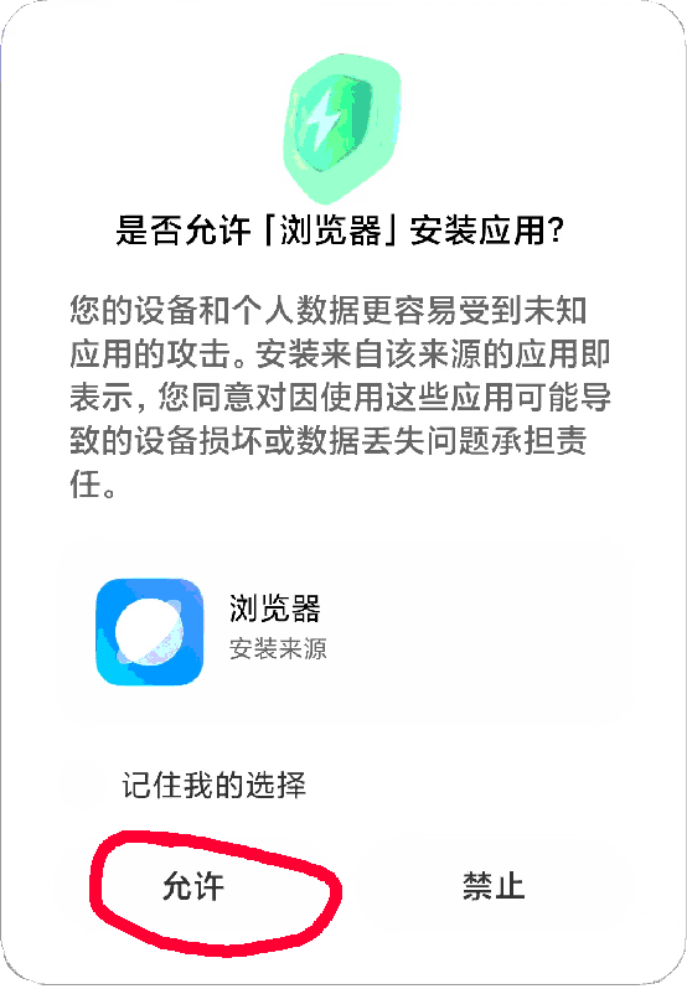

安装时，会有安全提醒，请选中“我已充分了解风险，并继续安装”。因为安卓手机品牌众多、版本众多，提示不尽相同，总之需要容许安装才可以。

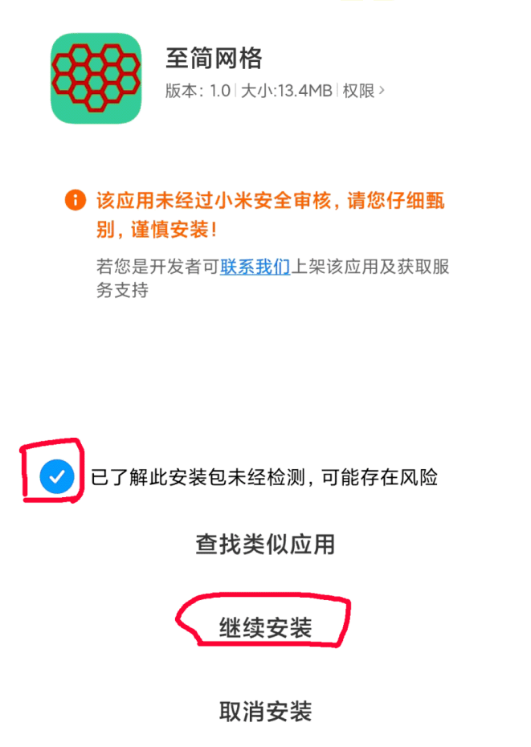

通过以上步骤，安装就完成了，与普通App安装是一样的。

## 端侧设置

帐号分为两类：个人帐号、公司帐号，用户可以登录一个个人账号，登录一个或多个公司的公司账号，比如，一个会计为多家公司代账的情况，就需要登录多家公司的服务，使用时根据需要切换到不同公司的公司帐号。

“设置”中可以进行个人帐号注册与登录，或者公司帐号的登录。

如果当前打开的服务是一个公司服务，则自动使用当前选中的公司的账号；如果是一个个人服务，无论当前选中的是哪个公司的账号，都使用个人账号。

### 个人帐号

在使用一些个人服务时，比如密码箱、专注力等服务，它们不属于任何一家公司，所以必须使用个人帐号。

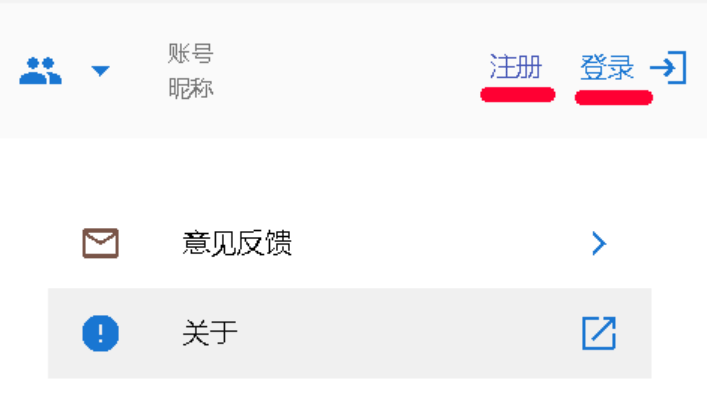

个人帐号需要自己注册，当前只支持自建帐号，没有使用QQ、微信等第三方帐号。

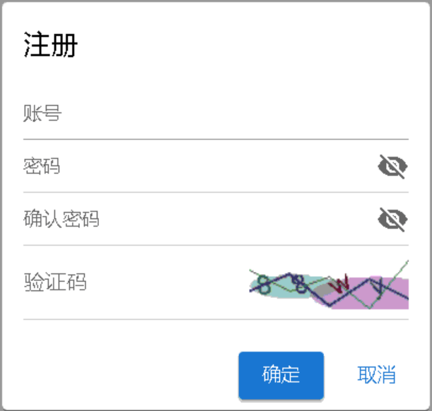

### 公司帐号

公司帐号及其初始密码是公司的超级管理员创建的，创建方法请参照[公司帐号管理](#公司帐号管理)。

在登录公司帐号之前，需要先点击左上角的图标添加公司，待添加的公司必须已经注册过，可以询问公司相关负责人获得公司id与接入码。

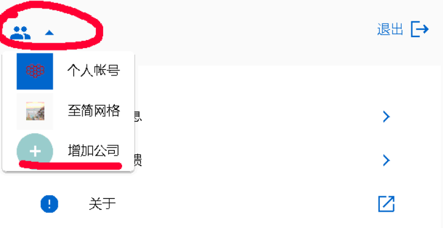

公司ID：公司或组织注册时获得的ID；

接入码：接入密码，需注意，它相当于WIFI密码，不可随意透露给公司外不相关人员。

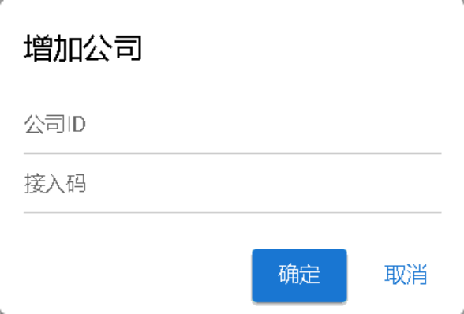

如果服务器置于内网环境，点击“确定”后，端侧无法知道连接哪个服务器，这时会要求输入“内网地址”。

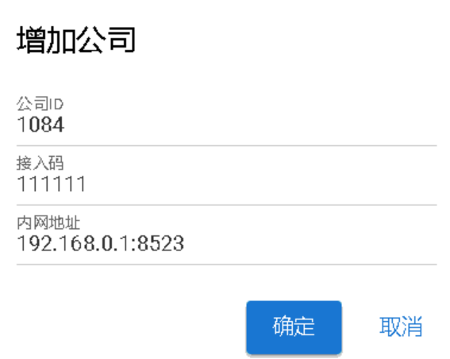

### 登录

个人帐号与公司帐号的登录与退出是一样的。

因为公司帐号是超级管理员添加的，系统默认的公司超级管理员帐号是admin，密码是123456。强烈建议在第一次登录时修改admin密码。

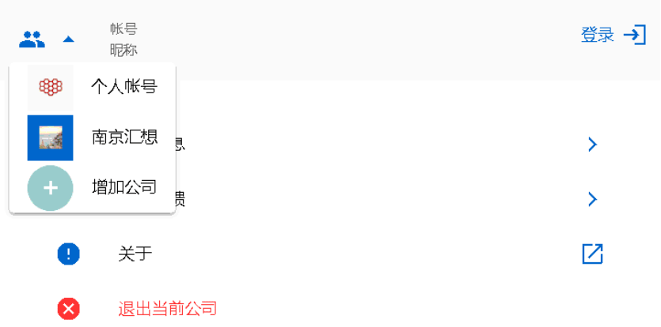

系统支持同时登录一个个人帐号与多个公司帐号，登录时需要点击左上角的图标，选择个人或者某个公司。

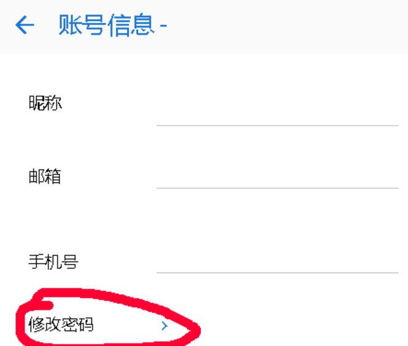

然后再点击右上角的登录，在弹出窗口中输入帐号、密码，点击“登录”即可。

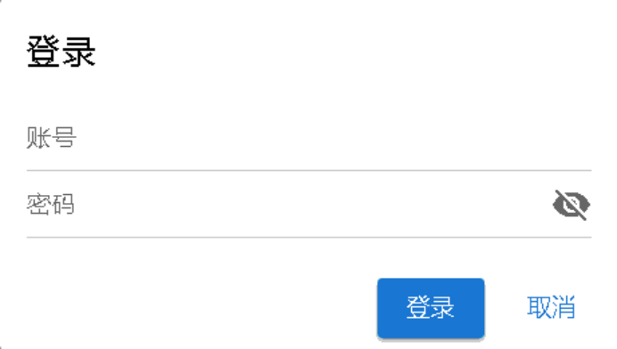

在使用服务时，如果是个人服务，则自动使用个人帐号身份。如果是公司服务，则使用当前选中的公司帐号，在左上角可以切换当前的公司。 如果当前帐号是个人帐号，且有多个公司帐号，因为个人帐号无法在公司级服务中使用，所以默认使用排在最前面的公司帐号。

## 应用市场

应用分成两类，一类是公司应用，如CRM、会员等。公司应用需要单独部署公司服务器才可以使用，服务器程序可以部署在一部安卓手机上，也可以部署在服务器上，或者部署在云端。
一类是个人应用，比如密码箱、专注力等。个人应用为生活提供便利，比如记密码、练习专注力、记单词、算账、杂记等，这些功能不需要部署服务器，安装即可使用。

### 应用列表

在应用列表中点击应用就可以进入详情界面，进行安装或卸载。

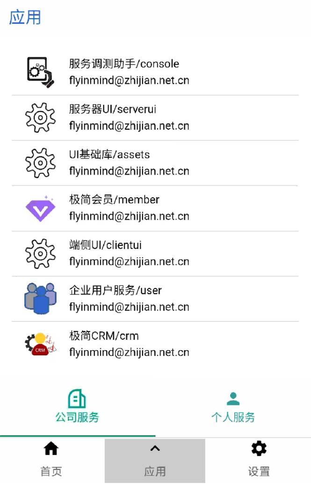

### 应用详情

在详情中有关于应用的详细介绍。如果没有安装，则下方显示“安装”按钮，否则显示“卸载”按钮；当检测到新版本时，会多一个“升级”按钮。

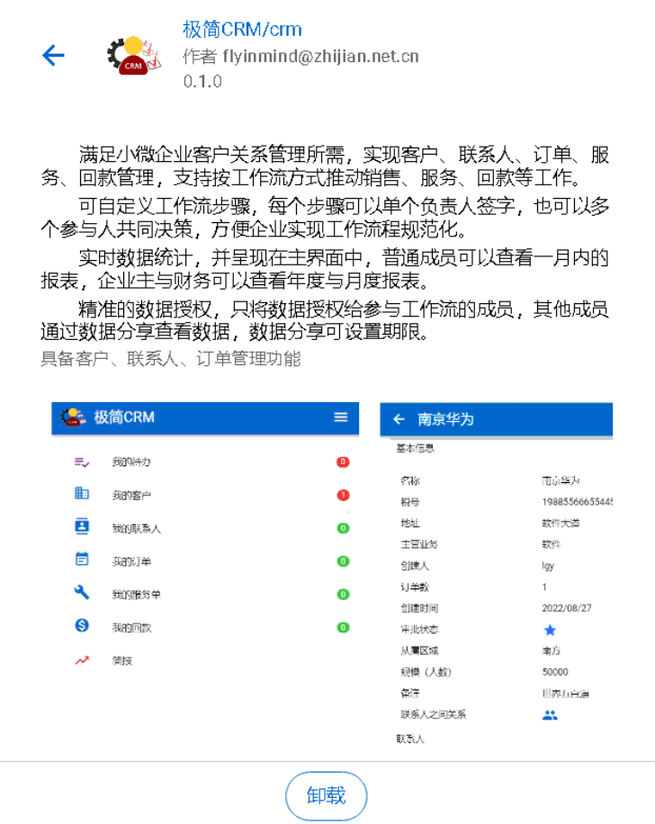

注：以上图例只作为样例，并不代表实际情况。

## 打开应用

在应用主界面的最下方，点击“应用”按钮，出现一个应用栏，里面列出了所有已安装的应用，比如CRM、会员等。 点击一个应用，就可以进入应用的主界面。

每种应用的主界面不同，下图为CRM的主界面。

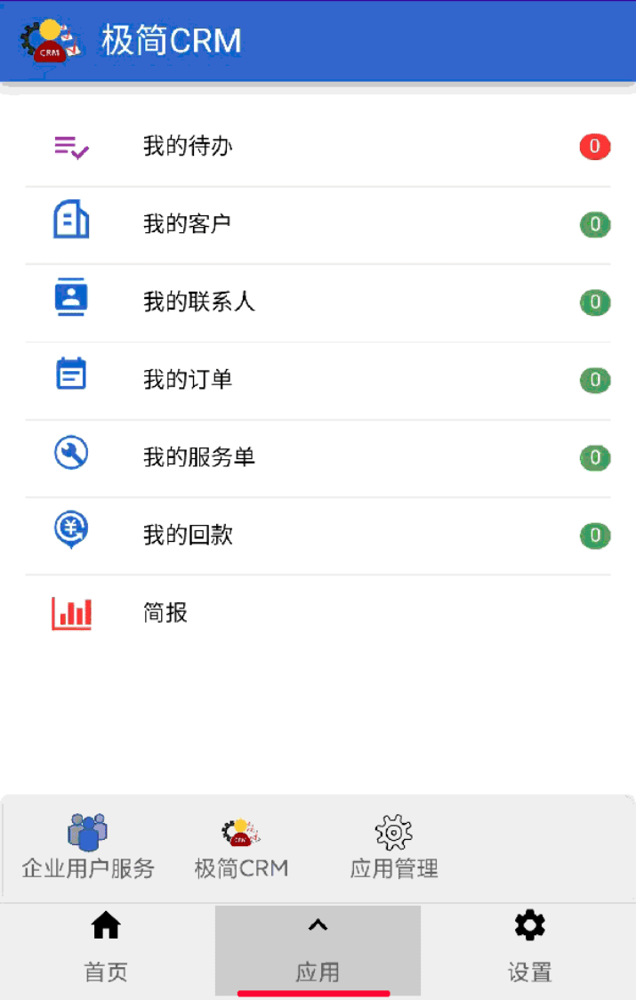

打开一个应用，使用一段时间后，再次点击“应用”按钮，可以切换到其他应用。 如果退出程序，下次打开程序时，会自动进入上次打开过的应用。

Windows版本的客户端与此类似，应用栏显示在屏幕的右侧。

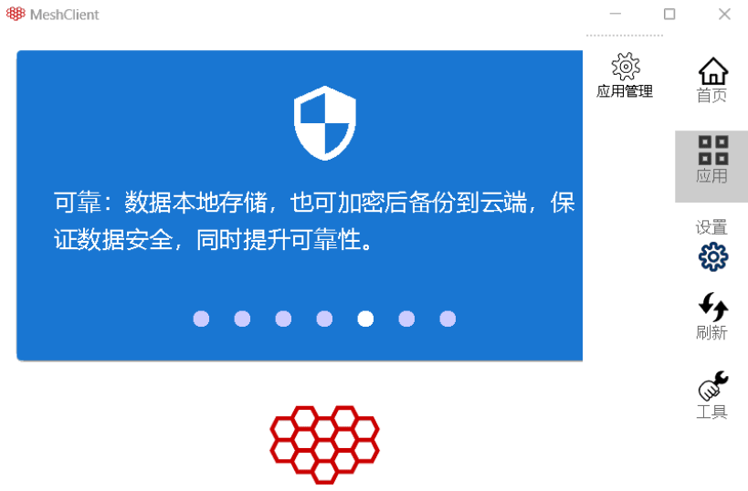

## 公司帐号管理

公司级服务大多依赖公司帐号服务，它记录了公司内所有员工的帐号、密码、授权等信息。主要功能有员工帐号管理、服务授权与群组管理。系统实现中，强依赖帐号管理与服务授权。群组管理在每个业务中根据需要使用，在CRM、会员服务中都未使用群组功能。

### 帐号管理

公司级员工帐号只有超级管理员可以增加、删除，在界面的右上角有“服务授权”与“群组管理”两个图标。

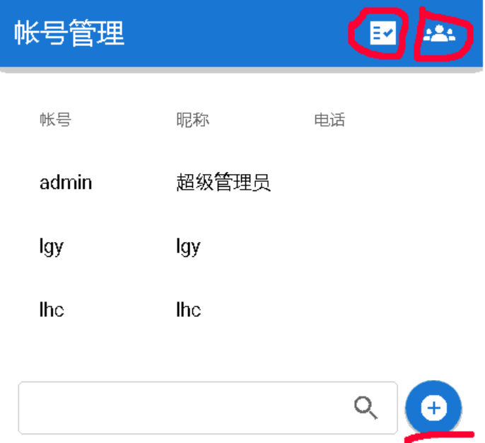

点击某个员工帐号，进入帐号详情界面，在此可以修改员工的邮箱、电话号码等信息。忘记密码时，可以在此重置密码。

注意：重置的密码是随机生成的6个字符，在使用此密码登录后，需及时更改。

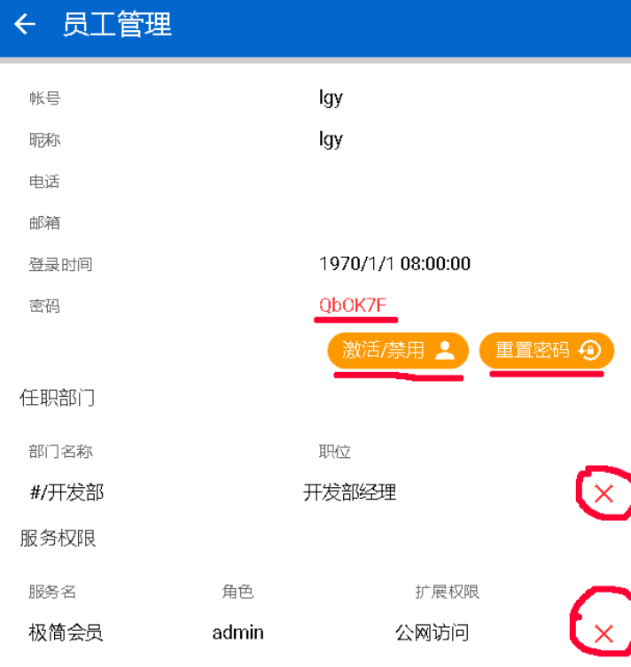

在此还可以禁用帐号，禁用的帐号无法登录系统，也可以重新启用。在此还可以查看帐号从属于哪些组织、在服务中拥有的授权。 如果需要调整，可以删除从属关系与授权。

### 服务授权

员工拥有帐号后，还不能在任何服务中进行操作，只有经过超级管理员授权后，才可以使用相应的服务。 授权时指定的角色，需要服务的开发人员在角色定义接口中定义。

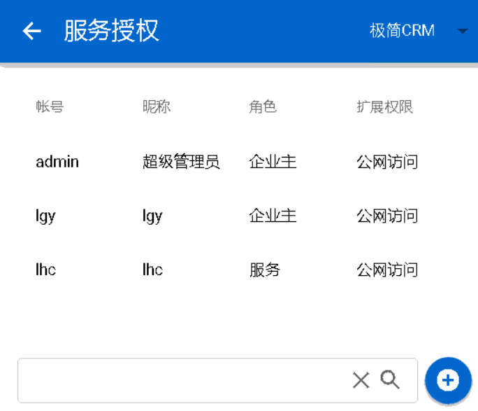

授权时可以指定是否可以在公网访问内网的服务，如果未授权公网访问，则只能在内网访问服务。

# 二、服务器安装

## 运行环境安装

在Linux、Window、Termux中只需安装OpenJDK11及以上版本即可，安装方法请参照[运行环境安装](#compile_and_install)。

## 服务程序安装

### 1、JVM环境

Linux、Termux、Windows中使用Java运行服务器。Linux、Termux中需要创建mesh用户，以mesh身份下载、安装、运行。

1. 创建server目录；

2. 从[码云](https://gitee.com/zhijian_net/MeshServer)或[GitHub](https://github.com/ZhiJianMesh/MeshServer)下载发布的版本；

3. 解压安装包到server目录；

4. 访问`http://www.zhijian.net.cn/`，点右上角菜单“使用指南”，选择“注册”，进入注册界面，输入注册信息获得注册命令行；

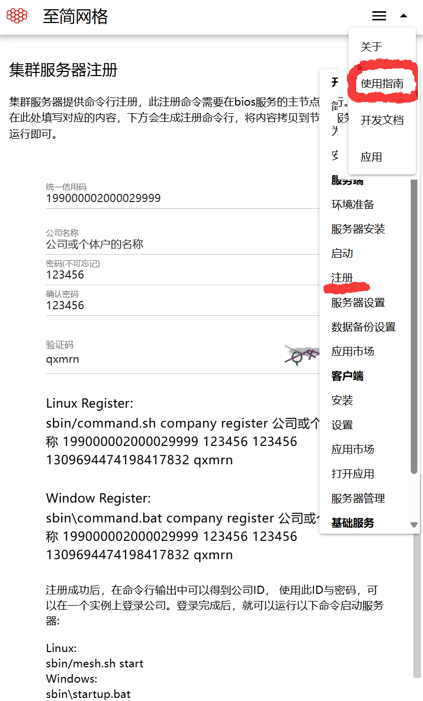

5. 在server目录下运行注册命令，等待注册成功；

6. 在server目录下运行启动命令，等待启动成功。


### 2、Android服务器
Android环境的服务器本质是一个驻留后台的安卓应用，与普通应用没有任何差异，所以安装运行与普通应用也没有任何差异，不需要提前安装运行环境。
1. 从[码云](https://gitee.com/zhijian_net/MeshServer)或[GitHub](https://github.com/ZhiJianMesh/MeshServer)下载发布的安装服务器版本；

2. 安装服务器应用，因为不是从厂商的应用市场下载，安装时会有告警，请忽略；

3. 第一次启动会自动弹出登录&注册界面，如果尚未注册，请先输入信息注册；

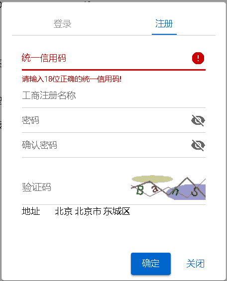

4. 注册完成后，输入公司id及密码登录；

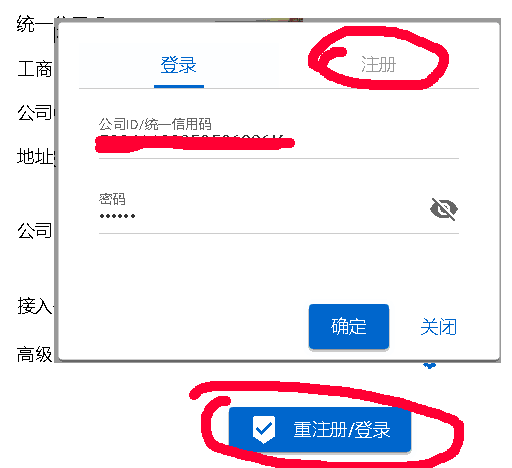

5. 登录完成后就可以点击启动按钮启动服务器。

### 3、数据备份设置

默认不开启每日备份。开启后，每天会自动将数据打包加密后存到至简网格的空间中，会产生一定的费用，每年大约几十元。

因为数据是打包加密的，所以至简网格无法读取您的数据。在恢复数据时必须输入数据备份密码才可以解开。

一旦恢复数据，最多会丢失一天的数据，所以建议只有在极端的情况才执行， 比如手机损坏、丢失，或者换机时才考虑恢复数据。

在换机的情况下，可以先关闭服务器，然后执行“立即备份”，将数据备份到至简网格。 当新手机安装好服务器软件后，再选择恢复数据，这样不会有数据损失。立即备份与定时备份一样，会消耗一次备份机会。

以下几个参数的注意事项：
| 参数 | 注意事项 |
| ---- | ------ |
| 每日备份时间点 | 默认为凌晨2点，时间点建议设置在业务低峰期，通常在凌晨2点 |
|备份站点	| 请选择离自己距离近的备份站点，这样可以缩短备份与恢复时间。每多一个备份站点，数据丢失的可能性越低，系统按“G.年”计费，每多一个站点，相应多占用一份空间 |

在配置发生变更后，会出现“保存”按钮，只有保存后，配置才会生效。

# 三、服务安装

## 系统管理工具
服务器程序都内置了SystemOM服务，客户端登录公司后，可以在“应用管理-公司服务”中安装此服务。


进入SystemOM就会要求输入公司登录密码（公司注册时设置的密码），验证成功后，在它的应用市场中可以在服务端安装、升级或卸载服务。

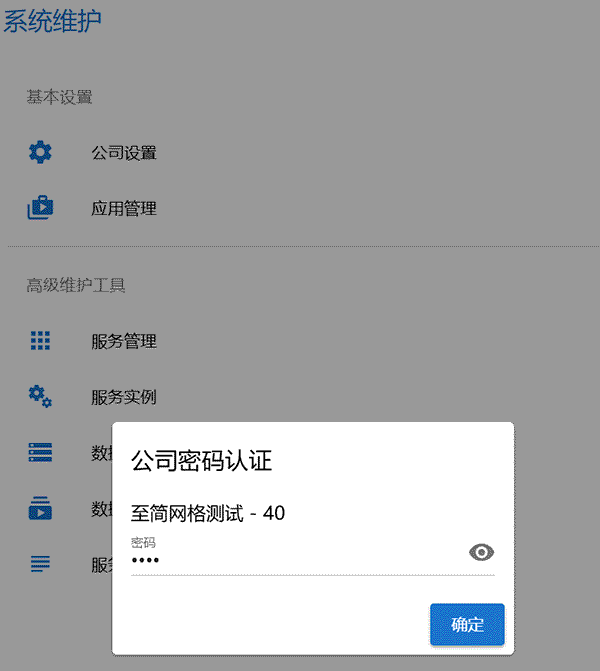

## 常见服务

至简网格提供了二十多个公司服务，能满足大部分中小企业IT工具需求。

| 名称  | 主要功能 |
| ---- | ----    |
| 极简会员 | 会员信息记录、消费信息记录、积分管理等，会员可以选择使用密码，消费记录可以一键导出为word文档 |
| 课时管理 | 学员信息记录、课时信息记录、积分管理等，课时记录可以一键导出为word文档 |
| 业财一体 | 包括ibfbase基础服务、ibusiness差旅、ifinance财务、iproject项目管理、ihr人事管理、iresource资源管理，icrm客户关系管理。ibusiness、iproject、ihr、iresource、icrm都围绕ifinance的收支平衡表展开，支出与收入都记入ifinance服务，ifinance定时输出财务报表；<br>icrm负责客户信息管理、销售机会管理等，关联的销售项目、差旅、采购、发货、回款等调用iproject、ibusiness、iresource、ifinance完成 |
| 简易记账 | 实现分散的团队管理，组织者给队员分发任务，组织者提成、队员分成计算、收支报表等 |
| 消息交换中心 | 接受端侧定时请求，在请求的响应中下发命令，完成对设备的远程管理 |
| 进销存系统 | 实现采购、销售两个主要功能，商品、分类、客户、供应商管理等辅助功能 |
| 用户管理 | 包括公司用户帐号管理、授权管理，是所有服务的基础服务 |


# 四、Mesh编译&运行环境安装
Mesh开发、运行环境安装方法，以及所需原生库跨平台编译方法。


## Java编译&运行环境<a id="compile_and_install"></a>

至简网格服务器运行时只依赖Java运行环境，如果不涉及Java源码修改，安装JRE即可，它的安装请在网上自行搜索。以下描述的是Java开发&运行环境安装。

### 1、Linux环境
Linux服务器提供apt包管理软件（阿里云提供dnf包管理软件，其他云服务提供商可能有不同的命令，请自行搜索）。
如果有现成的包管理软件，直接运行命令安装openjdk即可，最小版本11，比如Ubuntu中安装命令如下：
```bash
apt install -y openjdk-21
```

如果没有包管理工具，按以下步骤安装。

1. 登录root，ubuntu默认不用root，通过sudo passwd root设置root密码，然后用root登录；
2. 下载openjdk（比如`https://jdk.java.net/java-se-ri/11-MR3`），并上传到服务器的/jdk目录下；
3. 解压后，使用nano编辑/etc/profile，在末尾增加以下内容；

```bash
export JAVA_HOME=/jdk/openjdk11
export PATH=$JAVA_HOME/bin:$PATH
```

4. 运行“点”命令，使profile立刻生效；

```bash
. /etc/profile
```
以上步骤就完成了java的安装，下面是创建mesh用户，后继操作都是以mesh用户身份运行。

1. 创建mesh用户；
```bash
useradd -m -d /home/mesh -s /bin/bash mesh
```

注意指定bash，如未指定可以用chsh -s /bin/bash改正

2. 设置mesh用户密码(有密码与密码确认步骤)；
```bash
passwd mesh XXXXX
```

3. 退出root，登录mesh帐号，服务程序安装都**以mesh用户身份操作**。

### 2、Windows环境

下载openjdk21，解压后，在“我的电脑”或“此电脑”图标上点击右键菜单，选择属性->高级系统设置，在系统变量中增加JAVA\_HOME，指向解压目录；然后在PATH中增加%JAVA\_HOME%\bin，java就安装好了。

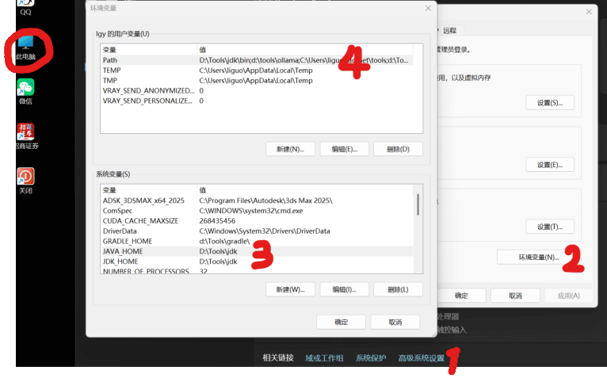

### 3、Android环境

Android环境的服务器本质是一个长期驻留后台的安卓应用，安卓版本在7.0（2016.5发布）及以上版本就可以。

### 4、Termux-Linux环境

Termux是一个安卓应用，下载安装就能运行。因为安卓内核是Linux，Termux在安卓的基础上加了一个Linux适配层，提供了一个精简的Linux程序运行环境。

至简网格服务器坚持极小的外部依赖，所以可以运行在这种资源极其有限的环境中，仍然可以实现多实例、多区域集群能力，即便于开发测试，也能以极小的成本运行。

从github下载Termux应用，连接为`https://github.com/termux/termux-app/releases`。选择合适的版本，下载后在安卓手机中安装，安卓版本至少为7.0。
因为不是从厂商的应用市场下载安装的，所以安装过程会有告警，请忽略所有告警。

#### A）工具安装

Termux安装完成后，使用pkg命令（对应于linux中的apt）安装以下工具：

| 命令 | 用处 |
| --- | --- |
| pkg install termux-auth -y | 提供passwd命令，设置或修改用户密码 |
| pkg install termux-services -y | 服务管理，比如运行sv-enable sshd |
| pkg install openssh -y | sshd服务，用于远程命令行操控 |
| pkg install -y openjdk-21 | Java运行环境安装 |

每次重启termux后，建议运行一下 pkg update && pkg upgrade 命令及时更新系统。

#### B）必要的配置

1. 用nano命令在home目录下编辑”.bashrc”文件（注意文件前面有个点），添加以下内容；
```bash
alias ll=’ls -l’
export LD_LIBRARY_PATH=$PREFIX/lib:/system/lib64:/system/lib
```

1. 修改$PREFIX/etc/apt/sources.list使用清华的镜像，提升安装速度；
```bash
deb https://mirrors.tuna.tsinghua.edu.cn/termux/apt/termux-main stable main
```
2. termux-wake-lock：让termux保持运行，忽略电池优化，运行后手机上会弹出窗口确认，请选择“总是允许”（或其他类似选项，每个品牌不同版本都不同）；
3. sv-enable sshd：使sshd服务自动启动（第一次要用sshd启动）；
4. termux-setup-storage：允许访问外部存储（可以不设置）。

#### C）ssh客户端连接

在手机中输入命令行很麻烦，在PC中使用ssh客户端连接，用键盘输入会很便捷。比如在Windows中使用Bitvise SSH客户端，注意连接的端口是8022，而不是默认的22。Linux环境也可以使用这个工具远程连接操作，如果是云服务器，需要在云上设置开放22号端口。

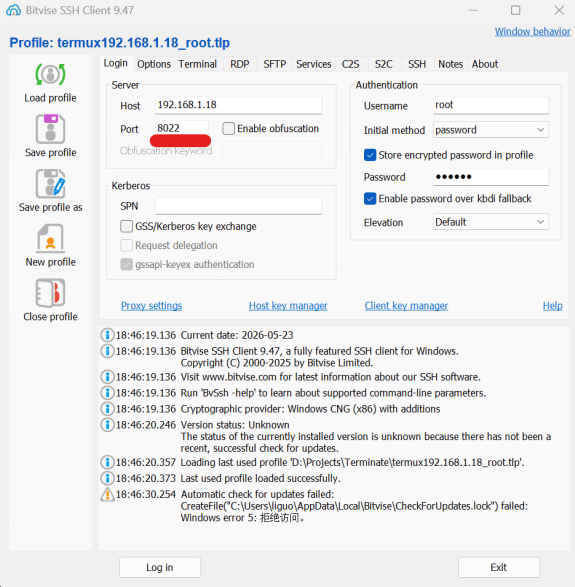


## 原生库编译

绝大部分情况，不需要了解此部分内容，只有需要对原生库做二次开发时才需要了解。

至简网格服务器用到QuickJs与Sqlite的原生库，在Windows、Linux、Termux、Android中原生库都已提供，通常不需要C/C++开发，当然无需重新编译。
如果你有更高的要求，需要修改原生库，请按照以下建议进行。

### 1、环境准备
#### Termux环境
| 命令 | 用处 |
| --- | --- |
| pkg install -y wget zip git | wget git用于下载sqlite、quickjs的源码 |
| pkg install -y clang make perl getconf cmake gradle | clang、make用于编译c源码，zip、perl是编译sqlite过程中用到的工具，getconf、cmake用于编译quickjs，gradle用于生成jar、执行单元测试。


#### wsl-Ubuntu环境

之所以选择wsl，是因为在wsl与宿主Windows系统非常容易互通，且Linux中做交叉编译相对简单一些。安装方法在网上非常容易搜索到，在此不赘述。

1. 在Windows中安装wsl（Windows Subsystem for Linux）；
2. 安装完wsl后，在命令行运行wsl install安装默认的ubuntu环境；
3. Ubuntu安装后，在Windows命令行运行wsl即进入Ubuntu系统；
4. 最后安装交叉编译环境，很容易支持Linux、Windows、Android(ndk)系统的交叉编译。

#### Linux、Windows交叉编译工具

```bash
sudo apt update && sudo apt upgrade
sudo apt install -y make gcc g++ openjdk-21-jdk gradle
## Windows 交叉编译工具链 (MinGW)
sudo apt install -y gcc-mingw-w64-x86-64 g++-mingw-w64-x86-64
## ARM 交叉编译工具链 (以 aarch64 为例)
sudo apt install -y gcc-aarch64-linux-gnu g++-aarch64-linux-gnu
## Android 交叉编译工具
sudo apt install -y git make cmake
```

#### 安装Android NDK

以r26c为例，其他版本的命令做适当修改即可。

```bash
cd /opt
sudo wget https://dl.google.com/android/repository/android-ndk-r26c-linux.zip
sudo unzip android-ndk-r26c-linux.zip
sudo mv android-ndk-r26c android-ndk
## 设置环境变量 (添加到 ~/.bashrc)
export ANDROID\_NDK_HOME=/opt/android-ndk
export PATH=$ANDROID_NDK_HOME/toolchains/llvm/prebuilt/linux-x86_64/bin:$PATH
```

运行命令aarch64-linux-android21-clang --version，如果能够正确返回，则说明安装成功。
>注意：不能将NDK存在windows系统中，然后用/mnt/映射目录。

### 2、交叉编译与打包

#### Sqlite-JDBC驱动原生库

Mesh没有修改Sqlitejdbc驱动，发布的版本中已提供windows、linux、mac等操作系统的原生库，所以无需为这些系统生成动态库。但是，它没有提供Termux中的原生库，所以，如果要运行在termux环境，仍然需要下载源码，在termux中编译生成动态库。

##### Termux
1. 下载源码：wget `https://github.com/xerial/sqlite-jdbc/archive/refs/tags/3.53.1.0.zip`
2. 解压源码：unzip 3.53.1.0.zip
3. 切换目录：cd sqlite-jdbc-3.53.1.0
4. 调整配置：修改Makefile.common，添加以下内容。

```Makefile
## Termux运行的设备都是aarch64位芯片，所以无需考虑x86、x86-64、arm32架构
Linux-Android-aarch64_CC := $(CROSS_PREFIX)clang
Linux-Android-aarch64_STRIP := $(CROSS_ROOT)/bin/llvm-strip
Linux-Android-aarch64_CCFLAGS := -I$(JAVA_HOME)/include -I$(JAVA_HOME)/include/linux -I$(PREFIX)/include -Os -fPIC -fvisibility=hidden -Wno-implicit-function-declaration
Linux-Android-aarch64_LINKFLAGS := $(Default_LINKFLAGS) -shared -pthread -lm -ldl
Linux-Android-aarch64_LIBNAME := libsqlitejdbc.so
Linux-Android-aarch64_SQLITE_FLAGS :=
```

5. 编译连接：make native

    编译完成后，在target/sqlite-3.53.1-Linux-Android-aarch64目录下就有了原生库libsqlitejdbc.so

6. 重新打包
    解压对应版本的jar，解压后的目录中有META-INF、org两个子目录。将libsqlitejdbc.so拷贝到org\sqlite\native\Linux-Android\aarch64目录下，然后再将这个目录压缩成zip，并改扩展名zip为jar。

#### QuickJS原生库

##### Linux/Windows/Android

进入wsl环境，在QuickJs工程目录下运行make生成windows、linux、android的原生库。
```bash
make all
```
windows、linux的jar使用gradle jar命令生成。

Android需要的是aar文件，所以先将so文件放在Android工程src/main/jniLibs相应芯片架构的目录下，然后点击右边栏gradle图标，选择项目的tasks\build\assemble生成aar文件。

##### Termux

Termux只生成Linux-Android aarch64的原生库。

```bash
make termux-aarch64
```
将生成的so复制到QuickJS工程的src/main/resources/native/Linux-Android下对应芯片架构的目录中，运行gradle jar命令重新生成jar。


