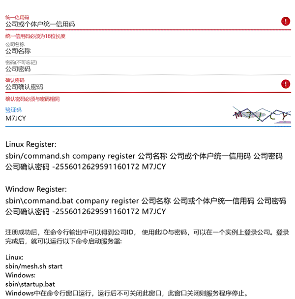

<div align="center" style="font-size:2em;font-weight:bold;">
  至简网格使用指南<br>
  
</div>

# 修订记录

| 日期 | 内容 | 作者 |
| --- | --- | --- |
| 2026.6.1 | 创建文档 | flyinmind |
| 2024.7.23 | 调整文档结构，将编译与运行环境部分合并到这篇文档中 | flyinmind |
| 2026.8.20 | 增加meshhelper一键安装脚本用法（脚本随服务器程序发布在根目录，在哪个目录运行就安装到哪个目录），更新AI智能体使用说明 | flyinmind |

# 摘要

本文讲解至简网格客户端与服务器安装与使用的方法。

# 一、客户端安装与使用

## 安装

在做端侧UI开发之前，首先需要安装客户端。当前支持windows、android两种客户端，两种界面很接近，操作也一样。 但是有部分安卓中的功能，在windows客户端中没有，比如扫码、横竖屏等。

### windows客户端

从网站下载安装程序后，双击安装即可。

windows客户端需依赖系统的Edge浏览器。此浏览器在windows7及以上版本都可以安装，windows10、windows11中已默认安装。如果未安装，则需要手动下载安装 [Edege浏览器](https://www.microsoft.com/zh-cn/edge/download)。

### android客户端

至简网格安卓客户端至少需要在安卓8.0中安装（2017年8月22日发布）。

至简网格客户端没有上传到各大应用市场，需要使用安卓手机的浏览器扫码下载，然后再安装。

有些情况下，浏览器没有安装应用的权限，会提示确认是否赋予浏览器安装应用的权限，此时必须给予授权。


安装时，会有安全提醒，请选中“我已充分了解风险，并继续安装”。因为安卓手机品牌众多、版本众多，提示不尽相同，总之需要容许安装才可以。


通过以上步骤，安装就完成了，与普通App安装是一样的。

## 端侧设置

帐号分为两类：个人帐号、公司帐号，用户可以登录一个个人账号，登录一个或多个公司的公司账号，比如，一个会计为多家公司代账的情况，就需要登录多家公司的服务，使用时根据需要切换到不同公司的公司帐号。

“设置”中可以进行个人帐号注册与登录，或者公司帐号的登录。

如果当前打开的服务是一个公司服务，则自动使用当前选中的公司的账号；如果是一个个人服务，无论当前选中的是哪个公司的账号，都使用个人账号。

### 个人帐号

在使用一些个人服务时，比如密码箱、专注力等服务，它们不属于任何一家公司，所以必须使用个人帐号。


个人帐号需要自己注册，当前只支持自建帐号，没有使用QQ、微信等第三方帐号。


### 公司帐号

公司帐号及其初始密码是公司的超级管理员创建的，创建方法请参照[公司帐号管理](#公司帐号管理)。

在登录公司帐号之前，需要先点击左上角的图标添加公司，待添加的公司必须已经注册过，可以询问公司相关负责人获得公司id与接入码。


公司ID：公司或组织注册时获得的ID；

接入码：接入密码，需注意，它相当于WIFI密码，不可随意透露给公司外不相关人员。


如果服务器置于内网环境，点击“确定”后，端侧无法知道连接哪个服务器，这时会要求输入“内网地址”。


### 登录

个人帐号与公司帐号的登录与退出是一样的。

因为公司帐号是超级管理员添加的，系统默认的公司超级管理员帐号是admin，密码是123456。强烈建议在第一次登录时修改admin密码。


系统支持同时登录一个个人帐号与多个公司帐号，登录时需要点击左上角的图标，选择个人或者某个公司。


然后再点击右上角的登录，在弹出窗口中输入帐号、密码，点击“登录”即可。


在使用服务时，如果是个人服务，则自动使用个人帐号身份。如果是公司服务，则使用当前选中的公司帐号，在左上角可以切换当前的公司。 如果当前帐号是个人帐号，且有多个公司帐号，因为个人帐号无法在公司级服务中使用，所以默认使用排在最前面的公司帐号。

## 应用市场

应用分成两类，一类是公司应用，如CRM、会员等。公司应用需要单独部署公司服务器才可以使用，服务器程序可以部署在一部安卓手机上，也可以部署在服务器上，或者部署在云端。
一类是个人应用，比如密码箱、专注力等。个人应用为生活提供便利，比如记密码、练习专注力、记单词、算账、杂记等，这些功能不需要部署服务器，安装即可使用。

### 应用列表

在应用列表中点击应用就可以进入详情界面，进行安装或卸载。


### 应用详情

在详情中有关于应用的详细介绍。如果没有安装，则下方显示“安装”按钮，否则显示“卸载”按钮；当检测到新版本时，会多一个“升级”按钮。


注：以上图例只作为样例，并不代表实际情况。

## 打开应用

在应用主界面的最下方，点击“应用”按钮，出现一个应用栏，里面列出了所有已安装的应用，比如CRM、会员等。 点击一个应用，就可以进入应用的主界面。

每种应用的主界面不同，下图为CRM的主界面。


打开一个应用，使用一段时间后，再次点击“应用”按钮，可以切换到其他应用。 如果退出程序，下次打开程序时，会自动进入上次打开过的应用。

Windows版本的客户端与此类似，应用栏显示在屏幕的右侧。


## 公司帐号管理

公司级服务大多依赖公司帐号服务，它记录了公司内所有员工的帐号、密码、授权等信息。主要功能有员工帐号管理、服务授权与群组管理。系统实现中，强依赖帐号管理与服务授权。群组管理在每个业务中根据需要使用，在CRM、会员服务中都未使用群组功能。

### 帐号管理

公司级员工帐号只有超级管理员可以增加、删除，在界面的右上角有“服务授权”与“群组管理”两个图标。


点击某个员工帐号，进入帐号详情界面，在此可以修改员工的邮箱、电话号码等信息。忘记密码时，可以在此重置密码。

注意：重置的密码是随机生成的6个字符，在使用此密码登录后，需及时更改。


在此还可以禁用帐号，禁用的帐号无法登录系统，也可以重新启用。在此还可以查看帐号从属于哪些组织、在服务中拥有的授权。 如果需要调整，可以删除从属关系与授权。

### 服务授权

员工拥有帐号后，还不能在任何服务中进行操作，只有经过超级管理员授权后，才可以使用相应的服务。 授权时指定的角色，需要服务的开发人员在角色定义接口中定义。


授权时可以指定是否可以在公网访问内网的服务，如果未授权公网访问，则只能在内网访问服务。

# 二、服务端安装与维护

## 运行环境安装

在Linux、Windows、Termux中只需安装OpenJDK11及以上版本即可，安装方法请参照[运行环境安装](#compile_and_install)。
Linux中需要创建mesh用户，以mesh身份下载、安装、运行；termux中不必创建帐号，直接在root中操作（真实身份不是root）。

## 服务器程序安装<a id="server_sw_install"></a>

按以下步骤手动安装，需要一定的动手能力。如果搞不定，可以安装腾讯的[codebuddy或workbuddy](https://www.workbuddy.cn/)，让智能体帮助完成，或者通过[邮件](mailto:zhijianmesh@sina.com)联系我们，远程协助完成。


### meshhelper 安装脚本（推荐）<a id="meshhelper_usage"></a>

`meshhelper.sh`（Linux/Termux）与`meshhelper.ps1`（Windows）是服务器程序与服务的**统一安装/更新/卸载工具**，位于服务器根目录。它自动解析最新服务器版本、自动对齐服务与引擎的版本，并在服务变更后自动重启服务器，因此**不需要手工下载安装包、不需要知道版本号**。

用法是"动词 + 目标"：

```BASH
./meshhelper.sh --help                     # 查看完整帮助
./meshhelper.sh install server             # 安装服务器程序到当前目录(默认源 gitee, 自动取最新版)
./meshhelper.sh install server --source github --dir /home/mesh/server
./meshhelper.sh install member             # 安装 member 服务(自动对齐引擎版本, 完成后自动带 totp 重启)
./meshhelper.sh update member              # 更新 member 服务(自动备份, 完成后自动带 totp 重启)
./meshhelper.sh uninstall member           # 卸载 member 服务(先备份, 完成后自动重启)
```

| 参数 | 说明 |
| --- | --- |
| `install <目标>` | 安装服务器程序或服务<br>`<目标>`：`server` 或服务名（`member`/`classhour`/`user`/`bios`…），也可为本机已存在的**服务目录**或**.zip 包** <br>`--source <gitee|github>`：安装源，默认 `gitee`；Windows 版为 `-Source`<br>`--dir <目录>`：<br>服务器程序：解压目标目录（默认当前目录）；<br>服务：服务器根目录（默认自动探测）；<br>Windows 版为 `-Dir` <br>`--url <直链>`：直接指定下载地址，跳过自动解析（网络受限时使用）；Windows 版为 `-Url`|
| `update <目标>` | 更新服务器程序或服务，参数与install相同 |
| `uninstall <目标>` | 卸载服务（先备份）；`server` 只支持 install/update，不支持 uninstall |
| `-h | --help` | 显示帮助；Windows 版为 `-Help` |

脚本的关键行为（了解后可避免多余操作）：

1. **自动探测服务器根目录**：先查运行中实例的`/backend/api/where`，再查脚本所在目录、当前目录；失败时才要求用`--dir`指定；
2. **自动探测引擎版本**：通过`sbin/command.sh company engineVer`（或`http://localhost:8523/backend/api/enginever`）获取，服务版本即引擎版本（以引擎版本为 release tag），因此**服务与引擎不会版本错配**；
3. **服务变更后自动重启**：安装/更新时先取临时管理口令（`company gettotp`），再用`sbin/mesh.sh restart <totp>`重启；卸载时直接`restart`（重启后 bios 注销该服务）；
4. **自动备份**：更新服务备份到`services/.<服务名>.bak.<时间戳>`；卸载备份到`backups/<服务名>.<时间戳>`；更新服务器程序时整个旧目录备份为`<根目录>.bak.<时间戳>`，并保留用户的`conf`与已装`services`；
5. **本地包交付**：自己开发/定制的服务，可用`./meshhelper.sh install ./myservice`或`./meshhelper.sh install ./myservice.zip`直接安装（不下载）；已有服务也可以用`update ./myservice`从本地目录更新。服务目录名或包名即服务名（zip 包内`service.cfg`不在包根目录时，取其所在目录名）；目录内必须有`service.cfg`，且`api`、`ui`子目录至少有一个；服务名仅允许字母、数字、下划线，最长 30 字符；`uninstall`只接受服务名或本地目录，不接受 zip 包。

**离线/内网安装**（目标机无法访问公网）：

1. 在一台可联网的机器上，从[码云](https://gitee.com/zhijian_net/MeshServer/releases)或[GitHub](https://github.com/ZhiJianMesh/MeshServer/releases)下载服务器程序 zip；从[enterprise releases](https://gitee.com/zhijian_net/enterprise/releases)下载对应引擎版本的服务 zip，拷贝到目标机；
2. 服务器程序：手工解压后把内容放到目标目录（保证该目录下直接是`sbin`、`conf`、`libs`、`services`）；
3. 服务：`./meshhelper.sh install ./member.zip`（也可直接把服务目录放进`services/`后重启）；若脚本无法自动探测根目录，加`--dir /home/mesh/server`；若本地已有 zip 或内网可访问的下载地址，也可用`--url`指定；
4. `meshhelper`脚本本身也可从仓库直接下载后拷贝到目标机使用，脚本除`curl`、`unzip`外无其他依赖（Debian/Ubuntu：`apt install curl unzip`；Termux：`pkg install curl unzip`）。

### Linux环境中安装
1. 创建mesh用户（不能依赖智能体完成）；
```BASH
useradd -m -d /home/mesh -s /bin/bash mesh
passwd mesh mesh帐号的密码
```

2. 在linux系统的home目录创建server子目录，后面的操作都在此目录下；

3. 用[meshhelper 安装脚本](#meshhelper_usage)安装服务器程序，**在哪个目录下运行命令，就在哪个目录安装**，不需要输入目录：

```BASH
# 第一步: 把 meshhelper 安装脚本下载到"服务器根目录"(即你准备装 server 的目录), 再从该目录执行安装
# 脚本随 MeshServer 发布在 releases 资产里, 要从 release 下载(不要再用仓库 raw 路径, 那是 404)

# --- GitHub: 自动取最新 release 的 meshhelper ---
curl -fsSL https://github.com/ZhiJianMesh/MeshServer/releases/latest/download/meshhelper.sh -o meshhelper.sh
chmod +x meshhelper.sh

# --- Gitee: 先取最新版本号再下载(码云无 latest 别名) ---
TAG=$(curl -fsSL https://gitee.com/api/v5/repos/zhijian_net/MeshServer/releases/latest | grep -o '"tag_name":"[^"]*"' | head -1 | cut -d'"' -f4)
curl -fsSL "https://gitee.com/zhijian_net/MeshServer/releases/download/$TAG/meshhelper.sh" -o meshhelper.sh
chmod +x meshhelper.sh

# 第二步: 在服务器根目录执行安装(下载到哪个目录就在哪个目录安装, 无需 --dir)
./meshhelper.sh install server                     #默认从码云取最新版; 加 --source github 从 GitHub 取服务器程序/服务
./meshhelper.sh install server --url <zip直链>     #无法访问仓库API时, 直接指定安装包直链
```

安装成功后，当前目录下会出现`sbin`、`conf`、`services`、`libs`等子目录；脚本还会打印注册公司、登录、启动的后续命令，可直接照做。其余参数（`--dir`、`--source`、`-h`等）见[meshhelper 安装脚本](#meshhelper_usage)。

4. 运行`sbin/command.sh company`执行公司相关的命令；

以下命令是sbin/command.sh company的子命令，比如查询引擎版本，完整命令为sbin/command.sh company engineVer。
子命令**不区分大小写**（`engineVer`与`enginever`等价），本文档统一写作驼峰形式。
除了register、login、engineVer，其他命令必须在login之后才可以正确执行。中括号[]里的参数，表示是可选的参数。

<a id="company_commands"></a>
| 命令  | 参数 | 作用 |
| ---   | --- | ---  |
| register | company_name company_creditcode password cfm_password session verify_code | 注册公司 |
| login | company_id password [outside_addr [inside_addr]] | 登录公司，获得证书，产生company.cfg |
| chgpwd | old_password new_password | 修改公司密码 |
| chgAuth | password | 传入公司密码，修改公司鉴权密钥对 |
| setinfo | company_name [country [province [city [info]]]] | 修改公司信息 |
| accesscode | [code\|generate] | 产生公司接入码，如果不输入[code\|generate]，则为查询接入码 |
| pubKey | | 显示公司认证的公钥 |
| info | | 显示公司信息，包括ID、名称、密钥对等 | 
| backupAt | [backupAt] | 设置公司数据库备份时间点，不传[backupAt]用来查询备份时间点<br>backupAt用的时UTC分钟，比如东八区2点，传入1080（120-480+1440） |
| setTotp | | 设置totp根密钥 |
| getTotp | | 服务实例启动时用到，从totp.key文件中或bios中读取根密钥，然后计算出临时管理totp，并返回剩余的有效秒数；从bios查询时必须保证bios服务已启动 |
| engineVer | |返回引擎版本号，从github或gitee下载服务时，需要根据引擎版本号下载，引擎版本不匹配的服务可能无法正常工作 |

5. 配置文件都放在server/conf目录下；

**channel.cfg**

通常默认配置即可，如果不用网关，每个实例中都相同
```JSON
{
    "httpPort":8523, //访问http接口的端口号
    "mode":"NORMAL" //NORMAL或GATEWAY网关模式
    //"tcpPort":8524, //tcp端口号，用于端侧用tcp直连服务器，比如ROS中连接服务器接受命令、上报数据；不开启长连接，不用配置
    //"tcpChecker":"" //tcp接入鉴权类，默认使用user服务的用户名密码登录
}
```

**partition.cfg**

通常默认配置即可，每个实例中需要相同
```JSON
{
    //固定为250000，如果集群复杂到需要划分多个分区时，请联系我们
    "partition":250000,
    //SINGLETON单例模式、CLUSTER集群模式
    "runMode":"CLUSTER",
    //bios节点的ip:port列表，第一个为主bios，如果发生切换，bios服务会自主决定，单例时可以不配置，默认当前节点就是bios
    "biosServers":[],
    //是否在公有云部署，私网部署时设为false
    "inCloud":false,
    //静态文件缓存时间
    "fileCacheTime":300
}
```
单例情况下，channel.cfg与partition.cfg使用默认配置即可；集群时，需要做一些修改，请参照[集群配置](#cluster_config)部分。

6. 访问`http://www.zhijian.net.cn/`，点击“注册”，进入注册页面，输入注册信息获得注册命令行；



7. 在server目录下运行注册命令，等待注册成功；

注册页面用来获取`验证码ID`与`验证码`，输入公司信息后，形成完整的命令行，拷贝这个命令行，在server目录下运行即可完成注册。

```BASH
sbin/command.sh company register 公司名称 公司或个体户统一信用码 公司密码 确认公司密码 验证码ID 验证码
```

注册之后返回公司ID，请记录此ID与你输入的公司密码。在公司员工从客户端接入服务器时，用到公司ID；公司密码在以下情况用到：
- 在第一个节点上登录公司获得证书、初始化company.cfg；
- 第一次启动系统；
- 登录SystemOM服务；
- 从云端恢复数据库。

8. 如果是第一个实例，需要先安装bios服务（bios是注册发现服务，必须最先安装）。用安装脚本会自动对齐引擎版本，无需知道版本号：

```BASH
./meshhelper.sh install bios
```

手工方式：先执行`sbin/command.sh company engineVer`查询引擎版本，再从[码云](https://gitee.com/zhijian_net/enterprise/releases)或[GitHub](https://github.com/ZhiJianMesh/enterprise/releases)下载**以该引擎版本为 tag** 的bios服务包，解压到`services/bios`下。比如引擎版本是0.13.1，gitee上的bios服务下载URL形如:

```URL
https://gitee.com/zhijian_net/enterprise/releases/download/0.13.1/bios-0.2.5.zip
```

bios自身版本号会变化，但下载连接中版本使用引擎版本（release tag），因此只要tag选对即可，具体文件名以 release 资产列表为准。

9. 在server目录下运行登录命令，获取证书，生成company.cfg文件、totpkey； 
```BASH
sbin/command.sh company login 公司ID 公司密码
```

10. 在server目录下运行启动命令，等待启动完成。

```BASH
sbin/mesh.sh start [totp_or_company_pwd [main_bios]]
sbin/mesh.sh stop|restart|status
```
如果主bios实例已经启动，在其他节点上启动服务器时，输入公司密码或totp密码与主bios的地址(ip:port)就可以自动完成所有配置。


### Windows环境中安装
1. 直接用当前工作用户即可安装；

2. 选择在恰当的目录下创建server子目录，后面的操作都是在server目录下；

3. 用[meshhelper 安装脚本](#meshhelper_usage)安装服务器程序，**在哪个目录下运行命令，就在哪个目录安装**，不需要输入目录：

```POWERSHELL
# 第一步: 把 meshhelper 安装脚本下载到"服务器根目录", 再从该目录执行安装(脚本在 MeshServer 的 releases 资产里)

# --- GitHub: 自动取最新 release 的 meshhelper ---
irm https://github.com/ZhiJianMesh/MeshServer/releases/latest/download/meshhelper.ps1 -OutFile meshhelper.ps1

# --- Gitee: 先取最新版本号再下载 ---
$TAG = (Invoke-RestMethod https://gitee.com/api/v5/repos/zhijian_net/MeshServer/releases/latest).tag_name
irm "https://gitee.com/zhijian_net/MeshServer/releases/download/$TAG/meshhelper.ps1" -OutFile meshhelper.ps1

# 第二步: 在服务器根目录执行安装(注意 .\ 前缀, 首次运行需放开执行策略)
Set-ExecutionPolicy -Scope Process Bypass
.\meshhelper.ps1 install server -Source gitee -Dir D:\mesh\server
.\meshhelper.ps1 -Help
```

注意：PowerShell 中运行当前目录下的脚本必须写`.\`前缀。Windows 版参数与 Linux 版一一对应（`--source`→`-Source`、`--dir`→`-Dir`、`--url`→`-Url`），详见[meshhelper 安装脚本](#meshhelper_usage)。

4. 切换到server目录可以运行`sbin\command.bat company`执行公司相关的命令；

sbin\command.bat company的子命令与Linux版本的[公司命令](#company_commands)完全相同。


5. 配置文件都放在server/conf目录下，与linux完全相同的配置方法；

6. 注册方法与Linux完全相同，获得命令行后，在server目录下直接运行；

```BAT
sbin\command.bat company register 公司名称 公司或个体户统一信用码 公司密码 确认公司密码 验证码ID 验证码
```

7. 第一个实例安装bios的方法与Linux完全相同，推荐直接运行：

```POWERSHELL
.\meshhelper.ps1 install bios
```

8. 在server目录下运行登录命令，获取证书，生成company.cfg文件、totpkey； 

```BAT
sbin\command.bat company login 公司ID 公司密码
```

9. 在server目录下运行启动命令，等待启动完成。

```BAT
sbin\mesh.bat start [totp_or_company_pwd [main_bios]]
sbin\mesh.bat stop|restart|status
```
如果主bios实例已经启动，在其他节点上启动服务器时，输入公司密码与主bios的地址(ip:port)就可以自动完成所有配置。

## 服务器程序维护

### 安装前检查

| 检查项 | 要求 | 说明 |
| --- | --- | --- |
| 时间同步 | **必须**，误差小于 1 分钟 | 临时管理口令（totp）由 UTC 时间计算，时间漂移会导致`gettotp`失败、带口令重启失败、服务安装中断。容器、安卓手机、树莓派最容易漂移；Linux 用`timedatectl`或`ntpdate`校准，Windows 启用自动同步 |
| 端口 | 空闲且可访问 | 默认 HTTP 端口 8523（`conf/channel.cfg`的`httpPort`）。单例部署要保证内网/端侧能访问该端口；集群与网关模式下还要放行相应端口 |
| 磁盘 | 预留足够空间 | 数据库文件、`logs`目录都在服务器根目录下，日志会持续增长，长期运行需预留余量 |
| 运行用户 | Linux 用 mesh 用户 | 不要用 root 运行；确保该用户对服务器根目录有读写权限（安装、升级、写库都必须） |
| JDK | OpenJDK 11+ | `java -version`能正常输出，见[运行环境安装](#compile_and_install) |

### 启停与状态

```BASH
sbin/mesh.sh start [totp_or_company_pwd [main_bios]]   # 启动(首个实例可不带参数)
sbin/mesh.sh stop                                      # 停止
sbin/mesh.sh restart [totp_or_company_pwd]             # 重启(变更服务/配置后用)
sbin/mesh.sh status                                    # 查看状态, 健康检查返回 code=0 表示正常
```

`start`发生错误时会自动重试并打印日志；`status`除返回健康检查 JSON 外，还会显示进程 PID 与 CPU/内存占用。

### 开机自启

服务器程序本身不带自启机制，需要按平台自行配置：

- **Linux（systemd）**：新建`/etc/systemd/system/mesh.service`（路径按实际安装目录调整）：

```INI
[Unit]
Description=Mesh Server
After=network-online.target

[Service]
Type=forking
User=mesh
WorkingDirectory=/home/mesh/server
PIDFile=/home/mesh/server/.pid
ExecStart=/home/mesh/server/sbin/mesh.sh start
ExecStop=/home/mesh/server/sbin/mesh.sh stop

[Install]
WantedBy=multi-user.target
```

然后`sudo systemctl daemon-reload && sudo systemctl enable --now mesh`；**配置后必须实际重启一次验证**。

- **Windows**：用"任务计划程序"创建"计算机启动时"触发的任务，操作填写`sbin\mesh.bat start`，起始于服务器根目录；
- **Termux**：把启动命令写入`~/.termux/boot/`下的脚本，并确保 Termux 已获得唤醒锁（`termux-wake-lock`）。

### 日志与排错

- 日志位于服务器根目录的`logs`目录，按服务/模块分文件；升级或长时间运行后请注意清理；
- `sbin/mesh.sh status`显示`is not running`或健康检查不是`code=0`时，先看`logs`下最新日志中的 ERROR；
- 常用运维接口：`/backend/api/checkup`（健康检查，无需登录即可访问）、`/backend/api/services`（当前节点运行的服务列表）；`/backend/api/where`、`/backend/api/listlogs`等 backend 接口**仅限本机调用**（带 backend 令牌）；`/服务名/downloadlog`可用于下载该服务的日志文件；
- 首次启动会自动初始化数据库并建表，等待日志稳定、无 ERROR 刷屏即可。

### 更新服务器程序与回滚

```BASH
./meshhelper.sh update server     # 保留用户 conf 与已装 services, 旧版本整体备份为 <根目录>.bak.<时间戳>
```

更新过程是"停服→整体备份→覆盖程序文件→恢复 conf 与 services"，更新后需手工`start`。若更新后异常，停服后用备份目录覆盖回来即可回滚（确认运行正常后再删除备份）。

### 卸载服务与迁移

```BASH
./meshhelper.sh uninstall member   # 卸载服务(先备份到 backups/, 完成后自动重启)
```

- 卸载只删除`services`下的服务目录，并把它完整备份到服务器根目录的`backups/`下；服务自带的文件会随之移走，如需保留请先查看备份目录；
- 卸载后 bios 会自动注销该服务，客户端"应用管理"中不再显示；
- 服务器程序不支持卸载：如需下线，停服后删除整个服务器根目录即可（请先确认数据已备份）；
- 换机迁移：先在 SystemOM 中执行"立即备份"（见[数据备份设置](#系统维护)），在新机器安装好服务器程序并登录同一公司后，选择"恢复数据"即可，这样几乎不会有数据损失。

## 集群配置<a id="cluster_config"></a>

集群配置时只需关注channel.cfg与partition.cfg，如果是单例运行，使用默认配置即可。

### 网关配置
如果需要从外网访问内部网络，则需要单独架设Gateway（可以多个实例，在httpdns中设置时，多个实例用逗号分隔），Gateway实例上也可以安装服务。
外部请求先发到Gateway，然后再由它转发给服务实例。内网用户的请求不经过Gateway，直接发送到服务实例。如果单例部署，无需Gateway。

```
          │          ┌─ Normal1─┐
外网客户端-┿>Gateway->├─ Normal2─┤<-内网客户端
          │          └─ Normal3─┘
```
是否为Gateway，由channel.cfg中的mode决定，mode设置为GATEWAY，表示该实例以Gateway方式运行，NORMAL（默认）则为普通实例运行。

### bios配置

服务实例的状态信息都记录在bios服务中，bios服务本身可以多实例部署，在partition.cfg的biosServers中指定哪些实例上有bios服务(多个实例用逗号分隔)。

在集群情况，每个实例都必须有相同的biosServers配置，包括bios实例的排序，否则不同实例注册到不同的bios中，导致集群混乱。

```
外部HttpDns
  ┊     ┊①
  ┊ 外网客户端请求
  ┊  │ ②    
━━┿━━┿━━━━━━━━━━━━━━━━━━━━━━━━━━━━━━━━━━━━━━━━━━━━━━
  ┊  │  ┌─────────────────>Bios<──内部HttpDns
  ┊  │  │                    │      ┊ 1
  ┊  │  │  ③   ┌─ Service1───┤ 2    ┊
  Gateway──────├─ Service2───┤────内网客户端请求  
               └─ Service3───┘
```

比如，Gateway实例就是从bios中获得服务实例的分布信息，然后才知道请求转个哪个实例执行；不同服务之间的调用同样依赖bios中实例分布信息。
每个服务实例都与bios之间保持心跳，心跳断开，则服务实例从集群中消失。

## 服务安装

至简网格服务器可以只运行一个实例（单例），也可以在多个机房中多个节点中运行，互相配合提供服务（集群）。
单例部署时，所有服务都在一个节点中；集群部署时，需要规划好服务在节点中的分布，其中至少要有一个节点安装bios服务。

至简网格提供了多个公司服务，能满足大部分中、小、微企业的IT工具需求：

| 名称    | 英文名 |主要功能 |
| ----   |  ---   |----    |
| 极简会员 | member|会员信息记录、消费信息记录、积分管理等，会员可以选择使用密码，消费记录可以一键导出为word文档 |
| 课时管理 | classhour|学员信息记录、课时信息记录、积分管理等，课时记录可以一键导出为word文档 |
| 业财一体 || 包括ibfbase基础服务、ibusiness差旅、ifinance财务、iproject项目管理、ihr人事管理、iresource资源管理，icrm客户关系管理。<br>ibusiness、iproject、ihr、iresource、icrm都围绕ifinance的资产负债表展开，支出与收入都记入ifinance服务，ifinance定时输出财务报表；<br>icrm负责客户信息管理、销售机会管理等，关联的销售项目、差旅、采购、发货、回款等调用iproject、ibusiness、iresource、ifinance完成 |
| 简易记账 | tally |实现分散的团队管理，组织者给队员分发任务，组织者提成、队员分成计算、收支报表等 |
| 消息交换中心 | dmxcenter|接受端侧定时请求，在请求的响应中下发命令，完成对设备的远程管理 |
| 进销存系统 | inventory|实现采购、销售两个主要功能，商品、分类、客户、供应商管理等辅助功能 |
| 用户管理 | user| 包括公司用户帐号管理、授权管理，是所有服务的基础服务 |

如果这些服务不能满足需求，可以通过AI智能体来协助修改，形成自己独特的版本。

### 手动安装&卸载

推荐使用服务器根目录下的[meshhelper 安装脚本](#meshhelper_usage)安装、更新或卸载服务。脚本会自动探测服务器根目录与引擎版本，下载与引擎版本匹配的服务包，在更新/卸载前自动备份，并在完成后自动重启服务器：

```BASH
# linux|termux（在服务器根目录下运行；脚本会先自动探测根目录）
./meshhelper.sh install member      # 安装member服务（自动对齐引擎版本，完成后自动带totp重启）
./meshhelper.sh update member       # 更新member服务（自动备份到 services/.member.bak.<时间戳>）
./meshhelper.sh uninstall member    # 卸载member服务（自动备份到 backups/member.<时间戳>）

# windows（PowerShell，注意 .\ 前缀）
.\meshhelper.ps1 install member
.\meshhelper.ps1 update member
.\meshhelper.ps1 uninstall member

# 目标为本地目录或zip包（自己开发或从别处拷来的服务）时不下载，直接（解压后）拷贝到services下
./meshhelper.sh install ./myservice         # 目录名即服务名；已存在则先备份再覆盖，随后自动带totp重启
./meshhelper.sh install ./myservice.zip     # zip包：包名即服务名（service.cfg不在包根目录时取其所在目录名）
.\meshhelper.ps1 install D:\work\myservice  # 目录内必须有service.cfg，且api、ui子目录至少有一个
```

手工操作的本质就是将服务目录拷贝到服务程序所在目录的services子目录下，如果是zip包，请解压到services子目录下（也可以直接把zip包交给meshhelper安装，见上）。
注意，子目录名就是服务名，下面必须要有service.cfg文件，api、ui子目录至少要有一个。

卸载方法更简单，删除services下服务目录，然后重启服务器即可。升级操作本质是先卸载、再安装两步的组合。

### 界面安装&卸载

界面安装只能用在单例部署时。服务器程序内置了SystemOM服务，客户端登录公司后，可以在“应用管理-公司服务”中安装此服务。


进入SystemOM就会要求输入公司登录密码（公司注册时设置的密码），验证成功后，在应用市场中可以在服务端安装、升级或卸载服务。


## 使用AI智能体

至简网格提供了mesh-app-factory技能，将该技能导入AI智能体，然后向AI智能体提要求，就可以实现以下功能：
1. 至简网格服务器安装，用服务器根目录下的meshhelper一键安装、sbin目录下的mesh脚本实现启停；
2. 公司注册、登录；
3. 至简网格集群维护；
4. 至简网格服务安装、升级与卸载；
5. 至简网格服务开发与定制。

技能包由三部分组成，**必须整体拷贝，不能只复制 SKILL.md**（否则文档内的图片与示例服务都会丢失）：

| 位置 | 内容 |
| --- | --- |
| `SKILL.md` | 技能主文档（即本文档），智能体据此回答问题、执行操作 |
| `imgs/` | 文档引用的截图，按相对路径引用 |
| `examples/` | 官方服务源码库，开发服务时的模板参考，见[官方示例服务导航](#examples_nav) |

加载方式随智能体而异：codebuddy 把整个技能目录放到用户技能目录下（如`C:\Users\<用户名>\.codebuddy\skills\mesh-app-factory\`），**目录名与技能名保持一致**；其他智能体按其"自定义技能/知识库"的方式导入整个目录。

在一台windows机器上安装[codebuddy](https://www.codebuddy.cn/)或其他容易操作的AI智能体，加载mesh-app-factory技能，这台机器就成为了助手，可以用自然语言命令它完成mesh-app-factory指定的工作。

无论是单例部署还是集群部署，AI智能体都可以支持。[运行环境安装](#compile_and_install)与[服务器程序安装](#server_sw_install) 可以参照本文档的其他章节。下面描述AI智能体操作与手动操作不同的命令。

### AI智能体安装服务器程序的流程

本节固化智能体在目标机上安装至简网格服务器程序的完整步骤与成功判据。
单例部署时目标机就是本机；集群部署时目标机通过[集群管理](#cluster_mng)建立的MCP连接远程操作。

#### 1. 确认运行环境

- 目标机已安装OpenJDK 11及以上，执行`java -version`能正常输出；
- Linux目标机已创建mesh用户，且后续操作**以mesh用户身份**执行（`useradd`需要root权限，此步不能依赖智能体，需人工完成）；
- 集群节点已安装并启动openssh服务（见[集群管理](#cluster_mng)）。

#### 2. 安装服务器程序

提供meshhelper脚本，可以从[码云](https://gitee.com/zhijian_net/MeshServer/releases)或[GitHub](https://github.com/ZhiJianMesh/MeshServer/releases)手动下载，也可以用以下命令一键完成：

```BASH
# linux|termux（先进入目标安装目录，再运行）
# 先从 MeshServer 的 release 下载 meshhelper 到当前目录(脚本在 releases 资产里, 不要再用 raw 路径), 再执行安装
curl -fsSL https://github.com/ZhiJianMesh/MeshServer/releases/latest/download/meshhelper.sh -o meshhelper.sh   # GitHub
# 或 Gitee: TAG=$(curl -fsSL https://gitee.com/api/v5/repos/zhijian_net/MeshServer/releases/latest | grep -o '"tag_name":"[^"]*"' | head -1 | cut -d'"' -f4); curl -fsSL "https://gitee.com/zhijian_net/MeshServer/releases/download/$TAG/meshhelper.sh" -o meshhelper.sh
chmod +x meshhelper.sh
./meshhelper.sh install server

# windows（PowerShell，先cd到目标安装目录，再运行）
irm https://github.com/ZhiJianMesh/MeshServer/releases/latest/download/meshhelper.ps1 -OutFile meshhelper.ps1   # GitHub
# 或 Gitee: $TAG = (Invoke-RestMethod https://gitee.com/api/v5/repos/zhijian_net/MeshServer/releases/latest).tag_name; irm "https://gitee.com/zhijian_net/MeshServer/releases/download/$TAG/meshhelper.ps1" -OutFile meshhelper.ps1
Set-ExecutionPolicy -Scope Process Bypass
.\meshhelper.ps1 install server
```

参数与用法见[meshhelper 安装脚本](#meshhelper_usage)：

- **在哪个目录下运行命令，就在哪个目录安装**，不需要输入目录；也可用`--dir D:\mesh\server`指定目标目录；
- 默认源为码云，取不到时改用`--source github`；两者都不可达时用`--url <zip直链>`指定安装包地址；
- 成功判据：目标目录下存在`sbin`、`conf`、`services`、`libs`子目录，脚本输出的下一步提示中包含注册、登录、启动命令；
- **离线/内网环境**：先在可联网机器上下载服务器程序zip，拷贝到目标机手工解压（保证目录下直接是`sbin`、`conf`、`libs`、`services`），后续用脚本安装服务时同样支持本地 zip（`install ./xxx.zip`）。


#### 3. 检查配置与环境

- 确认`conf/channel.cfg`中的`httpPort`（默认8523）等端口未被占用；
- **确认系统时间已同步（误差小于 1 分钟）**：临时管理口令（totp）依赖 UTC 时间，时间漂移会导致后续`gettotp`、自动重启、服务安装失败；这是容器、安卓手机、树莓派上最常见的坑；
- 确认运行用户对服务器根目录有读写权限（Linux 下为 mesh 用户）；
- 多实例或集群部署时，按规划修改`channel.cfg`的端口与`partition.cfg`的分区配置，集群的关键配置是partition.cfg中的biosServers配置。

#### 4. 启动并验证（成功判据）

- 执行`sbin/mesh.sh start`启动服务器；
- 执行`sbin/mesh.sh status`，确认健康检查返回`code=0`（进程存在且正常）；
- 访问`http://目标机IP:8523/backend/api/checkup`返回正常JSON；
- 观察`logs`目录日志，首次启动会自动初始化数据库，等待日志输出稳定、无ERROR刷屏。

#### 5. 注册公司并登录（单例/集群都必须）

- 按下面[公司注册](#comany_register)小节完成注册，然后用`sbin/command.sh company login 公司ID 公司密码`登录；
- 第一个注册的公司自动成为第一个实例；集群的其他实例登录同一公司后，通过bios服务互相发现。

#### 失败处置速查表

| 步骤 | 失败现象 | 处置方法 |
| ---- | ------ | ------ |
| 环境检查 | `java: command not found` | 按[运行环境安装](#compile_and_install)安装OpenJDK 11+后重试 |
| 下载解压 | 下载超时、解压报错 | 更换镜像源重试；重新下载并校验压缩包完整性 |
| 启动 | `mesh.sh status`返回非0 | 查看`logs`下最新日志；确认8523等端口未被占用；检查`channel.cfg`配置 |
| 注册 | 提示验证码错误 | 重新获取验证码与session后重试（session一次性，必须与验证码同批使用） |
| 注册 | 提示信用代码已注册 | 向用户说明该公司已注册，改用`company login`登录 |
| 登录 | 登录失败 | 确认公司ID与密码正确 |
| 服务安装 | 服务版本与引擎版本不匹配 | 使用安装脚本会自动对齐引擎版本，不会出现此错误；若手工安装，用`sbin/command.sh company engineVer`返回的引擎版本重新下载对应版本的服务 |
| 服务安装 | 脚本提示"未指定也未探测到服务器根目录" | 用`--dir 服务器根目录`（Windows 为`-Dir`）显式指定服务器根目录 |
| 服务安装 | 脚本提示"无法探测引擎版本" | 服务器未启动或未登录公司：先`sbin/mesh.sh start`并`company login`，再重试 |
| 自动重启 | `gettotp`失败、安装脚本提示"请手动执行 restart" | 目标机时间未同步（totp 依赖 UTC 时间），校准时间后重试，或手工执行`sbin/mesh.sh restart`（带公司密码或 totp） |


### 公司注册<a id="comany_register"></a>

公司注册使用了验证码，智能体可以通过以下接口获得验证码及验证码ID（session）。
```URL
http://www.zhijian.net.cn/verifycode/api/image?w=130&h=40&l=5
```

返回内容如下：

```JSON
{
    "code": 0,
    "info": "Success",
    "data": {
        "img": "base64格式的png图片",
        "session": "验证码ID"
    }
}
```
智能体需要显示base64格式的验证码图片，提示用户看图输入正确的验证码。AI智能体注册公司的流程如下：

#### 第一步：收集注册信息

向用户询问以下两项信息（**本步不要索要密码**，密码在第三步与验证码一起动态索取）：
1.  **公司名称**（例如：南京云创科技有限公司）
2.  **统一社会信用代码**（18位）
3.  **密码**

#### 第二步：获取并展示验证码

1.  请求`http://www.zhijian.net.cn/verifycode/api/image?w=130&h=40&l=5`，获取验证码图片和对应的 `session`。
2.  将base64格式的验证码图片展示给用户，并提示：“请输入下图中的验证码：”
3.  **等待用户输入验证码**，在用户提供验证码之前，**不要**继续执行。

#### 第三步：执行注册命令（密码动态提示）

在收到验证码后，**不要直接拼接完整命令**，而是按以下方式操作：

1.  向用户提示：
    > “现在请提供你的**公司密码**（输入时不会显示，但请放心输入），我将用它完成注册。密码仅用于本次命令执行，不会保存或泄露。”

2.  **等待用户输入密码**，收到密码后，**立即在内存中构建完整命令**，不写入任何日志或文件。

3.  在终端执行以下格式的命令（使用用户刚提供的密码和验证码）：
    ```bash
    # Linux / Termux 环境
    sbin/command.sh company register "公司名称" "统一社会信用代码" "用户输入的密码" "用户输入的密码" "session" "验证码"

    # Windows 环境
    sbin\command.bat company register "公司名称" "统一社会信用代码" "用户输入的密码" "用户输入的密码" "session" "验证码"
	```

### 服务安装&卸载

推荐使用服务器根目录下的[meshhelper 安装脚本](#meshhelper_usage)，它会自动探测服务器根目录与引擎版本，无需手工指定版本号，并在服务变更后自动重启服务器：

```BASH
# linux|termux（在服务器根目录下运行，脚本会自动探测根目录）
./meshhelper.sh install member      # 安装member服务（自动对齐引擎版本，完成后自动带totp重启）
./meshhelper.sh update member       # 更新member服务（自动备份到 services/.member.bak.<时间戳>）
./meshhelper.sh uninstall member    # 卸载member服务（自动备份到 backups/member.<时间戳>）

# windows（PowerShell，注意当前目录脚本必须写 .\ 前缀）
.\meshhelper.ps1 install member
.\meshhelper.ps1 update member
.\meshhelper.ps1 uninstall member

# 目标为本地目录或zip包时同样不下载，直接（解压后）拷贝覆盖（自己开发或定制的服务可这样交付）
./meshhelper.sh install ./myservice         # 目录名即服务名；已存在则先备份再覆盖，随后自动带totp重启
./meshhelper.sh install ./myservice.zip     # zip包：包名即服务名（service.cfg不在包根目录时取其所在目录名）
.\meshhelper.ps1 install D:\work\myservice  # 目录内必须有service.cfg，且api、ui子目录至少有一个
```

使用脚本时注意：

- 安装/更新服务前，服务器需要**已启动并登录公司**，否则脚本探测不到引擎版本，会明确提示；
- 安装/更新/卸载完成后脚本会**自动重启服务器使服务生效，不需要再手工调用`loadservice`**；
- 服务名规则：仅允许字母、数字、下划线，最长 30 字符；`services`下的目录名、zip 包名或本地目录名即服务名；
- 网络受限时用`--source github`切换源，或用`--url`指定直链。

如果服务器上没有安装脚本、需要手工处理时，按以下步骤操作：

**（1）找到服务器根目录**：访问`http://localhost:8523/backend/api/where`，返回内容如下：

```JSON
{
  "code": 0,
  "info": "Success",
  "data": {
    "at": "E:\\Work\\code\\CloudMesh\\server"
  }
}
```

响应中的`data.at`就是服务器运行的根目录，其下的子目录services存放服务，conf存放配置文件，sbin存放脚本。

**（2）放好服务目录**：切换到服务器根目录，运行`sbin/command.sh company engineVer`获得当前的引擎版本号（子命令不区分大小写），下载以该引擎版本为 tag 的服务包，解压到`services/<服务名>`下；如果服务有依赖服务，需要确认依赖已安装，依赖列表在`service.cfg`的`dependencies`中查看。

**（3）让服务生效**：推荐直接重启服务器`sbin/mesh.sh restart`（重启后 bios 会加载并注册该服务）。如果不想重启，也可以调用以下接口让运行中的实例动态加载服务：

`http://localhost:8523/backend/api/loadservice?service=SERVICE_NAME&pwd=OM_PWD`

`SERVICE_NAME`是服务名，`OM_PWD`通过`sbin/command.sh company gettotp`获得（60 秒内有效）。接口返回`code=0`表示加载成功，否则表示失败。

**（4）卸载服务**：删除`services`下的服务子目录并重启服务器即可；用`./meshhelper.sh uninstall <服务名>`卸载会先把服务完整备份到`backups/`再删除，推荐用脚本。


#### 服务安装后的验证

安装完成并重启服务器后，用以下方法确认服务生效：

1. 执行`sbin/mesh.sh status`，健康检查返回`code=0`；
2. 访问`/服务名/api/apis`列出该服务的全部接口（公共接口，无需登录）：

```BASH
curl "http://localhost:8523/member/api/apis"
```

3. 有数据库定义的服务首次启动会自动建表，可通过SystemOM确认数据库已初始化；
4. 客户端登录公司后，在“应用管理-公司服务”中能看到该服务并能进入。

### 给AI智能体下命令的示例

在智能体中加载mesh-app-factory技能后，直接说自然语言即可，不需要记忆命令细节。以下是常用命令示例：

| 你想做什么 | 对智能体说的话 |
| --- | --- |
| 安装服务器程序 | “请在这台机器上安装最新的至简网格服务器程序，安装到/home/mesh/server” |
| 安装首个实例的bios | “这是第一个实例，请先安装bios（注册发现）服务” |
| 安装服务 | “请给服务器安装member（极简会员）服务” |
| 更新服务 | “请把member服务更新到最新版” |
| 卸载服务 | “请卸载tally服务，卸载前先备份” |
| 安装本地开发的服务 | “把 D:\work\myservice 这个本地服务目录（或 myservice.zip 服务包）安装到服务器上（目录名/包名就是服务名，已存在就覆盖）” |
| 更新服务器程序 | “请把服务器程序更新到最新版，保留我的conf配置和已安装的服务” |
| 查看运行状态 | “看一下服务器的运行状态，并把最近的服务日志给我” |
| 离线安装 | “目标机不能上外网，安装包（服务器程序zip和member服务zip）我已经放到 /home/mesh/pkgs 下了，请用它完成安装” |
| 开发并部署服务 | “参照 examples 里的 inventory 写一个简单的记账服务，装到本机服务器并验证接口能用” |

给智能体下命令时的注意事项：

- **不需要指定版本号**：安装服务器程序时脚本自动获取最新版；安装/更新服务时脚本自动探测引擎版本并对齐；
- 安装服务前，服务器需要已启动并登录公司，否则脚本无法探测引擎版本，智能体会先引导完成启动、登录；
- 服务安装/更新/卸载脚本会自动完成并在必要时重启服务器，**不需要让智能体手工调用`loadservice`**；
- 如果目标机不是当前机器（集群部署），告诉智能体目标机是哪一台，智能体会通过MCP/ssh连接到目标机执行；
- 破坏性操作（卸载服务、删除备份、覆盖服务器程序）应先确认备份已经生成，备份位置见脚本输出。

### 集群管理<a id="cluster_mng"></a>

安装智能体的机器是主控机器，其他机器可以是windows、linux或安卓手机中的termux应用。
在建起集群前，需要事先规划好有哪些节点，每个节点是什么操作系统，在节点上安装什么服务，特别是要规划好bios、webdb服务的分布。

为了使主控机器能操控它们，首先要在它们上面安装openssh服务。

- Windows中安装并启动ssh服务：
```POWERSHELL
# 安装 openssh
Add-WindowsCapability -Online -Name OpenSSH.Server~~~~0.0.1.0
# 防火墙上放行22号端口
New-NetFirewallRule -Name sshd -DisplayName 'OpenSSH Server (sshd)' -Enabled True -Direction Inbound -Protocol TCP -Action Allow -LocalPort 22
# 启动ssh服务 
Start-Service sshd
Set-Service -Name sshd -StartupType Automatic
```

- Linux中安装并启动ssh服务（以Ubuntu为例）：
```
sudo apt update
# 安装openssh
sudo apt install -y openssh-server
# 启动ssh服务
sudo systemctl enable --now ssh
sudo systemctl status ssh 
```

- Termux中安装并启动ssh服务

请参照[Termux-Linux环境](#termux_env_install)章节操作


安装了ssh服务后，在主控机器powershell中运行`sbin\setup_ssh_mcp.ps1`，建立与它们的MCP连接。
```BASH
# 交互选择类型，逐步输入IP地址、端口、登录帐号
.\setup_ssh_mcp.ps1

# 指定连 Windows 主机，命令行参数传入IP地址、端口、登录帐号
.\setup_ssh_mcp.ps1 -HostName 192.168.1.50 -Port 22 -User admin -TargetType windows

# 指定连 Linux，跳过 MCP
.\setup_ssh_mcp.ps1 -HostName 10.0.0.5 -User root -TargetType linux -SkipMCP
```

连接都建立之后，就可以在智能体中用自然语言下命令，在这些服务器上安装至简网格的服务程序、启&停服务程序、安装&卸载服务。

#### 智能体操作安全约束

- 公司密码、totp密码仅用于构建命令时在内存中传递，**不写入日志、文档或shell历史**，执行完立即丢弃；
- 不将密码与账号信息输出到聊天记录以外的任何位置；
- 集群操作前先确认目标节点身份（IP/hostname），避免在错误的节点上执行启停与安装卸载；
- 用户未明确授权时，不执行服务卸载、数据删除、目录清理等破坏性操作；升级与卸载前必须先备份。

## 系统维护

在SystemOM服务中可以实现基本的维护。

### 基本信息设置

可以设置公司名称、重置接入码、外网入口，也可以直接连接数据库执行sql脚本、下载运行时日志、查看服务运行状态等。

### 数据备份设置

在SystemOM服务中设置数据每日云端备份，可以选则多个异地备份点。

默认每日备份不开启，开启后，每天会自动将数据打包加密后存到至简网格的空间中，会产生一定的费用，每年大约几十元。

因为数据是打包加密的，所以至简网格无法读取您的数据。在恢复数据时必须输入公司密码才可以解开，公司密码是通过pbkdf2混淆后存在至简网格，只能用于认证，无法知道原始密码。

一旦恢复数据，最多会丢失一天的数据，所以建议只有在极端的情况才执行，比如服务器或手机损坏、丢失，或者换机时才考虑恢复数据。

在换机的情况下，可以先关闭服务器，然后执行“立即备份”，将数据备份到至简网格。 在新环境安装好服务器软件后，再选择恢复数据，这样不会有数据损失。立即备份与定时备份一样，会消耗一次备份机会。

以下几个参数的注意事项：
| 参数 | 注意事项 |
| ---- | ------ |
| 每日备份时间点 | 默认为凌晨2点，时间点建议设置在业务低峰期，通常在凌晨2点 |
|备份站点	| 请选择离自己距离近的备份站点，这样可以缩短备份与恢复时间。每多一个备份站点，数据丢失的可能性越低，系统按“G.年”计费，每多一个站点，相应多占用一份空间 |

在配置发生变更后，会出现“保存”按钮，只有保存后，配置才会生效。

# 三、Mesh编译&运行环境安装
Mesh开发、运行环境安装方法，以及所需原生库跨平台编译方法。


## Java编译&运行环境<a id="compile_and_install"></a>

至简网格服务器运行时只依赖Java运行环境，如果不涉及Java源码修改，安装JRE即可，它的安装请在网上自行搜索。以下描述的是Java开发&运行环境安装。

### 1、Linux环境
Linux服务器提供apt包管理软件（阿里云提供dnf包管理软件，其他云服务提供商可能有不同的命令，请自行搜索）。
如果有现成的包管理软件，直接运行命令安装openjdk即可，最小版本11，比如Ubuntu中安装命令如下：
```bash
apt install -y openjdk-21
```

如果没有包管理工具，按以下步骤安装。

1. 登录root，ubuntu默认不用root，通过`sudo passwd root`设置root密码，然后用root登录；
2. 下载openjdk（比如`https://jdk.java.net/java-se-ri/11-MR3`），并上传到服务器的/jdk目录下；
3. 解压后，使用nano编辑/etc/profile，在末尾增加以下内容；

```bash
export JAVA_HOME=/jdk/openjdk11
export PATH=$JAVA_HOME/bin:$PATH
```

4. 运行“点”命令，使profile立刻生效；

```bash
. /etc/profile
```
以上步骤就完成了java的安装，下面是创建mesh用户，后继操作都是以mesh用户身份运行。

1. 创建mesh用户；
```bash
useradd -m -d /home/mesh -s /bin/bash mesh
```

注意指定bash，如未指定可以用chsh -s /bin/bash改正

2. 设置mesh用户密码(有密码与密码确认步骤)；
```bash
passwd mesh XXXXX
```

3. 退出root，登录mesh帐号，服务程序安装都**以mesh用户身份操作**。

### 2、Windows环境

下载openjdk21，解压到一个目录下，在“我的电脑”或“此电脑”图标上点击右键菜单，选择属性->高级系统设置，在系统变量中增加JAVA\_HOME，设为解压目录；然后在PATH中增加%JAVA\_HOME%\bin，java就安装好了。


### 3、Termux-Linux环境<a id="termux_env_install"></a>

Termux是一个安卓应用，从github[下载Termux应用](https://github.com/hanxinhao000/ZeroTermux/releases)选择最新arm64 release版本，下载后在安卓手机中安装（安卓版本至少为7.0）。因为不是从厂商的应用市场下载安装的，所以安装过程会有告警，请忽略所有告警。

如果无法访问github，安装[watt加速工具](https://apps.microsoft.com/detail/9mtcfhs560ng?launch=true&hl=zh-CN&gl=CN)，运行加速就可以访问了。

因为安卓内核是Linux，Termux在安卓的基础上加了一个Linux适配层，提供了一个精简的Linux程序运行环境。

至简网格服务器坚持极小的外部依赖，在这种资源极其有限的环境中，仍然可以实现多实例、多区域集群能力，能以几乎可以忽略的成本运行。


#### A）工具安装

Termux安装完成后，使用pkg命令（对应于linux中的apt）安装以下工具：

| 命令 | 用处 |
| --- | --- |
| pkg install termux-auth -y | 提供passwd命令，设置或修改用户密码 |
| passwd	|设置root用户的秘密，termux中可以直接root用户访问|
| pkg install termux-services -y | 服务管理，比如运行sv-enable sshd |
| pkg install openssh -y | sshd服务，用于远程命令行操控 |
| sshd |启动sshd服务，启动后就可以使用Bitvise等工具远程连接|
| pkg install -y openjdk-21 | Java运行环境安装 |

每次在termux中安装新工具前，建议运行一下 pkg update && pkg upgrade 命令及时更新系统。

运行 termux-info可以查看termux、linux、android的版本信息。

#### B）必要的配置

1. 用nano命令在home目录下编辑”.bashrc”文件（注意文件前面有个点），添加以下内容；
```bash
alias ll=’ls -l’
```
如果需要查看隐藏文件可以使用 alias ll='ls -lA'

2. 修改$PREFIX/etc/apt/sources.list使用清华的镜像，提升安装速度；
```bash
deb https://mirrors.tuna.tsinghua.edu.cn/termux/apt/termux-main stable main
```
3. termux-wake-lock：让termux保持运行，忽略电池优化，运行后手机上会弹出窗口确认，请选择“总是允许”（每个品牌不同版本都不同）；
4. sv-enable sshd：使sshd服务自动启动（第一次要用sshd启动）；
5. termux-setup-storage：允许访问外部存储（可以不设置）。

#### C）ssh客户端连接

在手机中输入命令行很麻烦，在PC中使用ssh客户端连接，用键盘输入会很便捷。比如在Windows中使用Bitvise SSH客户端，注意连接的端口是8022，而不是默认的22。Linux环境也可以使用这个工具远程连接操作，如果是云服务器，需要在云上设置开放22号端口。


## 原生库编译

绝大部分情况，不需要了解此部分内容，只有需要对原生库做二次开发时才需要了解。

至简网格服务器用到QuickJs与Sqlite的原生库，在Windows、Linux、Termux、Android中原生库都已提供，通常不需要C/C++开发，当然无需重新编译。
如果你有更高的要求，需要修改原生库，请按照以下建议进行。

### 1、环境准备
#### Termux环境
| 命令 | 用处 |
| --- | --- |
| pkg install -y wget zip git | wget git用于下载sqlite、quickjs的源码 |
| pkg install -y clang make perl getconf cmake gradle | clang、make用于编译c源码，zip、perl是编译sqlite过程中用到的工具，getconf、cmake用于编译quickjs，gradle用于生成jar、执行单元测试。


#### wsl-Ubuntu环境

之所以选择wsl，是因为在wsl与宿主Windows系统非常容易互通，且Linux中做交叉编译相对简单一些。安装方法在网上非常容易搜索到，在此不赘述。

1. 在Windows中安装wsl（Windows Subsystem for Linux）；
2. 安装完wsl后，在命令行运行wsl install安装默认的ubuntu环境；
3. Ubuntu安装后，在Windows命令行运行wsl即进入Ubuntu系统；
4. 最后安装交叉编译环境，很容易支持Linux、Windows、Android(ndk)系统的交叉编译。

#### Linux、Windows交叉编译工具

```bash
sudo apt update && sudo apt upgrade
sudo apt install -y make gcc g++ openjdk-21-jdk gradle
## Windows 交叉编译工具链 (MinGW)
sudo apt install -y gcc-mingw-w64-x86-64 g++-mingw-w64-x86-64
## ARM 交叉编译工具链 (以 aarch64 为例)
sudo apt install -y gcc-aarch64-linux-gnu g++-aarch64-linux-gnu
## Android 交叉编译工具
sudo apt install -y git make cmake
```

#### 安装Android NDK

以r26c为例，其他版本的命令做适当修改即可。

```bash
cd /opt
sudo wget https://dl.google.com/android/repository/android-ndk-r26c-linux.zip
sudo unzip android-ndk-r26c-linux.zip
sudo mv android-ndk-r26c android-ndk
## 设置环境变量 (添加到 ~/.bashrc)
export ANDROID\_NDK_HOME=/opt/android-ndk
export PATH=$ANDROID_NDK_HOME/toolchains/llvm/prebuilt/linux-x86_64/bin:$PATH
```

运行命令aarch64-linux-android21-clang --version，如果能够正确返回，则说明安装成功。
>注意：不能将NDK存在windows系统中，然后用/mnt/映射目录。

### 2、交叉编译与打包

#### Sqlite-JDBC驱动原生库

Mesh没有修改Sqlitejdbc驱动，发布的版本中已提供windows、linux、mac等操作系统的原生库，所以无需为这些系统生成动态库。但是，它没有提供Termux中的原生库，所以，如果要运行在termux环境，仍然需要下载源码，在termux中编译生成动态库。

##### Termux
1. 下载源码：wget `https://github.com/xerial/sqlite-jdbc/archive/refs/tags/3.53.1.0.zip`
2. 解压源码：unzip 3.53.1.0.zip
3. 切换目录：cd sqlite-jdbc-3.53.1.0
4. 调整配置：修改Makefile.common，添加以下内容。

```Makefile
## Termux运行的设备都是aarch64位芯片，所以无需考虑x86、x86-64、arm32架构
Linux-Android-aarch64_CC := $(CROSS_PREFIX)clang
Linux-Android-aarch64_STRIP := $(CROSS_ROOT)/bin/llvm-strip
Linux-Android-aarch64_CCFLAGS := -I$(JAVA_HOME)/include -I$(JAVA_HOME)/include/linux -I$(PREFIX)/include -Os -fPIC -fvisibility=hidden -Wno-implicit-function-declaration
Linux-Android-aarch64_LINKFLAGS := $(Default_LINKFLAGS) -shared -pthread -lm -ldl
Linux-Android-aarch64_LIBNAME := libsqlitejdbc.so
Linux-Android-aarch64_SQLITE_FLAGS :=
```

5. 编译连接：make native

    编译完成后，在target/sqlite-3.53.1-Linux-Android-aarch64目录下就有了原生库libsqlitejdbc.so

6. 重新打包
    解压对应版本的jar，解压后的目录中有META-INF、org两个子目录。将libsqlitejdbc.so拷贝到org\sqlite\native\Linux-Android\aarch64目录下，然后再将这个目录压缩成zip，并改扩展名zip为jar。

#### QuickJS原生库

##### Linux/Windows/Android

进入wsl环境，在QuickJs工程目录下运行make生成windows、linux、android的原生库。
```bash
make all
```
windows、linux的jar使用gradle jar命令生成。

Android需要的是aar文件，所以先将so文件放在Android工程src/main/jniLibs相应芯片架构的目录下，然后点击右边栏gradle图标，选择项目的tasks\build\assemble生成aar文件。

##### Termux

Termux只生成Linux-Android aarch64的原生库。

```bash
make termux-aarch64
```
将生成的so复制到QuickJS工程的src/main/resources/native/Linux-Android下对应芯片架构的目录中，运行gradle jar命令重新生成jar。


